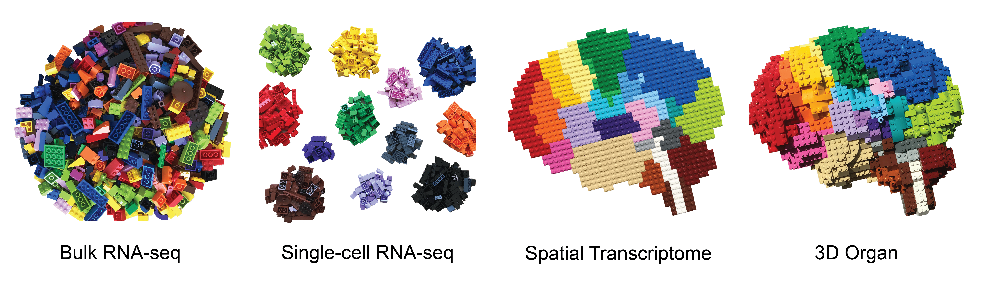
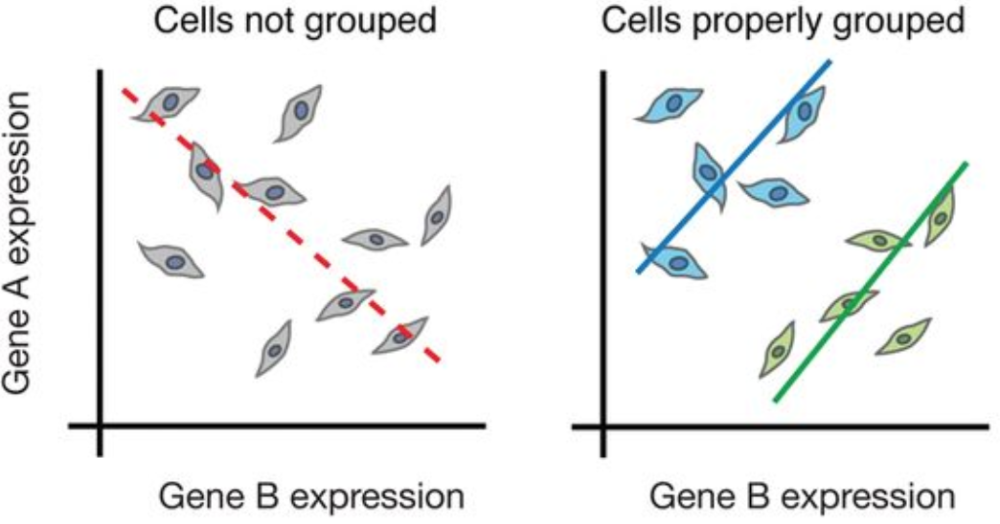

```{r}
#| label: load_libraries_data
#| echo: false
# Load libraries and data

```

Approximate time: XX minutes

## Learning Objectives 

In this lesson, we will:

- Follow the evolution of high-throughput sequencing
- Describe the differences in sequencing- and imaging-based technologies
- Define the advantages and disadvantages of different spatial transcriptomics technologies

## Overview of lesson

When doing XYZ...

## Overview of high-throughput sequencing

Over the years, transcriptomics technologies have evolved rapids from bulk sequencing, to single-cell sequencing, all the way to the current spatial transcriptomics methods.

::: {#fig-lego_sc .figure}
{width=630}

Lego representation of the evolution of sequencing technologies, showing more specificity and structure with each advancement.<br>
_Image credit:_ [Bo Xia Lab](https://www.boxialab.org/news)

:::


### Bulk and single-cell sequencing

**Bulk RNA-seq** is a method for comparing the averages of cellular expression for a population of cells. This method can be a good choice if looking at **comparative transcriptomics** (e.g. samples of the same tissue from different species), and for quantifying expression signatures in disease studies. It also has potential for the discovery of disease biomarkers if you are not expecting or not concerned about cellular heterogeneity in the sample.

While bulk RNA-seq can explore differences in gene expression between conditions (e.g. treatment or disease), the differences at the cellular level are not adequately captured. For instance, in the images below, if analyzed in bulk (left) we would not detect the correct association between the expression of gene A and gene B. However, if we properly group the cells by cell type or cell state, we can see the correct correlation between the genes.

::: {#fig-sc_vs_bulk .figure}
{width=630}

Comparison of bulk and single-cell RNA sequencing approaches, showcasing loss of cellular resolution in bulk due to averaging.<br>
_Image credit:_ [Bo Xia Lab](https://www.boxialab.org/news)

:::

Despite scRNA-seq being able to capture expression at the cellular level, sample generation and library preparation is more expensive and the analysis is much more complicated and more difficult to interpret. The complexity of analysis of scRNA-seq data involves:

- Large volume of data
- Low depth of sequencing per cell
- Technical variability across cells/samples
- Biological variability across cells/samples


### Spatial transcriptomics

Spatial transcriptomics extends the concept of single-cell sequencing further by adding the coordinates for each cell or spot on a grid/slide. This allows us to understand both the moleular and spatial context for gene expression. Many of the challenges of scRNA-seq are also present in spatial transcriptomics. 

Studies that focus on the tissue microenvironment benefit from the context of cellular location, as nearby cells are more likely to interact with one another. Another potential application is the ability to annotate key areas of a tissue based upon the histological features of the tissue, which can be particularly useful for studies of cancer and other diseases.


:::{.callout-tip}
# [**Exercise 1**](01_lesson-Answer_key.qmd#exercise-1)
1. A question to evaluate Learning Objective 1
2. A followup question to question #1
3. ...
:::

## Topic 2

### Subsection 2A

### Subsection 2B

:::{.callout-tip}
# [**Exercise 2**](01_lesson-Answer_key.qmd#exercise-2)
1. A question to evaluate Learning Objective 2
2. A followup question to question #1
3. ...
:::

## Topic 3

### Subsection 3A

### Subsection 3B

:::{.callout-tip}
# [**Exercise 3**](01_lesson-Answer_key.qmd#exercise-3)
1. A question to evaluate Learning Objective 3
2. A followup question to question #1
3. ...
:::

# References

- https://www.nature.com/articles/s41581-024-00841-1 
- https://www.sciencedirect.com/science/article/pii/S1044532325000302
- https://www.nature.com/articles/s41581-024-00841-1/tables/1


***

[Next Lesson >>](02_lesson.qmd)

[Back to Schedule](../schedule/schedule.qmd)