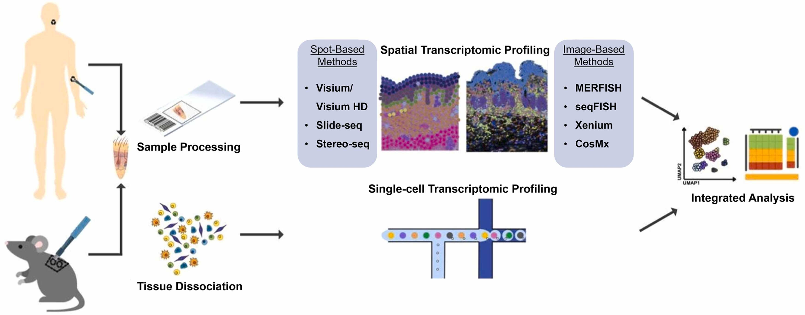

```{r}
#| label: load_libraries_data
#| echo: false
# Load libraries and data

```

Approximate time: XX minutes

## Learning objectives 

In this lesson, we will:

- Follow the evolution of high-throughput sequencing
- Describe the differences in sequencing- and imaging-based technologies
- Define the advantages and disadvantages of different spatial transcriptomics technologies

## Overview of lesson

When doing XYZ...

## High-throughput sequencing overview

Over the years, transcriptomics technologies have evolved rapids from bulk sequencing, to single-cell sequencing, all the way to the current spatial transcriptomics methods.

::: {#fig-lego_sc .figure}
{width=800}

Lego representation of the evolution of sequencing technologies, showing more specificity and structure with each advancement.<br>
_Image source: [Bo Xia Lab](https://www.boxialab.org/news)_

:::


### Bulk and single-cell sequencing

**Bulk RNA-seq** is a method for comparing the averages of cellular expression for a population of cells. This method can be a good choice if looking at **comparative transcriptomics** (e.g. samples of the same tissue from different species), and for quantifying expression signatures in disease studies. It also has potential for the discovery of disease biomarkers if you are not expecting or not concerned about cellular heterogeneity in the sample.

To contrast, **single-cell sequencing** is a method for measuring gene expression on a per-cell basis. This method is ideal for studies of **cellular heterogeneity** where the differences between celltypes or cell states are the primary focus.

::: {#fig-sc_vs_bulk .figure}
{width=500}

Comparison of bulk and single-cell RNA sequencing approaches, showcasing loss of cellular resolution in bulk due to averaging.<br>
_Image source: [Trapnell, 2015](https://dx.doi.org/10.1101/gr.190595.115)_
:::

To give an example, if we look at the image above, we can see that there are two cell types (blue and green) that have different expression patterns for genes A and B. If we were to analyze this data in bulk (left), we would not be able to detect the correct association between the genes. However, if we properly group the cells by cell type (right), we can see the correct correlation between the genes.


### Spatial transcriptomics

Spatial transcriptomics extends the concept of single-cell sequencing further by adding the coordinates for each cell or spot on a grid/slide. This allows us to understand both the moleular and spatial context for gene expression. Many of the challenges of scRNA-seq are also present in spatial transcriptomics. 

Studies that focus on the tissue microenvironment benefit from the context of cellular location, as nearby cells are more likely to interact with one another. Another potential application is the ability to annotate key areas of a tissue based upon the histological features of the tissue, which can be particularly useful for studies of cancer and other diseases.

::: {#fig-histology .figure}
{width=500}

Example of histology slide from a liver biopsy, annotated by a pathologist.<br>
_Image source: [Holzinger et al., 2019](https://pmc.ncbi.nlm.nih.gov/articles/PMC7017860/)_
:::

Many of the challenges that arise in single-cell experiments are also present in spatial, for example:

- Large volume of data
- Low depth of sequencing per cell
- Technical variability across cells/samples
- Biological variability across cells/samples


These technologies can be broadly categorized into two groups: sequencing-based and imaging-based. We will now discuss the different technologies within each of these categories, and their advantages and disadvantages.

::: {#fig-seq_vs_img .figure}
{width=700}

Showcasing the differences between sequencing- and imaging-based spatial transcriptomics technologies (spots vs. cells).<br>
_Image source: [Kazmi et al., 2025](https://www.sciencedirect.com/science/article/pii/S1044532325000302)_
::: 

## Sequencing-based technologies

Sequencing-based methods focus on capturing the full transcriptome of the cells in the dataset. To accomplish this, the tissue is “binned” into different spots which are then sequenced to measure expression levels. In some times, the spot can sometime be comprised of multiple cells (not single-cell level). As the technology has evolved, the bins sizes have become ever smaller, allowing for near single-cell levels.


### Summary of popular methods

In essence, these methods allow you apply a grid to the tissue and quanitify thousands of genes according to each square on the grid. Some popular technologies that belong to this category include:

Table: Summary of popular sequencing-based methods for spatial transcriptomics. {#tbl-seq_methods}

|                      | Visium              | Visium HD            | Stereo-seq          | Slide-seq          |
|----------------------|---------------------|----------------------|---------------------|--------------------|
| **vendor**           | 10x Genomics        | 10x Genomics         | BGI Group           | Curio Biosciences* |
| **capture size**     | ~6.5 × 6.5 mm capture area (×4 per slide) | ~11 × 11 mm–scale capture area (single array) | Up to ~1 × 1 cm chip (cm²‑scale field of view) | ~1 cm diameter puck (~80 mm²) |
| **resolution**       | 55 µm spot diameter; multicellular        | ~2 µm “pixel” size; near single‑cell          | 220 nm DNA nanoball spacing; subcellular       | 10 µm beads; near single‑cell  |
| **H&E**              | Yes (same section)  | Yes (same section)   | No                  | No                 |
| **tissue preservation** | FFPE and fresh frozen | Primarily FFPE; FF also supported | Fresh frozen          | Fresh frozen        |
| **year released**    | 2019                | 2023–2024            | 2022 (atlas)        | 2019               |


### Advantages and disadvantages

**Advantages:**

- Analyses that make use of many genes at once (functional analysis, RNA velocity, etc.) can be done on these datasets as you are sequencing the entire transcriptome instead a gene panel.
- Can be run on non-model organisms with more ease.

**Disadvantages:**

- High resolution experiments (Visium HD) can be very expensive 
- Spots are not guaranteed to be a single-cell (can be multiple cells, or no cells at all)

## Imaging-based technologies

These methods utilize floresence to quantify gene expression on a tissue slide. Specifically utilizing fluoresence in situ hybridization (FISH) to measure expression of a select panel of genes (selected by the researcher) using a probes. Therefore we are able to evaluate the expression for each individual cell after segmentation.

### Summary of popular methods

Table: Summary of popular imaging-based methods for spatial transcriptomics. {#tbl-img_methods}

|                      | seqFISH                 | MERFISH                     | Xenium                      |
|----------------------|-------------------------|-----------------------------|-----------------------------|
| **vendor**           | NA (academic method)    | Vizgen                      | 10x Genomics               |
| **capture size**     | Variable FOV; tiled imaging fields (typically mm-scale regions stitched across section) | Variable FOV; tiled imaging fields (mm-scale regions, stitchable to large areas) | Variable FOV; tiled high‑plex imaging over tissue sections (up to whole‑slide via tiling) |
| **resolution**       | Subcellular, subdiffraction (seqFISH/seqFISH+) | Subcellular (single‑molecule FISH) | Subcellular, targeted in situ (per‑cell calls with subcellular localization) |
| **H&E**              | No (standard workflow uses fluorescence imaging only) | No (fluorescence imaging only) | (Yes) — H&E‑like morphology and protein markers supported; H&E compatibility in active development at time of review |
| **tissue preservation** | Fresh frozen           | FFPE and fresh frozen       | FFPE and fresh frozen       |
| **year released**    | 2014 (first seqFISH paper) | 2015 (first MERFISH paper) | 2022 (commercial launch of Xenium platform) |

### Advantages and disadvantages

**Advantages:**

- Can be used to evaluate the expression of a select panel of genes with high sensitivity and specificity.
- Single-cell resolution


**Disadvantages:**

- Limited to a select panel of genes.
- Segmentation is not a trivial task and requires careful pre-processing.
- Challenging with non-model organisms as probes are necessary.

## Summary of comparison

: Table: Summary of the advantages and disadvantages of sequencing- and imaging-based spatial transcriptomics technologies. {#tbl-comparison}

| Sequencing-based                                              | Imaging-based                                           |
|--------------------------------------------------------------|---------------------------------------------------------|
| Transcriptome-wide sequencing                                | Probe-based sequencing from a panel of genes           |
| Spots/bins resolution depends on bin size (not always single-cell) | Single-cell resolution                           |
| More accessible to non-model organisms                       | Can be challenging to find probes for non-model organisms |


## References

- https://www.nature.com/articles/s41581-024-00841-1 
- https://www.sciencedirect.com/science/article/pii/S1044532325000302
- https://www.nature.com/articles/s41581-024-00841-1/tables/1


***

[Next Lesson >>](02_spaceranger.qmd)

[Back to Schedule](../schedule/schedule.qmd)