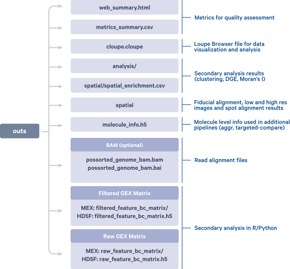
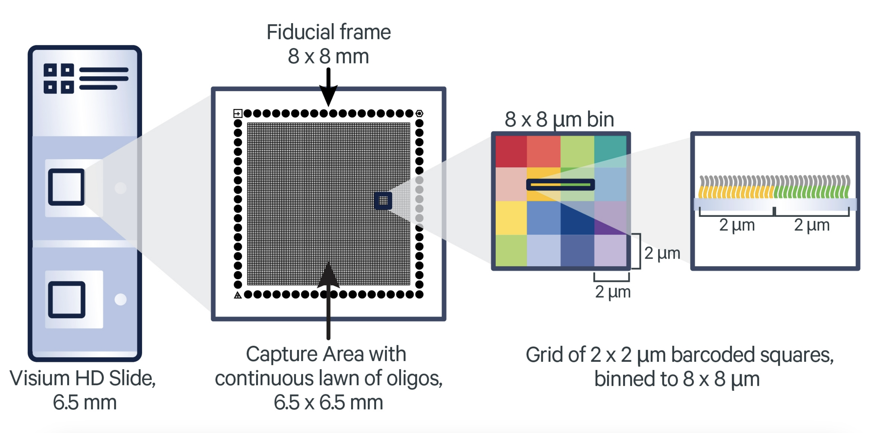
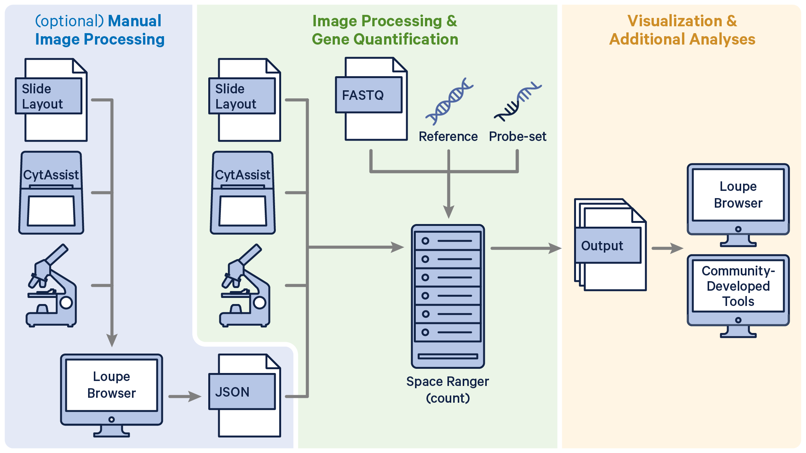
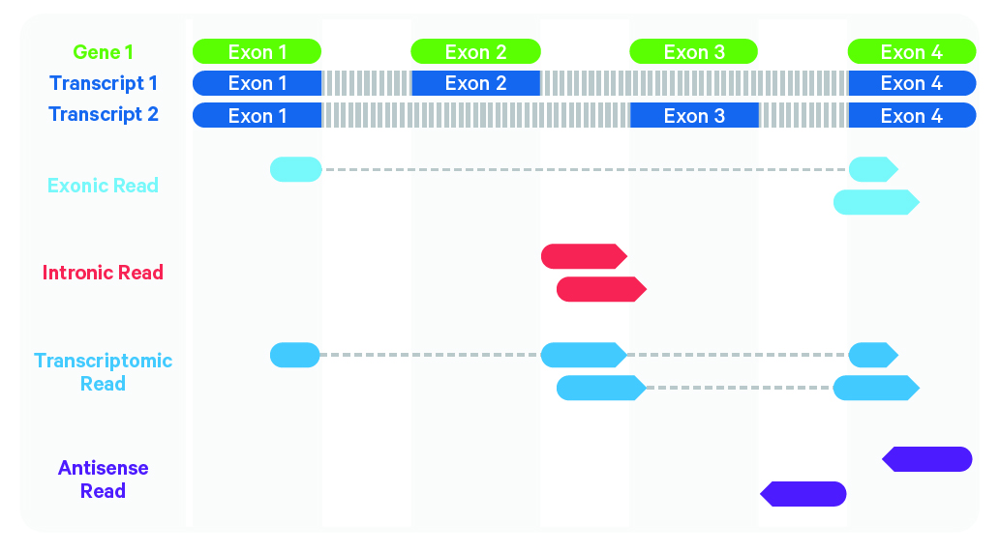
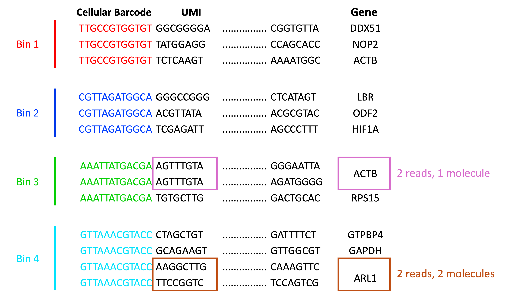
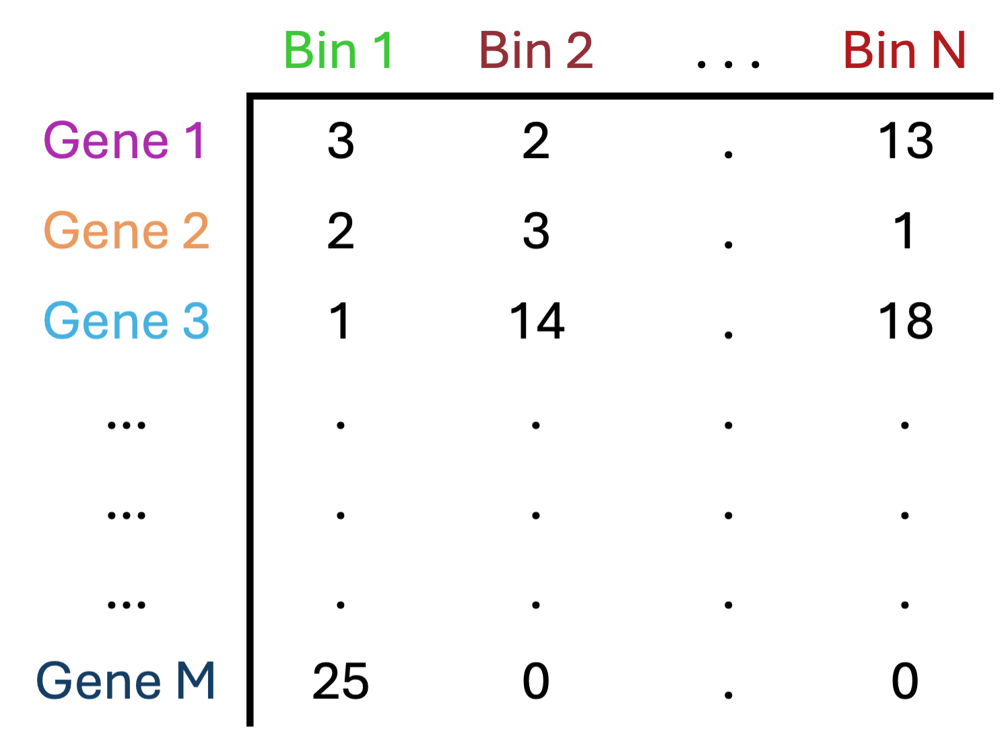
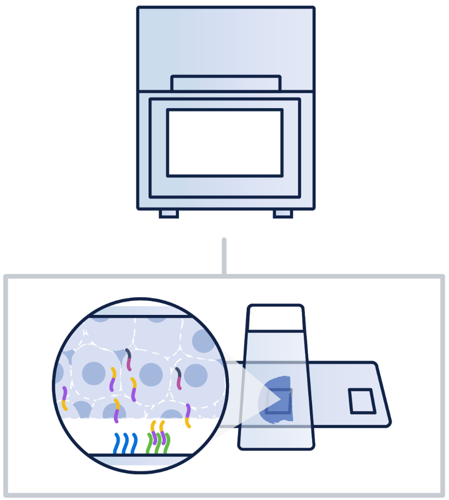
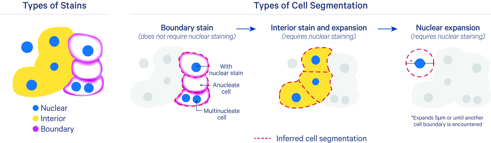

```{r}
#| label: load_libraries_data
#| echo: false
# Load libraries and data

```

Approximate time: XX minutes

## Learning objectives 

In this lesson, we will:

- Understand the inputs and outputs of the Space Ranger pipeline
- Outline the steps of the Space Ranger algorithm
- Discuss segmentation in the context of spatial transcriptomics data

## Overview of lesson

There is a key step that occurs between the sequencing experiment and the start of an analysis in R for spatial transcriptomics. We must pre-process the raw data (FASTQ and TIFF) files to generates outputs which we can then use to perform downstream analyses. In this lesson highlight the broad steps of what the Space Ranger algorithm does to take us from sequnces to a count matrix with associated spatial coordinates.

## Space Ranger overview

[Space Ranger](https://www.10xgenomics.com/support/software/space-ranger/latest) is a free software created by 10X Genomics to process Visium datasets. The output generated from Space Ranger can be used for downstream analysis in R/Python or using the proprietary [Loupe browser](https://www.10xgenomics.com/support/software/loupe-browser/latest) from 10X Genomics.

::: callout-important
# Other processing software
Space Ranger is not the only software that can be used to process spatial transcriptomics data. For example, there are also open-source tools such as [ST Pipeline](https://github.com/jfnavarro/st_pipeline) and [SAW](https://github.com/STOmics/SAW).

As we will be working with Visium HD data for this workshop, we will be using Space Ranger outputs. That being said, the overarching steps and considerations for processing spatial transcriptomics data are similar across different platforms and software. So, even if you are not working with Visium HD data, the concepts covered in this lesson will still be relevant.
:::

The starting point of this workshop is the files generated by Space Ranger, so here we will briefly go over the **inputs, outputs, and algorithms** used by Space Ranger. This will help you understand how the raw data is transformed into a count matrix and coordinates that can be used for downstream analysis.

### Input

To process Visium HD data, you use the `spaceranger count` command to align the reads in the FASTQ files against a reference genome and also provides the spatial location using the oligonucleotide barcode. The three primary inputs to the `count` command are:

1. FASTQ files containing the raw sequencing reads
2. A reference transcriptome (e.g. [human or mouse reference](https://www.10xgenomics.com/support/software/space-ranger/downloads#reference-downloads) provided by 10X Genomics, or a [custom reference](https://www.10xgenomics.com/support/software/space-ranger/latest/advanced/custom-references) that you create yourself)
3. Image (typically a `.TIFF` file) of the tissue section on the Visium slide

With these files, you would then run the `spaceranger count` command. Note that Space Ranger requires a Linux system with at least **32 cores, 64GB of RAM, and 1TB** of disk space. Do not try to run this on your laptop!!!

::: {.callout-note collapse="true"}
# Running `spaceranger count`

Here we are showing an example script of how you would run `spaceranger count`. We also describe what each of the parameters are set, to help you understand how to run this command on your own data.

```{bash}
#| label: space_ranger_script
#| eval: false
# Example script to run spaceranger count
# DO NOT RUN
cd /home/jdoe/runs
spaceranger count --id=sample345 \ #Output directory
                  --transcriptome=/home/jdoe/refdata/GRCh38-2020-A \ #Path to Reference
                  --fastqs=/home/jdoe/runs/HAWT7ADXX/outs/fastq_path \ #Path to FASTQs
                  --sample=mysample \ #Sample name from FASTQ filename
                  --image=/home/jdoe/runs/images/sample345.tiff \ #Path to brightfield image
                  --slide=V19J01-123 \ #Slide ID
                  --area=A1 \ #Capture area
                  --localcores=8 \ #Allowed cores in localmode
                  --localmem=64  #Allowed memory (GB) in localmode
```


Here we get a better idea of what the inputs to `spaceranger count` are:

Table: `spaceranger count` input parameters. {#tbl-spaceranger_inputs}

| Argument       | Filetype(s)                        | Description                                                                                   | Example Command                                                                                       |
|----------------|------------------------------------|-----------------------------------------------------------------------------------------------|--------------------------------------------------------------------------------------------------------|
| `cytaimage`    | TIFF                               | Corresponding CytAssist image.                                                                | `/path/to/CAVG10539_2023-11-16_14-56-24_APPS115_H1-YD7CDZK_A1_S11088.tif`                             |
| `image`        | TIFF, QPTIFF, BTF, JPEG            | Brightfield microscope image.                                                                 | `/path/to/APPS115_11088_rescan_01.btf`                                                                |
| `slide`        | Text ID                            | Slide identifier. Used with `area` (and optionally `slidefile`) to specify slide parameters   | `H1-YD7CDZK`                                                                                          |
| `area`         | Text ID                            | Capture area ID on the slide. Used with `slide` to specify slide parameters.                  | `A1`                                                                                                   |
| `transcriptome`| Reference transcriptome directory  | Path to reference transcriptome (10x human/mouse reference or custom).                        | `/path/to/refdata-gex-GRCh38-2020-A`                                                                  |
| `probe-set`    | CSV                                | Probe set CSV file from `probe_sets` in Space Ranger or from 10x Genomics. For Visium HD 3' data, **do not** specify this   | `/path/to/Visium_Human_Transcriptome_Probe_Set_v2.0_GRCh38-2020-A.csv`                               |
| `fastqs`       | Directory (FASTQ files)            | Directory containing FASTQ files named with the sample name given in `sample`.                | `/path/to/fastq_path`                                                                                  |
| `sample`       | Text ID                            | Sample name. Must match the sample name in the FASTQ filenames.                               | `mysample`                                                                                            |
| `id`           | Text ID                            | Output directory name. All output files are written under this directory.                     | `sample345`                                                                                           |
| `localcores`   | Integer                            | Number of cores to use when running in local mode.                                            | `8`                                                                                                   |
| `localmem`     | Integer (GB)                       | Memory (in GB) to use when running in local mode.                                             | `64`                                                                                                  |

:::

Once this command is run, it will take a few hours to generate the output files, which we will discuss in the next section.

### Output

When `spaceranger count` completes successfully, it will generate a variety of outputs (seen below), which will enable the analyst to perform further analysis in R/Python or using the proprietary Loupe browser from 10X Genomics. 

::: columns

::: column
::: {#fig-spaceranger_output .figure}
{width=400}

Example of the different outputs generated by `spaceranger count`.<br>
_Image source: [10X Genomics: Space Ranger Documentation](https://www.10xgenomics.com/support/software/space-ranger/2.1/tutorials/count-cytassist-tma)_
::: 
:::

::: column
A good starting point is to take a look at the QC of the sample in the web summary, which we have provided as:

-  `data/P5CRC_cropped/web_summary.html`
-  `data/P5NAT_cropped/web_summary.html` 

in the files that you will download as step 3 in the pre-reading.

In the Visium HD assay, Space Ranger aggregates transcript counts into square spatial bins of different sizes, typically:

-   2µm x 2µm
-   8µm x 8µm
-   16µm x 16µm
:::
:::

::: {#fig-visium_hd_bins .figure}
{width=600}

Depiction of the grid-like structure of a Visium HD slide, which can then be binned into various squares of different sizes.<br>
_Image source: [10x Genomics: Visium HD Spatial Gene Expression Manual](https://cdn.10xgenomics.com/image/upload/v1756507345/support-documents/CG000685_VisiumHD_GeneExpression_UserGuide_RevD.pdf)_
::: 


Having access to 2μm bins, along with matched high-resolution tissue morphology, provides a great opportunity to reconstruct single cells from the data. However, because the 2µm x 2µm bins (and even the 8µm x 8µm bins) are very small, there is a potential for very **little biological signal to be captured per bin**. Additionally, the sheer number of bins at these higher resolutions can substantially increase computational demands in terms of memory usage and processing time.


## Space Ranger algorithm

The Space Ranger algorithm is split into two main parts: [read](https://www.10xgenomics.com/support/software/space-ranger/latest/algorithms-overview/gene-expression
) and [image](https://www.10xgenomics.com/support/software/space-ranger/latest/algorithms-overview/image-processing) processing. Think of this as dealing with each of the two main data types generated in a Visium experiment: the sequencing data and the image data. At the end, everything is pulled together to generate the final output files that we can use for downstream analysis.

::: {#fig-spaceranger_algorithm .figure}
{width=600}

Schematic of the Space Ranger algorithm, including both read and image processing steps.<br>
_Image source: [10X Genomics: Visium HD Analysis with `spaceranger count`](https://www.10xgenomics.com/support/software/space-ranger/3.0/analysis/count-visium-hd)_
::: 

### Read processing

Quantifying the gene expression in a sample can be broken down into the following steps:

**1. Read trimming**

Remove the template switch oligo sequence from the 5' end as well as the polyA tail from the 3' end of the reads. This is to reduce mismatches during the alignment step to improve sensitivity and reduce computational time. The information about the trimmed bases is retained in the BAM file.

**2. Alignment and barcode correction**

::: {#fig-alignment .figure}
{width=600}

Reads are classified based on whether they are exonic (light blue) or intronic (red) and whether they are sense or antisense (purple).<br>
_Image source: [10X Genomics: Cell Ranger's Gene Expression Algorithm](https://www.10xgenomics.com/support/software/cell-ranger/latest/algorithms-overview/cr-gex-algorithm)_
:::

Sequenced reads are aligned against the reference probe set or transcriptome using STAR. Any read that does not map confidently to a single gene with a MAPQ score of 255 is flagged as low quality.

Space Ranger uses a Hamming Distance to correct for sequencing errors in the barcode sequence. This is possible because every barcode is a known sequence that is at least 3 edits away from any other barcode. This allows the algorithm to retain more reads that would have been discarded due to sequencing errors. This is the step where the BAM file is generated, with the sequence, gene, original barcode, and corrected barcode information is stored for each read.

**3. Count UMIs**

Similar to the barcode correction, Space Ranger also uses a Hamming Distance to correct for sequencing errors in the UMI sequence. Then, reads that have the same corrected barcode, gene, and UMI are collapsed into a single count to generate the count matrix. This is the step where we can begin tabulating the expression values for each barcode to generate a count matrix.

We can consider the following scenarios for "collapsing on UMIs":

- Reads with **different UMIs** mapping to the same transcript were derived from **different molecules** and are biological duplicates - each read should be counted.
- Reads with the **same UMI** originated from the **same molecule** and are technical duplicates - the UMIs should be collapsed to be counted as a single read.
- In image below, the reads for ACTB should be collapsed and counted as a single read, while the reads for ARL1 should each be counted.

::: {#fig-umi_collapsing .figure}
{width=600}

Example of how UMIs are collapsed to generate the count matrix.<br>
_Adapted from: [Macosko et al. (2015)](https://doi.org/10.1016/j.cell.2015.05.002)_
:::

**4. Binning**

Each barcode is then binned together with other barcodes that fall within the same spatial spot. By default, Visium HD datasets are binned into 2µm x 2µm, 8µm x 8µm, and 16µm x 16µm bins. The bin sizes will affect the amount of biological signal captured per bin. For example, an 8 µm bin provides a 16-fold increase compared to a 2µm square. 

An important consideration at this step is the concept of Modifiable Areal Unit Problem (MAUP), which is a source of bias that can occur when spatial data is aggregated (e.g. bins).

**5. Bins under the tissue**

Not every square on the slide will have tissue on it. In this step, bins that are "under the tissue" are identified and then the count matrix is generated to only include those bins.

::: {#fig-sc_mtx .figure}
{width=300}

Example of the count matrix generated by Space Ranger, where the rows are the genes and the columns are the barcodes (or bins).<br>
_Adapted from: [Lafzi et al. (2018)](https://doi.org/10.1038/s41596-018-0073-y)_
::: 

Beyond this point, there is also "secondary analyses" steps that are generated by default. However, we are going to load our dataset into R to perform our own QC and analyses. This is in part because the default Space Ranger analyses are generic and _not specific to the tissue or biological question_ you are asking.


### Image processing

The image processing steps of the Space Ranger algorithm are as follows:

**1. Fiducial alignment**

::: columns

::: column
Fiducial alignment refers to the process by which a marker is used to align/calibrate an image to the correct coordinates. For Visium HD, these are spots located throughout the slide. With these identifying features, there are algorithms that can align the image to the expected locations to accurately obtain the correct coordinates for each spot on the tissue.

If too many of the markers are hidden (< 25%), then some manual alignment may be necessary.
:::

::: column
::: {#fig-ctyassist .fig}
{width="30%"}

Minitaure schematic of a cytassist machine.<br>
_Image source: [10X Genomics: Visium Cytassist](https://www.10xgenomics.com/instruments/visium-cytassist)_
:::
:::

:::

**2. Tilt correction and tissue detection**

If the CytAssist camera is tilted, there is a built-in step to correct for this tilt. This is to ensure that the coordinates map accurately to the transcriptional data. Then, estimates are calculated on if tissue exists at each spot. This is then used to classify if a pixel is considered tissue or background.

**3. Image registration and UMI refinement**

As the CytAssist machine generates multiple images of the same tissue, it is crucial that there is consistency between each of the coordinates. A feature matching algorithm was created to match similar features across the different images to ensure consistency.

Similarly, the H&E stain is contrasted against the UMI counts as a quality control step to ensure that slides are oriented correctly in the 2µm resolution.

**4. Segmentation**

Space Ranger uses a customized version of the StarDist algorithm to perform segmentation on the H&E image to identify the boundaries of each cell. This method is a deep learning model that is able to identify boundaries of star-convex shapes (similar to nuclei). The result is a series of polygons that overlap the tissue that are meant to correspond with cell boundaries. 

::: {#fig-segmentation .figure}
{width=800}

Mock example of how stains are used to identify cell boundaries with segmentation algorithms.<br>
_Image source: [10X Genomics: Nucleus and Cell Segmentation Algorithms](https://www.10xgenomics.com/support/software/xenium-onboard-analysis/3.4/algorithms-overview/segmentation)_ 
:::

::: callout-important
# Segmentation in imaging-based spatial transcriptomics

Segmentation is not a key step when working with sequencing-based spatial transcriptomics data, such as Visium HD. This is because the data is already binned into small squares, so there is no need to segment individual cells.

However, **segmentation is a critical step when working with imaging-based spatial transcriptomics** data, such as MERFISH or Xenium. This is because we need to identify the boundaries of each cell to assigned transcript counts to that cell. These boundaries are typically identified with stains for the nuclei and cell walls in conjunction with expression data. 

Segmentatin is a challenging problem, especially when cells have irregular shapes (e.g., neuron cells).
Some methods for segmentation that have been published include, but are not limited to:

- [Cellpose](https://www.cellpose.org/)
- [Baysor](https://github.com/kharchenkolab/Baysor)

:::


***

[Next Lesson >>](03_loading_spatial_data.qmd)

[Back to Schedule](../schedule/schedule.qmd)