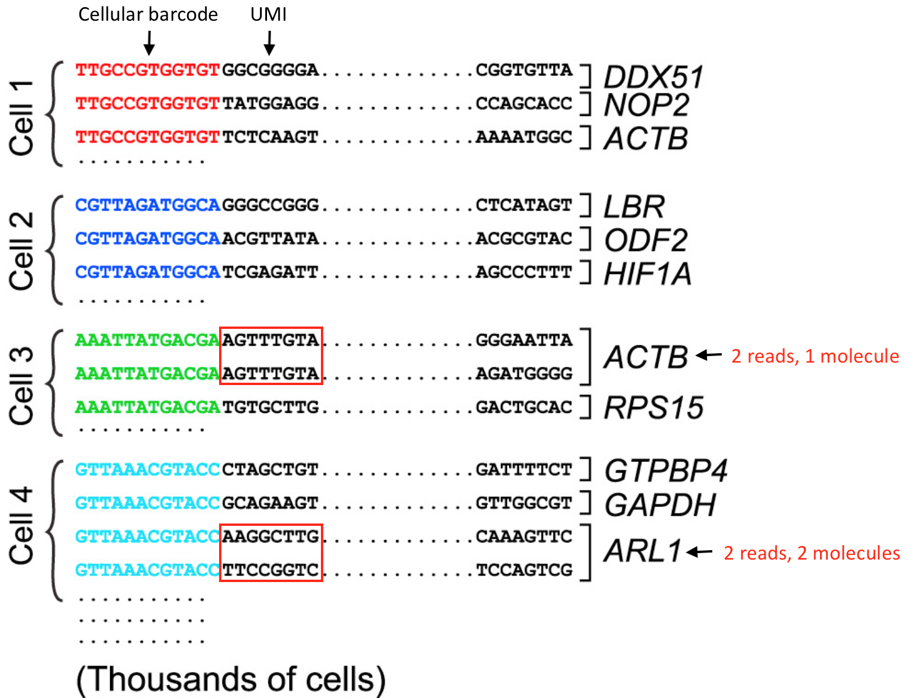
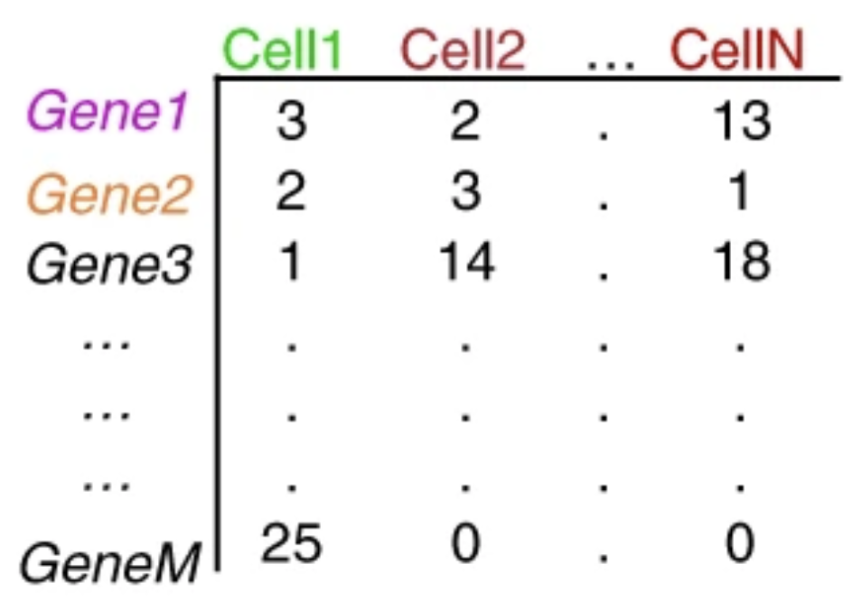

```{r}
#| label: load_libraries_data
#| echo: false
# Load libraries and data

```

Approximate time: XX minutes

## Learning objectives 

In this lesson, we will:

- Learning Objective 1
- Learning Objective 2
- Learning Objective 3

## Overview of lesson

When doing XYZ...

## Space Ranger overview

[Space Ranger](https://www.10xgenomics.com/support/software/space-ranger/latest) is a free software created by 10X genomics to process Visium datasets. The output generated from Space Ranger can be used for downstream analysis in R/Python or using the proprietary [Loupe browser](https://www.10xgenomics.com/support/software/loupe-browser/latest) from 10X Genomics.

The starting point of this workshop is the files generated by Space Ranger, so here we will briefly go over the inputs, outputs, and algorithms used by Space Ranger. This will help you understand how the raw data is transformed into a count matrix and coordinates that can be used for downstream analysis.

To process Visium HD data, you use the `spaceranger count` command to align the reads in the FASTQ files against a reference genome and provides their spatial location using the oligonucleotide barcode.

### Input

The three primary inputs to the `count` command are:

1. FASTQ files containing the raw sequencing reads
2. A reference transcriptome (e.g. [human or mouse reference](https://www.10xgenomics.com/support/software/space-ranger/downloads#reference-downloads) provided by 10X Genomics, or a [custom reference](https://www.10xgenomics.com/support/software/space-ranger/latest/advanced/custom-references) that you create yourself)
3. Image (typically a `.TIFF` file) of the tissue section on the Visium slide

With these files, you would then run the `spaceranger count` command. Note that Space Ranger requires a Linux system with at least **32 cores, 64GB of RAM, and 1TB** of disk space. Do not try to run this on your laptop!!!

```{bash}
#| label: space_ranger_script
#| eval: false
# Example script to run spaceranger count
# DO NOT RUN
cd /home/jdoe/runs
spaceranger count --id=sample345 \ #Output directory
                  --transcriptome=/home/jdoe/refdata/GRCh38-2020-A \ #Path to Reference
                  --fastqs=/home/jdoe/runs/HAWT7ADXX/outs/fastq_path \ #Path to FASTQs
                  --sample=mysample \ #Sample name from FASTQ filename
                  --image=/home/jdoe/runs/images/sample345.tiff \ #Path to brightfield image
                  --slide=V19J01-123 \ #Slide ID
                  --area=A1 \ #Capture area
                  --localcores=8 \ #Allowed cores in localmode
                  --localmem=64  #Allowed memory (GB) in localmode
```


Here we get a better idea of what the inputs to `spaceranger count` are:

Table: `spaceranger count` input parameters. {#tbl-spaceranger_inputs}

| Argument name       | Filetype(s)                                                                 | Description                                                                                                                                                                                                                                  | Value in example command                                                                                                                                                                  |
|---------------------|-----------------------------------------------------------------------------|----------------------------------------------------------------------------------------------------------------------------------------------------------------------------------------------------------------------------------------------|-------------------------------------------------------------------------------------------------------------------------------------------------------------------------------------------|
| `--cytaimage`       | TIFF                                                                       | Corresponding CytAssist image.                                                                                                                                                                                                              | `/path/to/CAVG10539_2023-11-16_14-56-24_APPS115_H1-YD7CDZK_A1_S11088.tif`                                                                                                                |
| `--image`           | TIFF, QPTIFF, BTF, JPEG                                                    | Brightfield microscope image.                                                                                                                                                                                                               | `/path/to/APPS115_11088_rescan_01.btf`                                                                                                                                                    |
| `--darkimage`       | TIFF, QPTIFF, BTF, JPEG                                                    | Dark background fluorescence microscope image.                                                                                                                                                                                              | Not used in example                                                                                                                                                                       |
| `--colorizedimage`  | TIFF, QPTIFF, BTF, JPEG                                                    | Composite colored fluorescence microscope image.                                                                                                                                                                                            | Not used in example                                                                                                                                                                       |
| `--slide`           | Text ID                                                                    | Slide identifier. Used with `--area` (and optionally `--slidefile`) to specify slide parameters when Space Ranger has or does not have internet access.                                                                                    | `H1-YD7CDZK`                                                                                                                                                                              |
| `--area`            | Text ID                                                                    | Capture area identifier on the slide. Used with `--slide` to specify slide parameters.                                                                                                                                                      | `A1`                                                                                                                                                                                      |
| `--slidefile`       | Slide layout file (downloaded file; typically CSV or JSON per 10x format)  | Local slide layout file used together with `--slide` and `--area` when Space Ranger has no internet access.                                                                                                                                | Not used in example                                                                                                                                                                       |
| `--unknown-slide`   | Flag                                                                       | Indicates that Visium slide details are unknown.                                                                                                                                                                                            | Not used in example                                                                                                                                                                       |
| `--transcriptome`   | Reference transcriptome directory                                          | Path to reference transcriptome. Human and mouse references can be downloaded, or a custom reference can be used.                                                                                                                          | `/path/to/refdata-gex-GRCh38-2020-A`                                                                                                                                                      |
| `--probe-set`       | CSV                                                                       | Probe set CSV file. Found in the `probe_sets` directory of the Space Ranger package or downloadable from 10x Genomics. For Visium HD 3' data, this parameter should **not** be specified.                                                  | `/path/to/Visium_Human_Transcriptome_Probe_Set_v2.0_GRCh38-2020-A.csv`                                                                                                                   |
| `--loupe-alignment` | JSON                                                                      | Alignment JSON file exported from Loupe Browser when automatic image-to-fiducial alignment and tissue detection fail; used to provide manual alignment information.                                                                        | Not used in example                                                                                                                                                                       |


One this command is run, it will take a few hours to generate the output files, which we will discuss in the next section.

### Output

When `spaceranger count` completes successfully, it will generate a variety of outputs (seen below), which will enable the analyst to perform further analysis in R/Python or using the proprietary Loupe browser from 10X Genomics. 

::: {#fig-spaceranger_output .figure}
{width=400}

Example of the different outputs generated by `spaceranger count`.<br>
_Image source: [10X Genomics Space Ranger Documentation](https://www.10xgenomics.com/support/software/space-ranger/2.1/tutorials/count-cytassist-tma)_
::: 

A good starting point is to take a look at the QC of the sample in the web summary, which we have provided in `reports/` folder that you downloaded.

In the Visium HD assay, Space Ranger aggregates transcript counts into square spatial bins of different sizes, typically:

-   2µm x 2µm
-   8µm x 8µm
-   16µm x 16µm

::: {#fig-visium_hd_bins .figure}
{width=600}

Depiction of the grid-like structure of a Visium HD slide, which can then be binned into various squares of different sizes.<br>
_Image source: [10x Visium HD Spatial Gene Expression Manual](https://cdn.10xgenomics.com/image/upload/v1756507345/support-documents/CG000685_VisiumHD_GeneExpression_UserGuide_RevD.pdf)_
::: 


Having access to 2μm bins, along with matched high-resolution tissue morphology, provides a great opportunity to reconstruct single cells from the data. However, because the 2µm x 2µm bins (and even the 8µm x 8µm bins) are very small, there is a potential for very **little biological signal to be captured per bin**. Additionally, the sheer number of bins at these higher resolutions can substantially increase computational demands in terms of memory usage and processing time.


## Space Ranger algorithm

The Space Ranger algorithm is split into two main parts: [read](https://www.10xgenomics.com/support/software/space-ranger/latest/algorithms-overview/gene-expression
) and [image](https://www.10xgenomics.com/support/software/space-ranger/latest/algorithms-overview/image-processing) processing. Think of this as the dealing with each of the two main data types generated in a Visium experiment: the sequencing data and the image data. At the end, everything it pulled together to generate the final output files that we can use for downstream analysis.

::: {#fig-spaceranger_algorithm .figure}
{width=600}

Schematic of the Space Ranger algorithm, including both read and image processing steps.<br>
_Image source: [10X Genomics Visium HD Analysis with `spaceranger count`](https://www.10xgenomics.com/support/software/space-ranger/3.0/analysis/count-visium-hd)_
::: 

### Read processing

Quantifying the gene expression in a sample can be broken down into the following steps:

**1. Read trimming**

Remove the template switch oligo sequence from the 5' end as well as the polyA tail from the 3' end of the reads. This is to reduce mismatches during the alignment step to improve sensitivity and reduce computational time. The information about the trimmed bases is retained in the BAM file.

**2. Alignment and barcode correction**

Sequenced reads are aligned against the reference probe set or transcriptome using STAR. Any read that does not map confiedently to a single gene with a MAPQ score of 255 is flagged as low quality.

Space Ranger uses a Hamming Distance to correct for sequencing errors in the barcode sequence. This is possible because every barcode is a known sequence that is at least 3 edits away from any other barcode. This allows the algorithm to retain more reads that would have been discarded due to sequencing errors.

This is the step where the BAM file is generated, where the gene, orginal barcode, and corrected barcode information is stored for each read.

**3. Count UMIs**

Similar to the barcode correction, Space Ranger also uses a Hamming Distance to correct for sequencing errors in the UMI sequence. Then, reads that have the same corrected barcode, gene, and UMI are collapsed into a single count to generate the count matrix. This is the step where we can begin tabulating the expression values for each barcode to get towards a count matrix.

We can consider the following scenarios for "collapsing on UMIs":

- Reads with **different UMIs** mapping to the same transcript were derived from **different molecules** and are biological duplicates - each read should be counted.
- Reads with the **same UMI** originated from the **same molecule** and are technical duplicates - the UMIs should be collapsed to be counted as a single read.
- In image below, the reads for ACTB should be collapsed and counted as a single read, while the reads for ARL1 should each be counted.

::: callout-warning
Need a new schematic that says bins instead of cells
:::


::: {#fig-umi_collapsing .figure}
{width=400}

Example of how UMIs are collapsed to generate the count matrix.<br>
_Image source: [Macosko et al. (2015)](https://doi.org/10.1016/j.cell.2015.05.002)_
:::

**4. Binning**

Each barcode is then binned together with other barcodes that fall within the same spatial spot. By default, Visium HD datasets are binned into 2µm x 2µm, 8µm x 8µm, and 16µm x 16µm bins. The bin sizes will affect the amount of biological signal captured per bin. For example, an 8 µm bin provides a 16-fold increase compared to a 2µm square. 

An important consideration at this step is the concept of Modifiable Areal Unit Problem (MAUP), which is a source of bias that can occur when spatial data is aggregated (e.g. bins).

**5. Bins under the tissue**

Not every square on the slide will have tissue on it. In this step, bins that are "under the tissue" are identified and then the count matrix is generated to only include those bins.

::: callout-warning
Need a new schematic that says bins instead of cells
:::

::: {#fig-sc_mtx .figure}
{width=300}

Example of the count matrix generated by Space Ranger, where the rows are the genes and the columns are the barcodes (or bins).<br>
_Image source: [Lafzi, et al. (2018)](https://doi.org/10.1038/s41596-018-0073-y)_
::: 

Beyond this point, there is also "secondary analyses" steps that are generated by default. However, we are going to load our dataset into R to perform our own QC and analyses. This is in part because the default Space Ranger analyses are generic and not specific to the tissue or biological question you are asking.


### Image processing

The image processing steps of the Space Ranger algorithm are as follows:

**1. Fiducial alignment**

**2. Tilt correction and tissue detection**

**3. Image registration**

**4. UMI refinement**

**5. Segmentation**


***

[Next Lesson >>](03_lesson.qmd)

[Back to Schedule](../schedule/schedule.qmd)