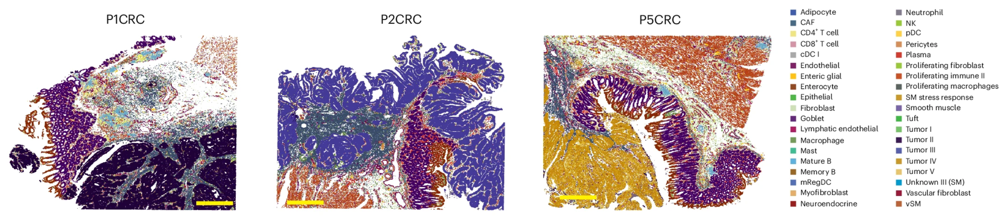

```{r}
#| label: load_libraries_data
#| echo: false
# Load libraries and data

```

Approximate time: XX minutes

## Learning objectives 

In this lesson, we will:

- Establish a hypothesis or biological question to assess using the provided dataset
- Quantify how bin size affects the count matrix
- Access important information from a Seurat object
- Create a merged Seurat object from Space Ranger outputs

## Overview of lesson

When doing XYZ...

## Exploring the example Visium HD dataset

Throughout this workshop, we will be working with a Visium HD dataset that came from a [larger study on human colorectal cancer](https://www.nature.com/articles/s41588-025-02193-3). The focus of this study was to understand the tumor microenvironment in colorectal cancer (CRC) by utilizing multiple sequencing modalities, including Visium HD, Xenium, and FLEX single-cell sequencing.

::: {#fig-experiment_design .figure}
{width=700}

Celltype annotation overlaid over three colorectral samples sequenced with Visium HD.<br>
_Image source: [Oliveira et al. (2025)](https://www.nature.com/articles/s41588-025-02193-3)_
::: 

In particular, we are going to be working with the **P5CRC** sample as there is a matched, normal adjacent tissue **P5NAT** sample that we can use to compare tumor versus normal tissue.

::: callout-note
# Dataset availability
This dataset was generated by 10X Genomics and is publicly available on their website [here](https://www.10xgenomics.com/platforms/visium/product-family/dataset-human-crc).
:::

### Metadata

While it may be tempting to get started right away with loading your data, it is crucial that you first take a moment to document metadata that is associated with your dataset. This will be important for you to interpret your results correctly as you move further along in your analysis. 

For this particular dataset, we have the following metadata available to us about the patient:

- Stage IV-A of CRC
- Female patient
- 58 years old

Additionally, we want to keep track of some basic information that we would expect to see in our dataset, more specifically the cell types we anticipate seeing:

::: columns
::: column
- B cells
- Endothelial cells
- Fibroblasts
- Intenstinal epithelial cells
- Myeloid cells
:::
::: column
- Neural cells
- Smooth musle cells
- T cells
- Tumor cells
:::
:::

::: {.callout-note collapse="true"}
# Sample preparation
It is also good to keep track of the sample preparation and sequencing protocols that were used to generate the data. For this dataset, we know:

- 5 µm sections were taken from the FFPE tissue blocks with a microtome
- Sectioning followed the Visium CytAssist v2 WT Panel Gene Expression protocol
- FFPE tissue sections were place on plain glass slides for deparaffinization, H&E staining and imaging following the Visium HD FFPE Tissue Preparation Handboo
- Sequencing was performed on an Illumina NovaSeq 6000 with paired-end reads
- Samples processed with Space Ranger v3.0
:::

:::{.callout-tip}
# [**Exercise 1**](03_loading_spatial_data-Answer_key.qmd#exercise-1)
1. Given the information that we know from the metadata, what might be some questions that we want to answer using our data?
2. What are some of the limitations of this dataset that we should keep in mind as we analyze it?
:::

With this information in mind, we can now move forward with loading our data and performing our analysis.


## Set up

We have assembled an R Project for you to download that includes the data along with a basic file structure for good data management. Whenever you start a new project, is is a good habit to set up a similar directory structure to clearly organize your data, scripts, and results. This will make it easier to keep track of your files and to share your work with others.

::: callout-important
# Download the data
If you haven’t done this already, the project can be accessed using this [link](https://www.dropbox.com/scl/fo/053p46ab36e53u6hr5jnl/ABPN8Bh7sKPUfG1O8L1TbRI?rlkey=lva3uunugrxp99xyo7xyf1mul&st=xqpfvj2f&dl=0). You will have to left-click the link and select `Save Link As..` or `Download Linked File As..`, then select a place on your computer where you would like to place this R Project.
::::

### Opening R Studio

We can open the R Project up and see that the provided file structure should look like:

```{r}
#| label: file_structure
#| echo: false
library(fs)

# Print the first level in the downloaded directory
dir_tree("data", recurse = 1)
```

::: callout-important
# Cropped images
You may notice that we are working with **cropped** folders for this workshop. This is due to the limitations of how much data can be loaded on a laptop. So here, we have cropped the image so that we have a smaller cross-section of the tissue to work with, ultimately reducing the number of cells for this example dataset.

The code used to create all the files for this workshop can be found [here](TODO: link).

::: callout-warning
TODO: link for aside lesson on cropping dataset
:::

:::

If your R Project looks like below, then you are ready to start!

::: callout-warning
TODO: Image of R project file structure
:::

### Project organization

When you have large amounts of data (like with spatial transcriptomics), it is easy to lose track of your files and become overwhelmed. We tend to prioritize the analysis and in the excitement of getting a first look at our data, we often forget to consider how we are going to manage our data and files. This is a common mistake, as **data management is often an afterthought** when it should be a key part of the workflow from the very beginning. The [HMS Data Management Working Group](https://datamanagement.hms.harvard.edu/), discusses in-depth some things to consider beyond the data creation and analysis.

One important aspect of data management is organization. For each experiment you work on and analyze data for, it is considered best practice to get organized by creating **a planned storage space**. We will do that for our spatial transcriptomics analysis. 

Look inside your project space and you will find that a directory structure has been setup for you:

::: callout-warning
TODO: is this the right directory structure? Do we need to add anything else?
:::

```{r}
#| label: data_structure
#| eval: false
spatial_transcriptomics/
├── data
├── figures
├── results
├── scripts
└── spatial_transcriptomics.Rproj
```

::: callout-important
# Note for Windows OS users
When you open the project folder after unzipping, please check if you have a `data` folder with a sub folder also called `data`. If this is the case, please move all the files from the subfolder into the parent `data` folder.
:::

### New script

Next, open a new Rscript file, and start with some comments to indicate what this file is going to contain. Ideally we will have one script per major step in our analysis. For this first script, we will be loading our data and performing quality control - as indicated in the header.

Loading your libraries at the top of the script also allows you to easily keep track of which libraries you are using and to load them all at once in the beginning.

```{r}
#| label: header_libraries
# Creating Seurat object from Space Ranger output
# Visium HD spatial transcriptomics workshop
# Author: Harvard Chan Bioinformatics Core
# Created: December 2025

library(tidyverse)
library(Seurat)
```

Save the Rscript as `quality_control.R` into the `scripts` folder. Your working directory should look something like this:

::: callout-warning
TODO: Image of R project file structure with new script
:::


## Loading Data into Seurat

There are several different tools that can used for loading and analyzing spatial transcriptomics data. While each has their own nuances, they all follow the same fundamental theory and processes:

- Python's [Squidpy](https://squidpy.readthedocs.io/en/stable/)
- R's [Spatial Experiment](https://bioconductor.org/packages/release/bioc/html/SpatialExperiment.html)
- R's [Seurat](https://satijalab.org/seurat/). 

**For this workshop, we will be using the Seurat workflow.**

### Input files

To load in our data, we are going to use the function `Load10X_Spatial()`, which is a function that is designed to read in the output from Space Ranger. 

Therefore, the input files that we will be using are the feature matrix and low-resolution tissue image generated by Space Ranger.

To load our data, we are going to make use of the function `Load10X_Spatial()`. The input needed for this function comes from the output generated by Space Ranger, including both the feature matrix and low-resolution tissue image. Once supplied, a Seurat object that contains our counts matrix and image is created.

::: {.callout-note collapse="true"}
# Using `?` to look up function arguments 
If you are ever unsure what parameters you can supply to a function, you make use of the `?` call in R. This will bring up the manual page for the function while will provide more details on what each variable is used for.

```{r}
#| label: function_man_page
#| eval: false
?Load10X_Spatial
```
:::

There are 3 main arguments that we will be utilizing for this step:

Table: Seurat's `Load10X_Spatial()` arguments. {#tbl-Load10X_Spatial_arguments}

| Argument | Description |
|---------|-------------|
| data.dir | Directory containing the H5 file specified by filename and the image data in a subdirectory called spatial |
| bin.size | Specifies the bin sizes to read in (defaults to c(16, 8)) |
| slice    | Name for the stored image of the tissue slice |


Before loading in the data, let us take a look at the files we will supplying to the function. In particular, let us take a look at sample `data/P5CRC_cropped` which is the path would supply as `data.dir` in the `Load10X_Spatial()` function.
 
```{r}
#| label: fig-Space Ranger_outs
#| fig-cap: File structure of Space Ranger output
#| echo: false
dir_tree("data/P5CRC_cropped/", recurse = 1)
```

In the Visium HD assay, Space Ranger bins the image into 2µm x 2µm, 8µm x 8µm, and 16µm x 16µm bins. **The output from each of these resolution is found in the `binned_outputs` folder.**

::: callout-important
# Choosing your bin size
This is not an easy question to answer! 

The typical recommendation for a Visium HD analysis is to use the 8µm x 8µm resolution of the dataset. However, it is important to consider the dataset you are working with. For example, neuron cells are know to be a larger celltype in size. Therefore it would be good to consider a large bin size in order to fully represent each cell within a bin.
:::

### Creating the Seurat object

Now that we understand the input needed for the `Load10X_Spatial()` function, let's use it to create a Seurat object called `crc`. We will specify that we want to load in the `8µm` and `16µm` bin sizes at the same time. 

**Typically you would only load in one bin size**, but for the purposes of better understanding bins and our Seurat data structure, we will load both here.

```{r}
#| label: crc_Load10X_Spatial
crc <- Load10X_Spatial(data.dir = "data/P5CRC_cropped/",
                       bin.size = c(8, 16),
                       slice = "P5CRC")
```

We can print out some basic information of our Seurat object to examine its data structure. We will do this frequently throughout the workshop to understand how our the Seurat data structure changes with each step of the workflow.

```{r}
#| label: crc_callout
crc
```
::: callout-note
# Anatomy of Seurat object

The Seurat object contains many different parts with specific functions to access each slot. To better understand how to access each component, we have created a lesson going through the [anatomy of a Seurat object](Aside_seurat_anatomy.qmd) for the `crc` object we have just created.
:::


**Seurat automatically creates some metadata** for each of the cells when the object is created. This information is stored in the `@meta.data` slot within the Seurat object. The rownames are automatically set to be the cell names.

```{r}
#| label: crc_meta_data_1
#| eval: false
crc@meta.data %>% View()
```

```{r}
#| label: tbl-crc_meta_data_1_dt
#| tbl-cap: Seurat default `@meta.data`
#| echo: false
crc@meta.data %>% 
  head(5) %>%
  knitr::kable()
```

What does each column represent?

| Column        | Description                                   |
|---------------|-----------------------------------------------|
| orig.ident    | Sample identity if known; defaults to “s”     |
| nCount_RNA    | Number of UMIs per cell                       |
| nFeature_RNA  | Number of genes detected per cell             |

: Columns automatically populated in `@meta.data` {#tbl-metadata_cols}

While it may seem intimidating at first, the important thing to remember is that this is a dataframe. Therefore can modify and work with this dataframe just like we would any other in R!

## Loading multiple samples into Seurat

Before we begin, we are going to remove the `crc` object we have been playing with in order to clear up extra space on our computers. Spatial transcriptomics take up a lot of memory! So we are being careful to remove any variables that might overload the RAM.

```{r}
#| label: rm_crc
rm(crc)
```

Now that we have a better understanding of how to create a Seurat object from SpaceRanger outpus, let's go through how we can load multiple samples at once. In this case we want to represent both samples `P5CRC` and `P5NAT` in a singular Seurat object.

### Using a `for` loop 

In practice, you will likely have several samples that you will need to read in data for, and that can get tedious and error-prone if you do it one at a time. So, to make the data import into R more efficient we can use a `for` loop, which will iterate over a series of commands for each of the inputs given and create Seurat objects for each of our samples. 

::: {.callout-note collapse=true}
# `for` loop syntax

In R, the `for` loop has the following structure/syntax:

```{r}
#| label: for_loop_example
#| eval: false
## DO NOT RUN

for (variable in input){
    command1
    command2
    command3
}
```

:::

Today we will use it to **iterate over the two sample folders** and execute commands for each sample as we did above for a single sample:

1. Create the Seurat objects from the SpaceRanger data (`Load10X_Spatial()`) and specify `slice` so that images are labeled with their sample name
2. Set `orig.ident` to be our sample

Once those steps run, we will store the newly generated Seurat object to a list called `list_seurat` so that we can eventually merge both samples together.

**We will be using a bin size of 16um for the remainder of this workshop!**

```{r}
#| label: for_loop_Load10X_Spatial
#| eval: false
samples <- c("P5CRC", "P5NAT")
list_seurat <- list()

for (sample in samples) {
  
  # Path to data directory
  data_dir <- paste0("data/", sample, "_cropped")
  # Create seurat object and set orig ident to be sample
  seurat <- Load10X_Spatial(data.dir = data_dir,
                            bin.size = 8,
                            slice = sample)
  seurat$orig.ident <- sample
  
  # Store seurat object in our list
  list_seurat[[sample]] <- seurat
}
```

To confirm that we succesfully loaded both samples in, we can take a look at the contents of `list_seurat`. We should see that there are two Seurat objects in our list that correspond to each sample.

```{r}
#| label: list_seurat_load
#| echo: false
# qs2::qs_save(list_seurat, "intermediate/03_list_seurat.qs")
list_seurat <- qs2::qs_read("intermediate/03_list_seurat.qs")
```

```{r}
#| label: list_seurat_print
list_seurat
```

This is exactly what we had hoped to see! So now we can move on to the next step which is merging the sample together into a singular Seurat object.

### Merge datasets together

We merge samples together because it make it easier to run the QC steps for both sample groups together. It also enables us to easily compare the data quality for all cells at one time

To create this combined Seurat object, we use the `merge()` function. Because the same cell IDs can be used for different samples, we add a **sample-specific prefix** to each of our cell IDs using the `add.cell.id` argument to ensure the cell names are unique.

```{r}
#| label: list_seurat_merge
seurat_merged <- merge(x = list_seurat[["P5CRC"]],
                       y = list_seurat[["P5NAT"]],
                       add.cell.id = c("P5CRC", "P5NAT"))
seurat_merged
```

From the callout we can see that we now have: `2 layers present: counts.1, counts.2` 

::: {.callout-note collapse=true}
# What if I am merging more than two samples?

Seurat has functionality to merge many samples together. You can do this quite easily by adding all sample objects to the `y` argument in a vector format. An example is provided below, assuming you use the list structured we used previously: 

```{r}
#| label: merging_multiple_objects
#| eval: false
## DO NOT RUN
merged_seurat <- merge(x = seurat_list[[1]], 
                       y = seurat_list[[2:length(seurat_list)]],
                       add.cell.id = names(seurat_list))
```       
:::

However, we do not want to have two distinct raw counts matrices (`counts.1` and `counts.2`). We want the counts for each sample to be concatenated together. This would be a single, large count matrix that represent each cell in the dataset. Seurat's function `JoinLayers()` allows us to do just this.

```{r}
#| label: seurat_merged_JoinLayers
seurat_merged <- JoinLayers(seurat_merged)
```

::: callout-tip
# [**Exercise 3**](03_loading_spatial_data-Answer_key.qmd#exercise-3)
4. What function can we use to double check that we have a singular `counts` _layer_?
:::


::: {.callout-note collapse=true}
# Merging vs. integration
A common point of confusion is the distinction between **integration** and merging. In the field, integration is considered to be modifying either your counts or latent space in a way to correct for a batch variable. Whereas what we are doing now is **merging** or concatenating multiple samples together. This process of merging does not transform the values in the count matrices.
:::

## Evaluating `merged_seurat`

Let’s also double check that we have the correct number of cells. First, let us see what the number of cells was for each sample:

```{r}
#| label: ncells_math
ncol(list_seurat[["P5CRC"]]) + ncol(list_seurat[["P5NAT"]])
```

Which is the same as the number of samples in our Seurat callout!

```{r}
#| label: seurat_merged_callout
seurat_merged
```

If we look at the metadata of the merged object we should be able to see the prefixes in the rownames (`Cells`) as well as the updated `orig.ident` we set in the for loop earlier.

```{r}
#| label: seurat_merged_metadata_head
#| eval: false
# Check that the merged object has the appropriate sample-specific prefixes
seurat_merged@meta.data %>% head()
```

```{r}
#| label: tbl-seurat_merged_metadata_head_dt
#| tbl-cap: First 5 rows of `@meta.data`
#| echo: false
seurat_merged@meta.data %>% 
  head(5) %>%
  knitr::kable()
```

```{r}
#| label: seurat_merged_metadata_tail
#| eval: false
seurat_merged@meta.data %>% tail()
```

```{r}
#| label: tbl-seurat_merged_metadata_tail_dt
#| tbl-cap: Last 5 rows of `@meta.data`
#| echo: false
seurat_merged@meta.data %>% 
  tail(5) %>%
  knitr::kable()
```

Lastly we want to make sure that the `Idents` of our cells is a useful piece of information, for example like `orig.ident`, which contains our sample IDs.

```{r}
#| label: seurat_merged_idents
Idents(seurat_merged) <- "orig.ident"
```

## Save!

Now is a great spot to save our `seurat_merged` object as the next step is going to be filtering. 

```{r}
#| label: seurat_merged_saveRDS
#| eval: false
# Save integrated Seurat object
saveRDS(seurat_merged, "data/seurat_merged.RDS")
```

```{r}
#| label: seurat_merged_saveqs
#| eval: false
#| echo: false
# Save integrated Seurat object
qs2::qs_save(seurat_merged, "intermediate/03_seurat_merged.qs")
```

A good rule of thumb is to save your intermediate objects before doing any filtration or after running a computational step that takes a long time to run.

***

[Next Lesson >>](04_theory_of_PCA.qmd)

[Back to Schedule](../schedule/schedule.qmd)