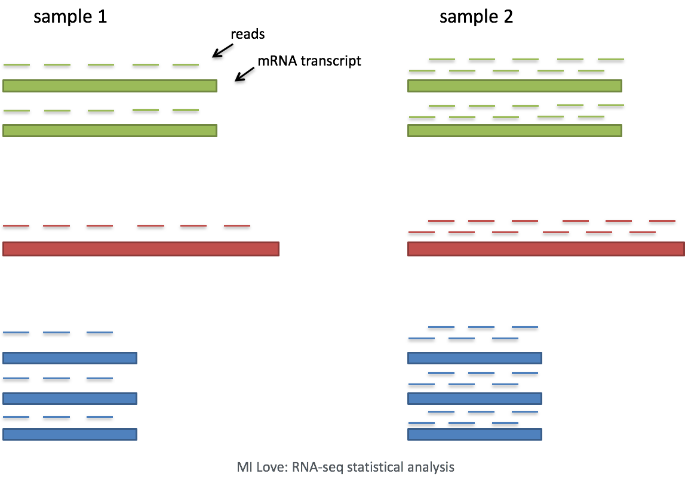
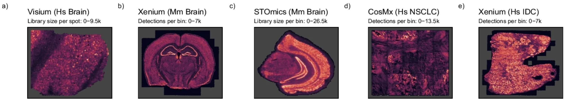
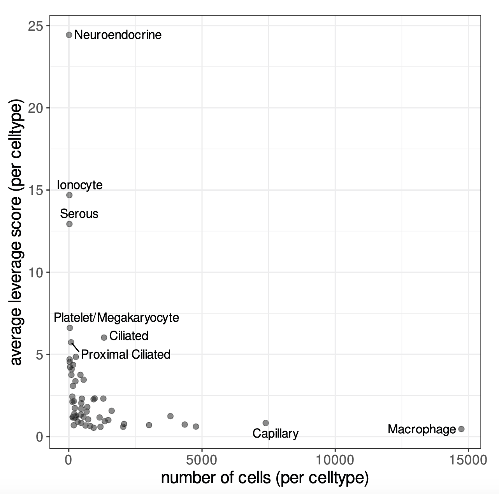

```{r}
#| label: load_libraries_data
#| echo: false
# Load libraries and data
library(Seurat)
library(tidyverse)
library(scales)

seurat_filtered <- qs2::qs_read("intermediate/05_seurat_filtered.qs")
```

Approximate time: XX minutes

## Learning objectives 

In this lesson, we will:

- Discuss why normalizing counts is necessary for accurate comparison between cells
- Identify interesting genes with highly variable gene selection
- Downsample our dataset while retaining the biological complexity

## Overview of lesson

When doing XYZ...

## Normalization

Normalization is the process by which we adjust raw counts to account for technical variation. **Normalization allows us to make fair comparisons of gene expression across different samples, cells, and genes**. The counts are affected by many factors, some of which are "interesting" (e.g. the expression of RNA) and some of which are "uninteresting" (e.g. sequencing depth, technical artifacts). Normalization is the process of adjusting raw count values to account for the "uninteresting" factors.

::: columns
::: column
The most common example of an "uninteresting" factor is **sequencing depth**. This is the total number of reads (UMIs) found in a cell. As seen below, sequencing depth can make it appear as though one cell has higher gene expression than another - simply because it was sequenced more deeply. In this example, each gene appears to have doubled in expression in cell 2, however this is a consequence of cell 2 having twice the sequencing depth. Therefore, we need to normalize the counts to account for differences in sequencing depth across cells.
:::
::: column
::: {#fig-seq_depth .figure}
{width=350}

Effect of sequencing depth on gene expression.<br>
_Image source: [M. Love: RNA-seq data analysis](https://www.bioconductor.org/help/course-materials/2016/CSAMA/lect-06-rnaseq-analysis/rnaseq.pdf)_
::: 
:::
:::


### Normalization in spatial transcriptomics

Based on this information, we may conclude that normalization is always a necessary step. However, [Bhuva et al. (2024)](https://genomebiology.biomedcentral.com/articles/10.1186/s13059-024-03241-7) evaluated several normalization strategies and found that normalizing by the number of transcripts detected per bin can negatively affect spatial domain identification. This is due to the fact that total detection per bin can represent real biology. Thus, normalizing by the number of transcripts detected per bin can mask true biological differences between bins.

We can also see that the depth of transcription also varies across different spatial technologies, and even across different tissues.

::: {#fig-bhuva .figure}
{height=400}

Library size across different spatial technologies for various tissues.<br>
_Image source: [Bhuva et al. (2024)](https://genomebiology.biomedcentral.com/articles/10.1186/s13059-024-03241-7)_
::: 

We are cognizant of this subtlety, but as discussed earlier, it can be challenging to tease apart technical artifact from a biological signal. Without normalization, this lack of signal will strongly affect clustering regardless of the reason. For this reason, we apply a **standard log-transformed library size normalization** to our data.

### Log-normalization steps

Log-normalization is one of the simplest normalization methods for scRNA-seq data. It is a **two-step process** that involves scaling and transformation.

**1. Scaling**

First, we divide each count by the total counts (`nCount_Spatial.008um`) for that cell. Then, we multiply a scaling factor (default is 10,000). Why would we want to do this? Different cells have different amounts of mRNA; this could be due to differences between cell types or variation within the same cell type depending on how well the kit worked in one bin versus another.

Regardless, we are not interested in comparing these absolute counts between cells. Instead we are interested in **comparing concentrations**, and scaling helps achieve this.

**2. Transformation**

The most common transformation is a **log transformation**, which is applied in the original Seurat workflow. Other transformations, such as a square root transform, are less commonly used.

::: {.callout-note collapse=true}
# Complex normalization methods
Various methods have been developed specifically for scRNA-seq normalization. Some simpler methods resemble what we have seen with bulk RNA-seq; the application of global scale factors adjusting for a count-depth relationship that is assumed common across all genes. However, if those assumptions are not true then this basic normalization can lead to over-correction for lowly and moderately expressed genes and, in some cases, under-normalization of highly expressed genes ([Bacher et al. (2017)](https://www.ncbi.nlm.nih.gov/pmc/articles/PMC5473255/)).

One such example is the [SCTransform](https://genomebiology.biomedcentral.com/articles/10.1186/s13059-019-1874-1) method, which models gene expression using a regularized negative binomial regression. This method accounts for technical variation. For more information on this methods, the Introduction to scRNA-seq workshop has a [lesson](https://hbctraining.github.io/Intro-to-scRNAseq/lessons/07_SCT_normalization.html#normalization-and-regressing-out-sources-of-unwanted-variation-using-sctransform) on how apply SCTransform and what is does in detail.
:::

### Perform log-normalization

Now that we are on a new step of our analysis, let us create another script titled `normalization_and_sketch.R` that will contain our normalization and sketching code. This will help us keep our workflow organized and modular.

After loading the necessary libraries, we will load in the `seurat_filtered` object we created in the previous lesson.

```{r}
#| label: set-up_script
#| eval: false
# Normalization and sketch downsampling
# Visium HD spatial transcriptomics workshop
# Author: Harvard Chan Bioinformatics Core
# Created: December 2025

# Load libraries
library(Seurat)
library(tidyverse)
library(scales)

seurat_filtered <- readRDS("data/seurat_filtered.RDS")
```

To avoid making biased comparisons across bins, we will apply a simple normalization with the `NormalizeData()` function. This function performs **log-normalization** by default, but it also has other options for normalization methods.

```{r}
#| label: normalize_data
# Normalize the counts
seurat_sketch <- NormalizeData(seurat_filtered)
seurat_sketch
```

When we examine our Seurat object, `seurat_sketch`, we see that there is a new addition in the layer line that says "data". This is where our log-normalized counts are stored. The original counts are still stored in the `counts` layer, and the `data` layer contains the normalized counts.

## Highly variable genes (HVGs)

Highly variable gene (HVG) selection is a critical step in the analysis of the workflow. We know that not all genes are equally informative. We want to emphasize the effect of genes that are changing across our dataset - rather than giving more weight to genes that remain consistent (less interesting). These genes are oftentimes indicators of biological processes or cell types. Ultimately, we get a list of genes ranked by how much they change across populations.

**Most downstream steps are computed only on these highly variable genes**. Therefore, understanding which genes are highly variable is important for understanding how the results of downstream analyses are computed.

### Calculating HVGs

HVGs are calculated using the `FindVariableFeatures()` function. Some key arguments supplied to this function are:

Table: Arguments for `FindVariableFeatures()` to calculate highly variable genes. {#tbl-hvgs}

| Argument | Description |
|--------------------|----------------------------------------------------|
| selection.method | How to choose top variable features. `vst`: Fits a line to log(variance) vs. log(mean) using loess, standardizes values, and computes variance after clipping (see clip.max). |
| nfeatures | Number of features to select as top variable features; used when selection.method is `dispersion` or `vst` |


```{r}
#| label: find_variable_genes
# Identify the most variable genes
seurat_sketch <- FindVariableFeatures(seurat_sketch, 
                                      selection.method = "vst",
                                      nfeatures = 2000)
seurat_sketch
```

When we examine our Seurat object, we see that `FindVariableFeatures()` has added 2,000 variable features - just as we specified with `nfeatures`. Seurat allows us to access the ranked highly variable genes with the `VariableFeatures()` function. Here we print the top 15:

```{r}
#| label: top_variable_genes
# Identify the 15 most highly variable genes
ranked_variable_genes <- VariableFeatures(seurat_sketch)
top_genes <- ranked_variable_genes[1:15]
top_genes
```

::: callout-tip
# [**Exercise 1**](06_normalization_and_sketch-Answer_key.qmd#exercise-1)

1. Using [GeneCards](https://www.genecards.org/), look up one of the top genes and read more about its role and how it could possible relate to CRC.
2. Visualize one of the top variable genes on the spatial slide with `SpatialFeaturePlot()` to see if expression varies across the image.
:::


## Sketch downsampling

As high-throughput sequencing has evolved, the number cells/bins in a dataset has increased dramatically. This can make it challenging to run calculations on the full dataset, especially for computationally intensive algorithms such as PCA and clustering. To offset these problems, "sketching" methods have been developed to **downsample the dataset while retaining the biological complexity** of the data. This allows us to retain the accuracy of our analyses while reducing the time and resources needed to run calculations.

But how do we know which cells to keep when downsampling? We want to make sure that we are not just keeping the most abundant cell types, but also retaining rare populations that may be biologically important.

::: callout-warning
TODO: explain how leverage score is calculated
:::

::: {#fig-seq_depth .figure}
{width="50%"}

Contrasting the number of cells per cell type against leverage scores, highlighting how rare populations have higher leverage scores.<br>
_Image source: [Hao et al. (2024)](https://www.nature.com/articles/s41587-023-01767-y)_
::: 

A [leverage score](https://dl.acm.org/doi/pdf/10.1145/3019134) is calculated for each bin. This value reflects the magnitude of a bin's contribution to the gene-covariance matrix, and its importance to the overall dataset. From these scores, bins are selected and added to the sketch assay. This sketch-based analyses aims to "subsample" large datasets in a way that preserves rare populations. The authors of Seurat found that rare celltype populations (with fewer cells) have higher leverage scores.

This means that our downsampled cells in the sketch will **oversample rare populations**, retaining the biological complexity of the dataset while drastically compressing the number of cells. 

### Downsampling

For our dataset, we are going to downsample our dataset to 10,000 bins using the `SketchData()` function. The function takes a **normalized** single-cell dataset containing a set of **variable features**. Both of which we have calculated in the previous steps. The function then calculates leverage scores for each bin and selects `ncells` based on these scores to create a new assay called "sketch".

This step may take a few minutes to run.

```{r}
#| label: sketch_data
# Select 10,000 cells based on leverage scores
# Create a new 'sketch' assay
seurat_sketch <- SketchData(object = seurat_sketch,
                            assay = 'Spatial.008um',
                            ncells = 10000,
                            method = "LeverageScore",
                            sketched.assay = "sketch")
```


### Sketch assay

We can see that there are four major changes that have taken place:

- The number of features in the second line has double, because we have added a new assay
- Accordingly, the number of assays has increased from one to two
- The active assay has change from `Spatial.008um` to `sketch`
- There is a new line listing additional assays that exist in the Seurat object

```{r}
seurat_sketch
```

We can also see that the `leverage.score` has been added as a column to the metadata of our object.

```{r}
#| label: leverage_score_meta
#| eval: false
seurat_sketch@meta.data %>% View()
```

```{r}
#| label: tbl-leverage_score
#| tbl-cap: Updated `@meta.data` with `leverage.score` calculated for bin.
#| echo: false
seurat_sketch@meta.data %>% 
  head(5) %>%
  knitr::kable()
```

### Visualizing leverage scores

We would not like to see a strong bias in leverage scores across samples, as this would indicate that we are preferentially keeping bins from one sample over another. 

```{r}
#| label: fig-leverage_score_hist
#| fig-cap: Distribution of leverage scores across samples.
ggplot(seurat_sketch@meta.data) +
  geom_histogram(aes(x=leverage.score, 
                     fill=orig.ident), 
                 alpha=0.5, bins=100) +
  theme_classic() +
  scale_x_log10(labels = scales::label_number())
```

We can also visualize the spatial distribution of leverage scores across the slide to see if we can begin identifying spatial patterns in the data with `SpatialFeaturePlot()`.

```{r}
#| label: fig-leverage_score_spatial
#| fig-cap: Spatial distribution of leverage scores across the slide.
SpatialFeaturePlot(seurat_sketch,
                   "leverage.score",
                   pt.size.factor = 15,
                   image.alpha = 0,
                   max.cutoff = 2)
```


## Save!

Now is a great spot to save our `seurat_sketch` object as we have added a new assay to our Seurat object.

```{r}
#| label: save_seurat
#| eval: false
# Save Seurat object
saveRDS(seurat_sketch, "data/seurat_sketch.RDS")
```

```{r}
#| label: save_seurat_qs
#| eval: false
#| echo: false
# Save Seurat object
qs2::qs_save(seurat_sketch, "intermediate/06_seurat_sketch.qs")
```


***

[Next Lesson >>](07_dim_reduction.qmd)

[Back to Schedule](../schedule/schedule.qmd)