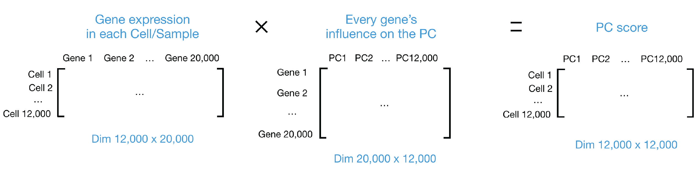
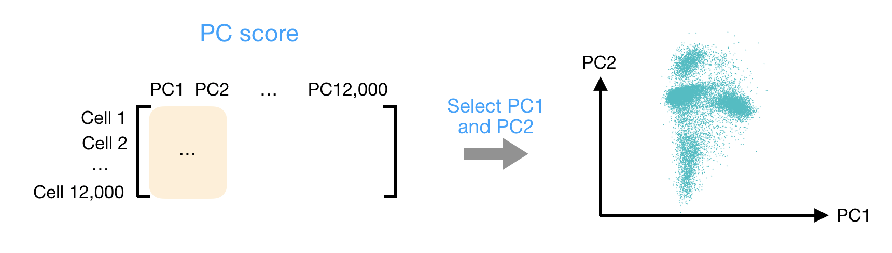

```{r}
#| label: load_libraries_data
#| echo: false
# Load libraries and data
library(Seurat)
library(tidyverse)
set.seed(12345)

seurat_sketch <- qs2::qs_read("intermediate/06_seurat_sketch.qs")
```

Approximate time: XX minutes

## Learning objectives 

In this lesson, we will:

- Follow a standard single-cell RNA-seq workflow on our `sketch` assay
- Identify highly variable genes in the `sketch` assay and compare to the full dataset
- Perform dimensionality reduction using PCA and UMAP on the `sketch` assay

## Overview of lesson

When doing XYZ...

## Single-cell RNA-seq (scRNA-seq) workflow

We will be performing a standard scRNA-seq workflow on our `sketch` assay.
For more explicit details on each one of these steps, we have materials
on how to conduct a [scRNA-seq
analysis](https://hbctraining.github.io/Intro-to-scRNAseq/) from
start to end.

Here we show the overarching steps that are takin in a classical
single-cell analysis.

::: {#fig-sc_workflow .figure}
{width=630}

Single-cell RNA-seq analysis workflow.<br>
_Image source: [Intro to scRNA-seq analysis](https://hbctraining.github.io/Intro-to-scRNAseq/)_.
:::


The broader principles of this workflow remain the same when working
with spatial transcriptomics data. This lesson will cover the following
steps:

1.  `FindVariableFeatures()`: As before, this generates a list of highly
    variable genes, which may be slightly different for the sketched
    dataset than for the full dataset.
2.  `ScaleData()`: Highly variable genes will be confounded with the
    most highly expressed genes, so we need to adjust for this before PCA.
3.  `RunPCA()`: Perform a principal component analysis using our scaled
    data and variable genes. This will emphasize variation in gene
    expression as well as similarity across bins.
4.  `RunUMAP()`: Calculate UMAP coordinates for each bin, which will be used for
    visualization and clustering.

With that being said, there are certain elements that are unique to a
spatial dataset that we will highlight as we go through each of these
steps.

## Variation in the dataset

```{r}
#| label: header
#| eval: false
# Dimensionality reduction (PCA and UMAP)
# Visium HD spatial transcriptomics workshop
# Author: Harvard Chan Bioinformatics Core
# Created: December 2025
library(Seurat)
library(tidyverse)
set.seed(12345)

seurat_sketch <- readRDS("data/seurat_sketch.RDS")
```


### Identify highly variable genes (HVGs)

Recall that when we were working with the entire dataset, we found the
following genes to be the most variable:

```{r}
#| label: top_15_variable_genes_full
# Identify the 15 most highly variable genes
ranked_variable_genes <- VariableFeatures(seurat_sketch, 
                                          assay = "Spatial.008um")
top_genes <- ranked_variable_genes[1:15]
top_genes
```

We are going to run `FindVariableFeatures()` once more, but this time on
our smaller sketch assay of 10,000 bins.

```{r}
#| label: find_variable_features_sketch
# Identify the most variable genes
seurat_processed <- FindVariableFeatures(seurat_sketch, 
                                         selection.method = "vst",
                                         nfeatures = 2000,
                                         assay = "sketch")
seurat_processed
```

::: callout-tip
# [**Exercise 1**](07_dim_reduction-Answer_key.qmd#exercise-1)

1. Do you notice any differences when we calculated HVGs for the entire
dataset versus the sketch assay?

```{r}
#| label: top_15_variable_genes_sketch
# Identify the 15 most highly variable genes
ranked_variable_genes <- VariableFeatures(seurat_processed, 
                                          assay="sketch")
ranked_variable_genes[1:15]
```
:::

### Visualize highly variable genes

We can visualize the dispersion of all genes using Seurat's
`VariableFeaturePlot()`, which shows a gene's average expression across
all cells on the x-axis and variance on the y-axis. Ideally we would see
genes lay across the entire x-axis, as we want to ensure that we are
using genes that are both lowly and highly expressed.

For the visualization, we are adding labels using `LabelPoints()` to
help us better understand which genes are driving the shape of our data.

```{r}
#| label: fig-VariableFeaturePlot
#| fig-cap: Scatterplot of genes variance and average expression, with top 15 variable genes labeled.
# Identify the 15 most highly variable genes
ranked_variable_genes <- VariableFeatures(seurat_processed,
                                          assay = "sketch")
top_genes <- ranked_variable_genes[1:15]

# Plot the average expression and variance of these genes
# With labels to indicate which genes are in the top 15
p <- VariableFeaturePlot(seurat_processed)
LabelPoints(plot = p, points = top_genes, repel = TRUE)
```

Now we are primed to run the next step of the workflow, which is
Principal Component Analysis.

## Principal component analysis (PCA)

PCA is a technique used to emphasize
variation as well as similarity, and to bring out strong patterns in a
dataset; it is one of the methods used for **dimensionality reduction**.

::: {.callout-note collapse="true"}
# Video on how PCA is calculated

For a more **detailed explanation on PCA**, please [look over this
lesson](04_theory_of_PCA.qmd) (adapted from StatQuests/Josh Starmer's
YouTube video). We also strongly encourage you to explore the video
[StatQuest's video](https://www.youtube.com/watch?v=_UVHneBUBW0) for a
more thorough understanding.
:::

Let's say you are working with a single-cell RNA-seq dataset with
_12,000 cells_ and you have quantified the expression of _20,000 genes_.
The schematic below demonstrates how you would go from a cell x gene
matrix to principal component (PC) scores for each individual cell.

::: {#fig-PCA_schematic .figure}
{width=900}

Schematic of PCA: from a cell-by-gene count matrix to principal component scores per cell.
::: 

To perform PCA, we need to first choose the most variable features, then
**scale the data**. Since highly expressed genes exhibit the highest
amount of variation and we don't want our 'highly variable genes' only
to reflect high expression, we need to scale the data to scale variation
with expression level. The Seurat `ScaleData()` function will scale the
data by:

-   Adjusting the expression of each gene to give a mean expression
    across cells to be 0
-   Scaling expression of each gene to give a variance across cells to
    be 1

```{r}
#| label: scale_data
# Scale the log-normalized expression
seurat_processed <- ScaleData(seurat_processed)
seurat_processed
```

We have calculated a new layer titled `scale.data`, where our scaled
log-normalized counts now exist. So now we can proceed in calculating
our Principal Components with `RunPCA()`.

```{r}
#| label: run_pca
# Run PCA
seurat_processed <- RunPCA(seurat_processed,
                           assay = "sketch",
                           reduction.name = "pca.sketch")
```

The information printed out show the top genes that influence a cell's
score for each component. This includes genes that have both a positive
and negative weight.

```{r}
#| label: pca_callout
seurat_processed
```

If we look at our updated `seurat_processed` object, we can see the PCA results have been stored:
`dimensional reduction calculated: pca.sketch`

### Visualize PCA

After the PC scores have been calculated, you are looking at a matrix of
12,000 x 12,000 that represents the information about relative gene
expression in all the cells. You can select the PC1 and PC2 columns and
plot that in a 2D way.

::: {#fig-PCA_scrnaseq_2 .figure}
{width=600}

Example of visualizing cells using the first two principal components (PC1 vs PC2).
:::

```{r}
#| label: fig-PCA_plot
#| fig-cap: PCA plot of PC1 vs PC2 with bins colored by sample.
# Plot PCA
DimPlot(seurat_processed,
        group.by = "orig.ident",
        reduction = "pca.sketch")
```

Ultimately what we have calculated with PCA are values that can represent how similar cells are to one another. We would expect that cells with similar gene expression will have similar PC values. For example, we would anticipate that two Fibroblast cells would have comparable gene expression - which would also results in similar scores in principal components. This is why many of the downstream steps in the remainder of this lesson use PCA as the input.

Also assess the differences in coordinates based on batch variables.

```{r}
#| label: fig-PCA_plot_batch
#| fig-cap: PCA plot of PC1 vs PC2 with bins colored and split by sample.
# Plot PCA, split by sample
DimPlot(seurat_processed,
        pt.size = 2,
        reduction = "pca.sketch",
        group.by = "orig.ident",
        split.by = "orig.ident")
```

### Selecting PC dimensions

To overcome the extensive technical noise in the expression of any single gene for scRNA-seq data, Seurat assigns cells to clusters based on their PCA scores derived from the expression of the integrated most variable genes. Each PC essentially representing a "metagene" that combines information across a correlated gene set. **Determining how many PCs to include in the clustering step is therefore important to ensure that we are capturing the majority of the variation**, or cell types, present in our dataset. 

It is useful to explore the PCs prior to deciding which PCs to include for the downstream clustering analysis.

The **elbow plot** is a helpful way to determine how many PCs to use for clustering so that we are capturing majority of the variation in the data. The elbow plot visualizes the standard deviation of each PC, and we are looking for where the standard deviations begins to plateau. Essentially, **where the elbow appears is usually the threshold for identifying the majority of the variation**. However, this method can be quite subjective. 

Let's draw an elbow plot using the top 50 PCs:

```{r}
#| label: fig-PC_elbow_plot
#| fig-cap: Elbow plot representing the standard deviations of the first 50 principal components.
# Plot the elbow plot
ElbowPlot(object = seurat_processed,
          reduction = "pca.sketch",
          ndims = 50)
```

Based on this plot, we could roughly determine the majority of the variation by where the elbow occurs around PC8 - PC10, or one could argue that it should be when the data points start to get close to the X-axis, PC30 or so. This gives us a very rough idea of the number of PCs needed to be included.

**We will be using 50 PCs for our downstream steps.**

## UMAP

To visualize the cell clusters, there are a few different dimensionality reduction techniques that can be helpful. The most popular methods include [t-distributed stochastic neighbor embedding (t-SNE)](https://kb.10xgenomics.com/hc/en-us/articles/217265066-What-is-t-Distributed-Stochastic-Neighbor-Embedding-t-SNE-) and [Uniform Manifold Approximation and Projection (UMAP)](https://umap-learn.readthedocs.io/en/latest/index.html) techniques. 

Both methods aim to place cells with similar local neighborhoods in high-dimensional space together in low-dimensional space. These methods will require you to input number of PCA dimentions to use for the visualization, we suggest using the same number of PCs as input to the clustering analysis. Here, we will proceed with the [UMAP method](https://umap-learn.readthedocs.io/en/latest/how_umap_works.html) for visualizing the clusters.

```{r}
#| label: run_umap
# Run UMAP
seurat_processed <- RunUMAP(seurat_processed, 
                            reduction = "pca.sketch", 
                            reduction.name = "umap.sketch", 
                            return.model = TRUE, 
                            dims = 1:50,
                            seed.use = 12345)
seurat_processed
```

These UMAP coordinates are now stored in the `dimensional reductions calculated: pca.sketch, umap.sketch`. 

```{r}
#| label: fig-umap_plot
#| fig-cap: UMAP plot with bins colored by sample.
# Plot UMAP
DimPlot(seurat_processed, 
        group.by="orig.ident",
        reduction="umap.sketch")
```

::: callout-tip
# [**Exercise 2**](07_dim_reduction-Answer_key.qmd#exercise-2)
2. Plot the `nCount_Spatial.008um` on the UMAP with `FeaturePlot()`. Do you notice any patterns?
3. Plot the expression of one of the top variable genes on the UMAP also with `FeaturePlot()`. What do you notice?
:::

```{r}
#| label: save_seurat_qs
#| echo: false
#| eval: false
qs2::qs_save(seurat_processed, "intermediate/07_seurat_processed.qs")
```

***

[Next Lesson >>](08_clustering.qmd)

[Back to Schedule](../schedule/schedule.qmd)