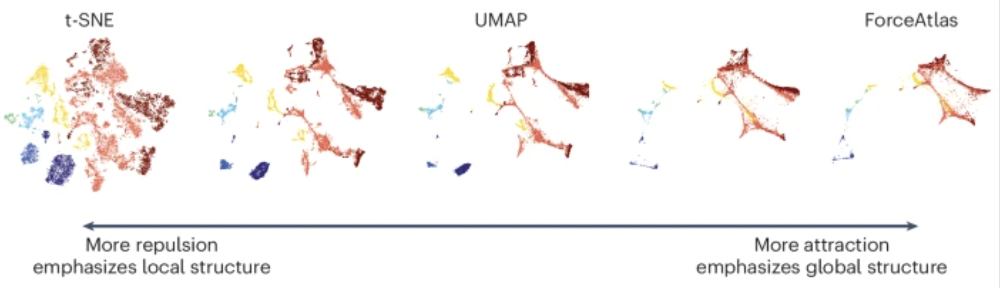
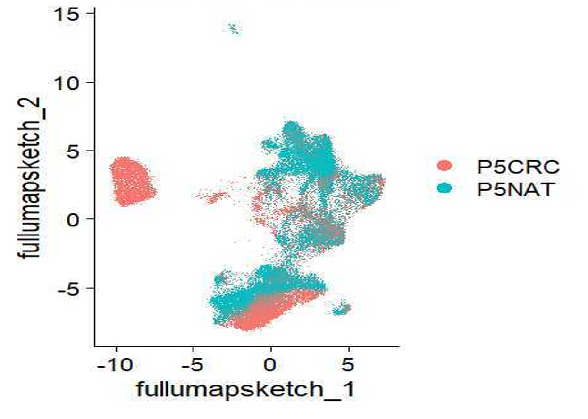

```{r}
#| label: load_libraries_data
#| echo: false
# Load libraries and data
library(Seurat)
library(tidyverse)
set.seed(12345)

seurat_sketch <- qs2::qs_read("intermediate/06_seurat_sketch.qs")
```

Approximate time: 40 minutes

## Learning objectives 

In this lesson, we will:

- Follow a standard single-cell RNA-seq workflow on our `sketch` assay
- Identify highly variable genes in the `sketch` assay and compare to the full dataset
- Perform dimensionality reduction using PCA and UMAP on the `sketch` assay

## Overview of lesson

At this point, we have loaded our dataset after we ran filtration, normalization, and downsampling. Even though we have reduced the number of bins, ultimately we still have thousands of genes to contend with. The goal is to summarize the information across genes to identify bins that are similar to one another in gene-expression space. We will learn how to reduce the number of dimensions (genes) using principal component analysis (PCA) and UMAP. These embeddings become the backbone for clustering, visualization and downstream analyses in future lessons.


## Single-cell RNA-seq (scRNA-seq) workflow

We will be performing a standard scRNA-seq workflow on our `sketch` assay. For more explicit details on each one of these steps, we have materials on how to conduct a [scRNA-seq analysis](https://hbctraining.github.io/Intro-to-scRNAseq/) from start to end.

Here we show the overarching steps that are taken in a classical single-cell analysis.

::: {#fig-sc_workflow .figure}
{width=630}

Single-cell RNA-seq analysis workflow.<br>
_Image source: [Intro to scRNA-seq analysis](https://hbctraining.github.io/Intro-to-scRNAseq/)_.
:::

The broader principles of this workflow remain the same when working with spatial transcriptomics data. This lesson will cover the following steps:

1.  `FindVariableFeatures()`: As before, this generates a list of highly variable genes, which may be slightly different for the sketched dataset than for the full dataset.
2.  `ScaleData()`: Highly variable genes will be confounded with the most highly expressed genes, so we need to adjust for this before PCA.
3.  `RunPCA()`: Perform a principal component analysis using our scaled data and variable genes. This will emphasize variation in gene expression as well as similarity across bins.
4.  `RunUMAP()`: Calculate UMAP coordinates for each bin, which will be used for visualization and clustering.

With that being said, there are certain elements that are unique to a spatial dataset that we will highlight as we go through each of these steps.

## Variation in the dataset

First we will create a new R script called `03_dimensionality_reduction.R` and place it within our `scripts` directory.  We will continue where we left off in the previous lesson and load in the `seurat_sketch` object. With this sketch assay, we need to once again ask which genes are driving the variation in the dataset?

```{r}
#| label: header
#| eval: false
# Dimensionality reduction (PCA + UMAP) and clustering
# Visium HD spatial transcriptomics workshop
# Author: Harvard Chan Bioinformatics Core
# Created: May 2026

# Load libraries
library(Seurat)
library(tidyverse)
set.seed(12345)

seurat_sketch <- readRDS("data/seurat_sketch.RDS")
```

Therefore, the first step of this workflow will be computing the top variable features, but this time for our sketch assay.


### Identify highly variable genes (HVGs)

Recall that when we were working with the entire dataset, we found the following genes to be the most variable:

```{r}
#| label: top_15_variable_genes_full
# Identify the 15 most highly variable genes
ranked_variable_genes <- VariableFeatures(seurat_sketch, 
                                          assay = "Spatial.008um")
top_genes <- ranked_variable_genes[1:15]
top_genes
```

We are going to run `FindVariableFeatures()` once more, but this time on our smaller "sketch" assay of 10,000 bins. Note, in the above code how we are pulling our variable genes from our full dataset using `assay = "Spatial.008um"`, while in the code below we are setting `assay = "sketch"` in order to find variable genes in our "sketch" assay.

```{r}
#| label: find_variable_features_sketch
# Identify the most variable genes
seurat_processed <- FindVariableFeatures(seurat_sketch, 
                                         selection.method = "vst",
                                         nfeatures = 2000,
                                         assay = "sketch")
seurat_processed
```

::: callout-tip
# [**Exercise 1**](07_dim_reduction-Answer_key.qmd#exercise-1)

1. Do you notice any differences when we calculated HVGs for the entire dataset versus the sketch assay?

```{r}
#| label: top_15_variable_genes_sketch
# Identify the 15 most highly variable genes
ranked_variable_genes <- VariableFeatures(seurat_processed, 
                                          assay="sketch")
ranked_variable_genes[1:15]
```
:::

### Visualize highly variable genes

We can visualize the dispersion of all genes using Seurat's `VariableFeaturePlot()`, which shows a gene's average expression across all bins on the x-axis and variance on the y-axis. Ideally, we would see genes lay across the entire x-axis, as we want to ensure that we are using genes that are both lowly and highly expressed. From the y-axis, we see genes with high levels of variance (gene expression changes across populations) near the top. These scores are how we identify what are our **top** variable features.

For the visualization, we are adding labels using `LabelPoints()` to help us better understand which genes are driving the shape of our data.

```{r}
#| label: fig-VariableFeaturePlot
#| fig-cap: Scatterplot of genes variance and average expression, with top 15 variable genes labeled.
# Identify the 15 most highly variable genes
ranked_variable_genes <- VariableFeatures(seurat_processed,
                                          assay = "sketch")
top_genes <- ranked_variable_genes[1:15]

# Plot the average expression and variance of these genes
# With labels to indicate which genes are in the top 15
p <- VariableFeaturePlot(seurat_processed)
LabelPoints(plot = p, points = top_genes, repel = TRUE)
```

We are now primed to run the next step of the workflow, which is the Principal Component Analysis.

## Principal component analysis (PCA)

PCA is a technique used to emphasize variation as well as similarity, and to bring out strong patterns in a dataset; it is one of the methods used for **dimensionality reduction**.

::: {.callout-note collapse="true"}
# Video on how PCA is calculated

For a more **detailed explanation on PCA**, please [look over this lesson](04_theory_of_PCA.qmd) (adapted from StatQuests/Josh Starmer's YouTube video). We also strongly encourage you to explore the video [StatQuest's video](https://www.youtube.com/watch?v=_UVHneBUBW0) for a more thorough understanding.
:::

Let's say you are working with a single-cell RNA-seq dataset with _12,000 cells_ and you have quantified the expression of _20,000 genes_. The schematic below demonstrates how you would go from a cell-by-gene matrix to principal component (PC) scores for each individual cell.

::: {#fig-PCA_schematic .figure}
{width=900}

Schematic of PCA: from a cell-by-gene count matrix to principal component scores per cell.
::: 

To perform PCA, we need to first choose the most variable features, then **scale the data**. Since highly expressed genes exhibit the highest amount of variation and we don't want our 'highly variable genes' only to reflect high expression, we need to scale the data to account for the dependence of variation on expression level. The Seurat `ScaleData()` function will scale the data by:

- Adjusting the expression of each gene to give a mean expression across bins of 0
- Scaling expression of each gene to give a variance across bins of 1

```{r}
#| label: scale_data
# Scale the log-normalized expression
seurat_processed <- ScaleData(seurat_processed)
seurat_processed
```

We have calculated a new layer titled `scale.data`, where our scaled log-normalized counts now exist. So now we can proceed with calculating our Principal Components with `RunPCA()`.

```{r}
#| label: run_pca
# Run PCA
seurat_processed <- RunPCA(seurat_processed,
                           assay = "sketch",
                           reduction.name = "pca.sketch")
```

```{r}
#| label: print_top_pc_genes
#| echo: false
# Examine PCA results 
print(seurat_processed[["pca.sketch"]], 
                        dims = 1:5, 
                        nfeatures = 10)
```

The information printed out shows the top genes that influence a bin's score for each component. This includes genes that have both a positive and negative weight.

```{r}
#| label: pca_callout
seurat_processed
```

If we look at our updated `seurat_processed` object, we can see the PCA results have been stored under `dimensional reduction calculated: pca.sketch`.

### Visualize PCA

After the PC scores have been calculated, you are looking at a matrix of 12,000 x 12,000 that represents the information about relative gene expression in all the bins. You can select the PC1 and PC2 columns and plot that in a 2-dimensional way.

::: {#fig-PCA_scrnaseq_2 .figure}
{width=600}

Example of visualizing cells using the first two principal components (PC1 vs PC2).
:::

```{r}
#| label: fig-PCA_plot
#| fig-cap: PCA plot of PC1 vs PC2 with bins colored by sample.
# Plot PCA
DimPlot(seurat_processed,
        group.by = "orig.ident",
        reduction = "pca.sketch")
```

Ultimately, what we have calculated with PCA are values that can represent how similar bins are to one another. We would expect that bins with similar gene expression will have similar PC values. For example, we would anticipate that two bins from Fibroblast cells would have comparable gene expression, which would also result in similar principal component scores. This is why many of the downstream steps use PCA as the input.

::: {.callout-note collapse="true"}
# Selecting PC dimensions

Each PC essentially represents a "metagene" that combines information across a correlated gene set. **Determining how many PCs to include in the clustering step is therefore important to ensure that we are capturing the majority of the variation**, or cell types, present in our dataset. 

It is useful to explore the PCs prior to deciding which PCs to include for the downstream clustering analysis.

The **elbow plot** is a helpful way to determine how many PCs to use for clustering so that we are capturing the majority of variation in the data. The elbow plot visualizes the standard deviation of each PC, and we are looking for where the standard deviations begin to plateau. Essentially, **where the elbow appears is usually the threshold for identifying the majority of the variation**. However, this method can be quite subjective. 

Let's draw an elbow plot using the top 50 PCs:

```{r}
#| label: fig-PC_elbow_plot
#| fig-cap: Elbow plot representing the standard deviations of the first 50 principal components.
# Plot the elbow plot
ElbowPlot(object = seurat_processed,
          reduction = "pca.sketch",
          ndims = 50)
```

Based on this plot, we could roughly determine the majority of the variation by where the elbow occurs around PC8 - PC10, or one could argue that it should be when the data points start to get close to the X-axis, PC30 or so. This gives us a very rough idea of the number of PCs needed to be included.

A general rule of thumb is to use a **minimum of 30 PCs for an analysis.** This is to adequately represent the majority of the variation in the data.

:::

**We will be using 50 PCs for our downstream steps.**

## UMAP

To visualize the cell clusters, there are a few different [dimensionality reduction techniques](https://www.nature.com/articles/s41598-025-14301-8) that can be helpful. The most popular methods include:

- t-distributed stochastic neighbor embedding: [t-SNE](https://www.nature.com/articles/s41467-019-13056-x)
- Uniform manifold approximation and projection: [UMAP](https://www.scdiscoveries.com/blog/knowledge/what-is-a-umap-plot/)
- Singular value decomposition: [SVD](https://pmc.ncbi.nlm.nih.gov/articles/PMC12753137/)

::: {.callout-note collapse="true"}
# UMAP vs t-SNE vs SVD

Both UMAP and t-SNE are built under the same general structure of taking a larger dimensional space (PCA) and flattening it to two dimensions using manifolds. UMAP has come out on top between the two due its ability to balance both local and global structures of the dataset. Additionally, it is less sensitive to parameter choice, making it easier to tune. In contrast, the output of t-SNE plots tend to emphasize the local neighborhood to the detriment of the global structure of the data.

::: {#fig-umap_vs_tsne .figure}
{width=500}

Schematic of how parameters are tuned for manifold learning algorithms to emphasize either local or global structure.<br>
_Image source: [Marx (2024)](https://www.nature.com/articles/s41592-024-02301-x)_
::: 

SVD is another form of reduction that is best suited for sparse, scATAC-seq datasets.
:::

Each method aims to place bins with similar local neighborhoods in high-dimensional space together in low-dimensional space. These methods will require you to input the number of PCA dimensions to use for the visualization, we suggest using the same number of PCs as input to the clustering analysis. Here, we will proceed with the [UMAP method](https://umap-learn.readthedocs.io/en/latest/how_umap_works.html) for visualizing the clusters.

```{r}
#| label: run_umap
# Run UMAP
seurat_processed <- RunUMAP(seurat_processed, 
                            reduction = "pca.sketch", 
                            reduction.name = "umap.sketch", 
                            return.model = TRUE, 
                            dims = 1:50,
                            seed.use = 12345)
seurat_processed
```

These UMAP coordinates are now stored in the `dimensional reductions calculated: pca.sketch, umap.sketch`. 

```{r}
#| label: fig-umap_plot
#| fig-cap: UMAP plot with bins colored by sample.
# Plot UMAP
DimPlot(seurat_processed, 
        group.by = "orig.ident",
        reduction = "umap.sketch")
```


::: {.callout-note collapse="true"}
# My UMAP plot looks rotated!

As with PCA, the values on the UMAP axes are not meaningful. What actually matters is the **distance and relative arrangement of points** in the UMAP space. Rotations or reflections of the plot do not change these relationships, as the distance will be preserved. This is why many figures omit axis tick labels entirely.

So if you got different UMAP coordinates, that is to be expected as long as the overall structure and patterns are preserved.


::: {#fig-rotated_umap .figure}
{width="50%"}

Possible UMAP rotation of the dataset.
::: 

Many papers discuss the difficulties of interpreting results when plotted on a UMAP. So, while we acknowledge the usefulness of a UMAP plot as a first pass look at the data, we encourage you all to utilize other plots (violin plots, dot plots, bar plots, etc.) to showcase your data in a more quantitative manner.

:::

::: callout-tip
# [**Exercise 2**](07_dim_reduction-Answer_key.qmd#exercise-2)
2. Plot the `nCount_Spatial.008um` on the UMAP with `FeaturePlot()`. Do you notice any patterns?
3. Plot the expression of one of the top variable genes on the UMAP also with `FeaturePlot()`. What do you notice?
:::

As a sanity check that we have our PCA and UMAP values stored in our Seurat object, we can call the `@reduction` slot to preview the information retained.

```{r}
#| label: seurat_reduction
# View dimensionality reduction results
seurat_processed@reductions
```

```{r}
#| label: save_seurat_qs
#| echo: false
#| eval: false
qs2::qs_save(seurat_processed, "intermediate/07_seurat_processed.qs")
```

***

[Next Lesson >>](08_clustering.qmd)

[Back to Schedule](../schedule/schedule.qmd)