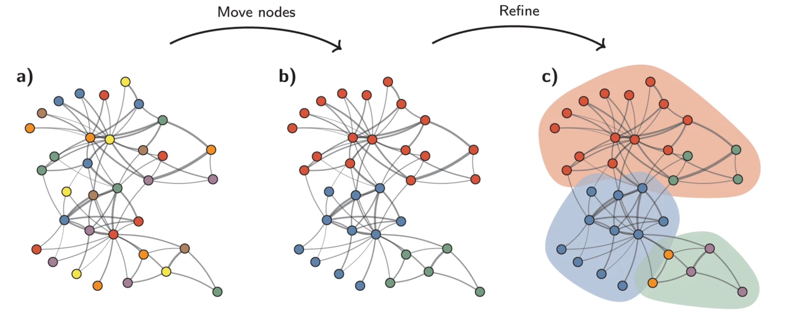

```{r}
#| label: load_libraries_data
#| echo: false
# Load libraries and data
library(Seurat)
library(tidyverse)
set.seed(12345)

seurat_processed <- qs2::qs_read("intermediate/07_seurat_processed.qs")
```

Approximate time: 60 minutes

## Learning objectives 

In this lesson, we will:

- Compute a neighborhood graph to identify similar phenotypes in bins
- Group bins into clusters based upon their gene expression profiles
- Evaluate the quality of clustering against biological knowns

## Overview of lesson

At this point in the analysis, we have successfully calculated PC scores, thus providing meaningful embeddings of our bins. Using these principal component scores, we can now evaluate the similarity of bins through clustering. This is a two-step process where we first calculate k-nearest neighbors to build a graph structure, linking similar bins together. Then, we will utilize the Leiden algorithm to cluster bins into larger groups. These cluster labels will be reused to identify spatial domains and major celltypes in the dataset.


## Grouping similar bins together

Now, we want to group similar bins (cell states) together based upon their gene expression profiles with clustering. This is a two step process that involves:

1. Constructing a K-nearest neighbor (KNN) graph based on the PCA space.
2. Group bins together based upon the KNN graph to assign cluster labels to each bin.

This graph-based approach allows us to partition the graph of bins into highly interconnected ‘quasi-cliques’ or ‘communities’ that represent clusters of similar bins. A nice in-depth description of clustering methods is provided in the [SVI Bioinformatics and Cellular Genomics Lab course](https://biocellgen-public.svi.edu.au/mig_2019_scrnaseq-workshop/clustering-and-cell-annotation.html).

## k-nearest neighbors (kNN)

The first step is to **construct a K-nearest neighbor (KNN) graph**. As previous mentioned, this is calculated on the PCA space. Recall that we have multiple principle components (PCs) with scores for each one of our bins. We can think of the steps taken like so:

1. Each bin is a point in PCA (n-dimensional) space.
2. We calculate the distance (euclidean) between each bin and all other bins in this PCA space.
3. We then connect bins together (edges) that are close to each other in this PCA space. Bins that are close together in PCA space will have similar gene expression profiles, and thus are likely to be similar.
4. Then edge weights are calculated for each connection based upon the shared overlap in their local neighborhoods to create a **shared nearest neighbor (SNN) graph**. 

This means that if two bins are close together in PCA space and have similar neighbors, they will have a stronger connection (higher edge weight) than two bins that are close together but do not share similar neighbors.

::: {#fig-k_means .figure}
{width=500}

Schematic showing how bins are connected in PCA space, where edges connected between close bins are then used to calculate edge weights based upon the shared overlap in their local neighborhoods.<br>
_Image source: [Analysis of Single cell RNA-seq data](https://biocellgen-public.svi.edu.au/mig_2019_scrnaseq-workshop/clustering-and-cell-annotation.html)_.
:::

All of this is done in one step with the Seurat function `FindNeighbors()`. Let's go ahead and make a new script to be used for our clustering, we will call it `04_clustering.R` and place it within our `scripts` directory. We will add this to the header of the script:

```{r}
#| label: header
#| eval: false
# Clustering
# Visium HD spatial transcriptomics workshop
# Author: Harvard Chan Bioinformatics Core
# Created: May 2026

# Load libraries
library(Seurat)
library(tidyverse)

# TODO: Load Seurat object
```

The `FindNeighbors()` function takes in the PCA reduction and calculates the KNN graph. We specify the `reduction` (sketch) as well as which components (`dims`) will be used for the calculation. In this case, we will be using the first 50 PCs.

```{r}
#| label: FindNeighbors
# Determine the K-nearest neighbor graph
seurat_processed <- FindNeighbors(seurat_processed, 
                                  assay = "sketch", 
                                  reduction = "pca.sketch",
                                  dims = 1:50)
```    

We should now see two graphs in the `@graphs` slot of `seurat_processed`. The first in the list is the KNN graph (`sketch_nn`) and the second is the shared nearest neighbor (SNN) graph (`sketch_snn`).

```{r}
#| label: print_seurat_graphs
seurat_processed@graphs
```

We use the SNN graph because it considers both the distance between two bins and the similarity of their local neighborhoods. This leads to more robust and biologically meaningful connections between bins. In contrast, the KNN graph only considers the distance between two bins, which may not capture the full complexity of the global relationships between many bins at once.

 Now that we have this shared nearest neighbor graph, we can begin the clustering step.

## Clustering

The next step in the spatial transcriptomics workflow is to **group bins into clusters based on the neigborhood graph**.

The `FindClusters()` function iteratively groups bins with the goal of optimizing the standard modularity function (a measure of how well a network is partitioned into clusters). Higher modularity values indicate a clearer cluster structure. In other words, we want clusters to be well-separated from one another, yet, internally, tightly knit. By default, `FindClusters()` uses the Louvain algorithm, but we will be setting `algorithm = 4` to [use the Leiden algorithm](https://www.nature.com/articles/s41598-019-41695-z) due to its increased speed and ability to connect communities. 

::: {#fig-leiden .figure}
{width=600}

Schematic showing how bins are connected in neighborhood space, where clusters are iteratively identified following the Leiden algorithm.<br>
_Image source: [Traag et al. (2019)](https://www.nature.com/articles/s41598-019-41695-z)_.
:::

Another key parameter is `resolution`, which controls the **granularity of the clustering** and must be tuned for each experiment. **Higher resolution values produce more clusters**. For a first-pass look at the data, a lower resolution is sufficient to see broad patterns and communities. Typically, we recommend that for datasets on the order of 30,000–50,000 cells/bins, setting a `resolution` between `0.4` and `1.4` typically yields reasonable clustering. So for a much larger dataset, such as this one, we will be setting a low resolution parameter to start.


::: callout-note
# Testing different resolution values
We would typically recommend using a variety of different resolutions and select a resolution that best suits your dataset. However, for the sake of time, we will proceed with a `resolution = 0.65`. We have more [detailed explanations](https://hbctraining.github.io/Intro-to-scRNAseq-Quarto/lessons/10_clustering_cells_SCT.html#find-clusters) of how to test a variety of resolutions at one time.
:::

```{r}
#| label: FindClusters
seurat_processed <- FindClusters(seurat_processed, 
                                 cluster.name = "seurat_cluster.sketched", 
                                 algorithm = 4,
                                 resolution = 0.65,
                                 random.seed = 12345)
```

If we take a look at the columns in our `@meta.data`, we see that a new column, `seurat_cluster.sketched`, was added.

```{r}
#| label: head_meta_data_clusters
#| eval: false
seurat_processed@meta.data %>% 
  head() %>% 
  relocate("seurat_cluster.sketched")
```

```{r}
#| label: tbl-head_meta_data_clusters_kable
#| tbl-cap: Updated `@meta.data` with sketch Leiden clusters. 
#| eval: true
#| echo: false
seurat_processed@meta.data %>% 
  head() %>% 
  relocate("seurat_cluster.sketched") %>%
  knitr::kable()
```

::: callout-tip
# [**Exercise 1**](08_clustering-Answer_key.qmd#exercise-1)

1. When we look at the first few rows of our metadata, it appears that there were many cells that do not have a cluster value. Count how many `NA`'s are found for our `seurat_cluster.sketched` column with `table()` function and use the argument (`useNA = "ifany"`). Why do you think there are so many `NA` values?

:::

The Seurat workflow tends to automatically change the `Idents()` of the Seurat object to the last cluster values that were calculated during `FindClusters()`. If we take a look at our `Idents` we can see if that it has changed from `orig.ident` to `seurat_cluster.sketched`.

```{r}
#| label: idents
Idents(seurat_processed) %>% head()
```

### Visualize clusters on UMAP

We previously [calculated UMAP coordinates](07_dim_reduction.qmd#umap) for our sketch assay and colored the bins by which sample they belonged to. Now, we can visualize the clusters that we just calculated on this UMAP to see how well the clusters are separating.

```{r}
#| label: fig-umap_sketch
#| fig-cap: UMAP scatterplot with bins colored and labeled by sketch Leiden cluster annotation.
# Plot UMAP
p <- DimPlot(seurat_processed, 
        reduction = "umap.sketch", label = T) + 
  ggtitle("Sketched clustering")
LabelClusters(p, id = "ident",  fontface = "bold", size = 5, 
              bg.colour = "white", bg.r = .2, force = 0)
```

We would ideally see **distinct clusters of bins that are well separated from each other**. If we see a lot of overlap between clusters, this may indicate that the clustering is not optimal and we may need to adjust our `resolution` parameter or re-consider our previous steps (QC, filtration, highly variable gene selection, etc.) to improve the clustering.

## Project back to the entire dataset

Recall that we have been calculating all of these steps on our sketched dataset of 10,000 bins. Now, we want to know what the cluster labels are for all of the bins in our full dataset. We can do this with the `ProjectData()` function.

::: callout-warning
TODO: what method is used for ProjectData()
:::

### Run `ProjectData()`

During this projection step, we provide the sketched information we have just calculated:

- `sketched.assay` = sketch assay name (`sketch`)
- `sketched.reduction` = reduction (PCA) calculated on the sketch assay (`pca.sketch`)
- `umap.model` =  UMAP reduction calculated on the sketch assay (`umap.sketch`)

Then, we specify the `assay` with the full dataset that we want to project onto (in this case, the `Spatial.008um` assay). We also specify the `full.reduction` to name the PCA that will have scores for each bin in the full dataset (`full.pca.sketch`) as well as the number of principal components to use (`dims`).

```{r}
#| label: ProjectData
#| eval: false
# Increases the size of the default vector (8GB)
options(future.globals.maxSize = 8000 * 1024^2)

# Project from sketch assay onto entire dataset
seurat_processed <- ProjectData(
  object = seurat_processed,
  sketched.assay = "sketch",
  sketched.reduction = "pca.sketch",
  umap.model = "umap.sketch",
  assay = "Spatial.008um",
  full.reduction = "full.pca.sketch",
  dims = 1:50,
  refdata = list(seurat_cluster.projected = "seurat_cluster.sketched"))
```

```{r}
#| label: load_clustered_obj
#| echo: false
# qs2::qs_save(seurat_processed, "intermediate/08_seurat_projected.qs")
seurat_processed <- qs2::qs_read("intermediate/08_seurat_projected.qs")
```

Using the sketch PCA and UMAP, the `ProjectData` function returns a Seurat object that includes:

| Category                   | Description                                                                                           |
|----------------------------|-------------------------------------------------------------------------------------------------------|
| Dimensional reduction (PCA) | The `full.pca.sketch` reduction extends the PCA from sketched cells to all bins in the dataset        |
| Dimensional reduction (UMAP)| The `full.umap.sketch` reduction extends the UMAP from sketched cells to all bins in the dataset       |
| Cluster labels             | The `seurat_cluster.projected` metadata column labels all cells with cluster labels from sketched cells |


So now when we investigate the `@reductions` slot, we see that we have two new reductions: `full.pca.sketch` and `full.umap.sketch`. 

```{r}
#| label: seurat_processed_callout
seurat_processed@reductions
```

We also now have a `seurat_cluster.projected` column with Leiden cluster labels for every bin.

```{r}
#| label: seurat_processed_metadata
#| eval: false
seurat_processed@meta.data %>% head()
```

```{r}
#| label: tbl-seurat_processed_metadata
#| tbl-cap: Updated `@meta.data` with projected Leiden clusters. 
#| echo: false
seurat_processed@meta.data %>% head() %>% knitr::kable()
```

::: callout-tip
# [**Exercise 2**](08_clustering-Answer_key.qmd#exercise-2)

2. How many bins are in each cluster with the new projected values? Use the `table()` function to count the number of bins in each cluster for each sample. 
:::


### Visualize projected clusters

This is a good point to pause and inspect our datset!

We now have UMAP and cluster labels for every bin in our dataset. Earlier, we visualized the _sketch_ UMAP with the cluster labels and saw separation in groups. Now, we can visualize the _full_ UMAP with the projected cluster labels to ensure that the projection step worked and that the clusters are still well separated in the full dataset.

```{r}
#| label: fig-umap_projected_clusters
#| fig-cap: UMAP scatterplot with bins colored and labeled by projected Leiden cluster annotation.
# Switch to full dataset assay
DefaultAssay(seurat_processed) <- "Spatial.008um"

# Change the idents to the projected cluster assignments
Idents(seurat_processed) <- "seurat_cluster.projected"

# Plot UMAP
p <- DimPlot(seurat_processed, 
        reduction = "full.umap.sketch", label = T) + 
  ggtitle("Projected clustering")
LabelClusters(p, id = "ident",  fontface = "bold", size = 5, 
              bg.colour = "white", bg.r = .2, force = 0)
```

::: {.callout-note collapse="true"}
# My cluster labels are all out of order!
To ensure that our cluster labels are listed in proper numeric order, we are going to make our `seurat_cluster.projected` a factor and set the levels such that the order is correct.

```{r}
#| label: arrange_cluster_levels
# Arrange seurat_cluster.projected so that values are in numeric order
cluster_order <- seurat_processed$seurat_cluster.projected %>%
  unique() %>% as.numeric() %>%
  sort() %>% as.character()
cluster_order
```

```{r}
#| label: factor_cluster_levels
# Factorize seurat_cluster.projected with levels in correct numeric order
seurat_processed$seurat_cluster.projected <- seurat_processed$seurat_cluster.projected %>% 
  factor(levels = cluster_order)

# Print head of seurat_cluster.projected to confirm levels are in correct order
seurat_processed$seurat_cluster.projected %>% head()
```

We should now see the levels in numerical order on our UMAP legend.

```{r}
#| label: fig-umap_numeric
#| fig-cap: UMAP scatterplot with bins colored and labeled by projected Leiden cluster annotation (in numerical order).
# Change the idents to the projected cluster assignments
Idents(seurat_processed) <- "seurat_cluster.projected"

# Plot UMAP
p <- DimPlot(seurat_processed, 
        reduction = "full.umap.sketch", label = T) + 
  ggtitle("Projected clustering")
LabelClusters(p, id = "ident",  fontface = "bold", size = 5, 
              bg.colour = "white", bg.r = .2, force = 0)
```

:::

In a typical single-cell analysis, this would a pause point. However, this is a **spatial transcriptomics** analysis with coordinates associated with each bin. So now we can visualize the clusters superimposed on the tissue image to see how the groups are spatially distributed across the tissue.

This is another litmus test to see if we have generated clusters that are biologically meaningful. For example, if a pathologist were to look at the tissue image, they may be able to identify unique, distinct regions of the tissue. If our clusters are biologically meaningful, we would expect to see that the clusters are spatially separated and correspond to these regions of the tissue (depending on the tissue type and the biological question at hand). 

In order to plot the clusters superimposed on our image we use the `SpatialDimPlot()` function.

```{r}
#| label: fig-spatial_projected_clusters
#| fig-cap: Bins on the tissue slide, colored by projected Leiden cluster annotation.
#| fig-width: 10
SpatialDimPlot(seurat_processed,
               pt.size.factor = 16,
               image.alpha = 0)
```

## Assessing cluster quality

In the ideal scenario, we expect that the clusters should correspond with the celltypes in our dataset at this point. When we began the analysis, we identified the celltypes that we expected to see in the dataset. 

Here, we have taken that information one step further by finding several well characterized marker genes for each celltype:

Table: Marker genes for broad cell types in our dataset. {#tbl-marker_genes}

| Cell type                   | Marker genes                                             |
|-----------------------------|------------------------------------------------------------|
| B cells                     | IGKC, IGHM, CD79A, MS4A1, MZB1                             |
| Endothelial cells           | PECAM1, VWF, PLVAP, ENG, KLF2                              |
| Fibroblasts                 | COL1A1, COL3A1, DCN, LUM, COL6A2                           |
| Intestinal epithelial cells | CLCA1, FCGBP, MUC2, PIGR, ZG16                             |
| Myeloid cells               | C1QC, SELENOP, SPP1, LYZ, CD68                             |
| Neural cells                | NRXN1, L1CAM, NCAM1, VIP, CALB2                            |
| Smooth muscle cells         | TAGLN, ACTA2, MYH11, MYL9, CNN1                            |
| T cells                     | TRAC, CD3E, TRBC2, IL7R, CD52                              |
| Tumor cells                 | CEACAM6, CEACAM5, EPCAM, KRT8, LCN2                        |

So now, for example, we can see how the marker genes for Endothelial cells appear in our `seurat_cluster.projected`:

```{r}
#| label: fig-vln_endothelial_marker
#| fig-cap: Violin plots of `PECAM1` and `VWF` for each cluster to potentially identify populations of Endothelial cells.
VlnPlot(seurat_processed,
        features = c("PECAM1", "VWF"),
        pt.size = 0.1,
        ncol = 1) +
  NoLegend()
```

We can see that there is an uptick of expression of both genes in cluster 8, which is an indication that cluster 8 is likely comprised of Endothelial cells. Because we know these celltype markers, we are able to more concretely tell how well the clustering and QC of our dataset is going. This is why we strongly encourage everyone to go into a single-cell study with a general concept of the broad, expected celltypes and marker genes associated with them to save time down the line.

::: callout-tip
# [**Exercise 3**](08_clustering-Answer_key.qmd#exercise-3)

3. Use the `DotPlot()` function in conjunction with `marker_list` to see if clusters correspond well with celltypes.

```{r}
#| label: marker_list
marker_list <- list(
  "B cells" = c("IGKC", "IGHM", "CD79A", "MS4A1", "MZB1"),
  "Endothelial cells" = c("PECAM1", "VWF", "PLVAP", "ENG", "KLF2"),
  "Fibroblasts" = c("COL1A1", "COL3A1", "DCN", "LUM", "COL6A2"),
  "Intestinal epithelial cells" = c("CLCA1", "FCGBP", "MUC2", "PIGR", "ZG16"),
  "Myeloid cells" = c("C1QC", "SELENOP", "SPP1", "LYZ", "CD68"),
  "Neural cells" = c("NRXN1", "L1CAM", "NCAM1", "VIP", "CALB2"),
  "Smooth muscle cells" = c("TAGLN", "ACTA2", "MYH11", "MYL9", "CNN1"),
  "T cells" = c("TRAC", "CD3E", "TRBC2", "IL7R", "CD52"),
  "Tumor cells" = c("CEACAM6", "CEACAM5", "EPCAM", "KRT8", "LCN2")
)
```

4. Roughly identify which clusters correspond to which celltypes to provide better context for future analyses.

:::

## Save!

Now is a great spot to save our `seurat_processed` object as we have added a lot new information into our Seurat object, including:

- Sketch HVGs
- Scaled log-normalized counts
- PCA
- k-Nearest neighbors
- Clusters
- UMAP
- Projected clusters

```{r}
#| label: save_seurat_processed
#| eval: false
# Save Seurat object
saveRDS(seurat_processed, "data/seurat_processed.RDS")
```

```{r}
#| label: qsave_seurat_processed
#| eval: false
#| echo: false
qs2::qs_save(seurat_processed, "intermediate/08_seurat_processed.qs")
```

***

[Next Lesson >>](09_integration.qmd)

[Back to Schedule](../schedule/schedule.qmd)