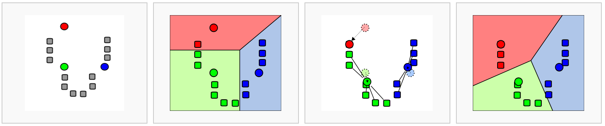

```{r}
#| label: load_libraries_data
#| echo: false
# Load libraries and data
library(Seurat)
library(tidyverse)
seurat_processed <- qs::qread("intermediate/07_seurat_processed.qs")
```

Approximate time: XX minutes

## Learning objectives 

In this lesson, we will:

- Learning Objective 1
- Learning Objective 2
- Learning Objective 3

## Overview of lesson

When doing XYZ...

## Grouping similar bins together

Seurat uses a graph-based clustering approach using a K-nearest neighbor approach, and then attempts to partition this graph into highly interconnected ‘quasi-cliques’ or ‘communities’ [[Seurat - Guided Clustering Tutorial](https://satijalab.org/seurat/v3.1/pbmc3k_tutorial.html)]. A nice in-depth description of clustering methods is provided in the [SVI Bioinformatics and Cellular Genomics Lab course](https://biocellgen-public.svi.edu.au/mig_2019_scrnaseq-workshop/clustering-and-cell-annotation.html).


## k-nearest neighbors (kNN)

The first step is to **construct a K-nearest neighbor (KNN) graph** based on the euclidean distance in PCA space. 


_Image source: [Analysis of Single cell RNA-seq data](https://biocellgen-public.svi.edu.au/mig_2019_scrnaseq-workshop/clustering-and-cell-annotation.html)_
  
- Edges are drawn between cells with similar features expression patterns.
- Edge weights are refined between any two cells based on shared overlap in their local neighborhoods.

This is done in Seurat by using the `FindNeighbors()` function. We also specify the `reduction` we want to use as well as which components (`dims`) will be used for the calculation. In this case, we will be using the first 50.

```{r}
#| label: FindNeighbors
# Determine the K-nearest neighbor graph
seurat_processed <- FindNeighbors(seurat_processed, 
                                  assay = "sketch", 
                                  reduction = "pca.sketch",
                                  dims = 1:50)
```    

We should now see both of these graphs in the `@graph` slot of our seurat object.


```{r}
seurat_processed@graphs
```

## Clustering

Next, Seurat will **iteratively group cells together with the goal of optimizing the standard modularity function**. 

We will use the `FindClusters()` function to perform the graph-based clustering. The `resolution` is an important argument that sets the "granularity" of the downstream clustering and will need to be optimized for every individual experiment.  For datasets of 3,000 - 5,000 cells, the `resolution` set between `0.4`-`1.4` generally yields good clustering. Increased resolution values lead to a greater number of clusters, which is often required for larger datasets. 

The `FindClusters()` function allows us to enter a series of resolutions and will calculate the "granularity" of the clustering. This is very helpful for testing which resolution works for moving forward without having to run the function for each resolution.

::: callout-note
# Testing different resolution values
Typically we would recommend using a variety of different resolutions and select a resolution that best suits your dataset. However, for the sake of time, we will proceed with a `resolution = 0.65`. We have more [detailed explanations](https://hbctraining.github.io/Intro-to-scRNAseq-Quarto/lessons/10_clustering_cells_SCT.html#find-clusters) of how to test a variety of resolutions at one time.
:::

```{r}
seurat_processed <- FindClusters(seurat_processed, 
                                 cluster.name = "seurat_cluster.sketched", 
                                 resolution = 0.65)
```

If we take a look at the columns in our `@meta.data`, we see that the column `seurat_cluster.sketched` is a new column that was added.

```{r}
seurat_processed@meta.data %>% head() %>% 
  relocate("seurat_cluster.sketched")
```

::: callout-tip
# [**Exercise 1**](08_clustering-Answer_key.qmd#exercise-1)

1. When we looked at the first few rows of our metadata, it appeared that there were many cells that do not have a cluster value. Count how many `NA`'s are found for our cluster with `table()` function and use the argument (`useNA = "ifany"`). Why do you think there are so many `NA` values?

:::

`FindClusters()` tends to automatically change the `Idents()` to the cluster values that were just calculated. If we take a look at our `Idents` we can see if that it has changed from `orig.ident` to `seurat_cluster.sketched`

```{r}
Idents(seurat_processed) %>% head()
```

### Visualize clusters on UMAP

Now we can visualize these clusters on the UMAP that we calculated earlier using `DimPlot() and adding clearer labels with `LabelClusters()`.

```{r}
# Plot UMAP
p <- DimPlot(seurat_processed, 
        reduction = "umap.sketch", label = T) + 
  ggtitle("Sketched clustering")
LabelClusters(p, id = "ident",  fontface = "bold", size = 5, 
              bg.colour = "white", bg.r = .2, force = 0)
```

## Project Back to Entire Dataset

Now that we have our clusters and dimensional reductions from our sketched dataset, we need to extend these to the full dataset.

### Run `ProjectData()`

The `ProjectData` function projects all the bins in the dataset (the `Spatial.008um` assay) onto the `sketch` assay. 

```{r}
#| eval: false
# Increases the size of the default vector
options(future.globals.maxSize= 2000000000)

seurat_processed <- ProjectData(
  object = seurat_processed,
  assay = "Spatial.008um",
  full.reduction = "full.pca.sketch",
  sketched.assay = "sketch",
  sketched.reduction = "pca.sketch",
  umap.model = "umap.sketch",
  dims = 1:50,
  refdata = list(seurat_cluster.projected = "seurat_cluster.sketched"))
```

```{r}
#| echo: false
# qs::qsave(seurat_processed, "intermediate/08_seurat_projected.qs")
seurat_processed <- qs::qread("intermediate/08_seurat_projected.qs")
```

Using the sketch PCA and UMAP, the `ProjectData` function returns a Seurat object that includes:

| Category                   | Description                                                                                           |
|----------------------------|-------------------------------------------------------------------------------------------------------|
| Dimensional reduction (PCA) | The `full.pca.sketch` reduction extends the PCA from sketched cells to all bins in the dataset        |
| Dimensional reduction (UMAP)| The `full.umap.sketch` reduction extends the UMAP from sketched cells to all bins in the dataset       |
| Cluster labels             | The `seurat_cluster.projected` metadata column labels all cells with cluster labels from sketched cells |


We can now see the additional full-dataset reductions in the object.

```{r}
seurat_processed
```

Note that a score for the projection of each bin will be saved as a column in the metadata. Now the `seurat_cluster.projected` column shows values for every bin.

```{r}
head(seurat_processed@meta.data)
```

### Visualize Projected Clusters

We can now visualize our clusters from the projected assignments. The UMAP plot now contains more points, which is expected because we are now visualizing the full dataset rather than our 10,000 bin sketch. Nonetheless, we can see that the full dataset is still well-represented by the projected dimensional reduction and clustering. 

```{r}
# switch to full dataset assay
DefaultAssay(seurat_processed) <- "Spatial.008um"

# Change the idents to the projected cluster assignments
Idents(seurat_processed) <- "seurat_cluster.projected"

# Plot UMAP
p <- DimPlot(seurat_processed, 
        reduction = "full.umap.sketch", label = T) + 
  ggtitle("Projected clustering")
LabelClusters(p, id = "ident",  fontface = "bold", size = 5, 
              bg.colour = "white", bg.r = .2, force = 0)
```

::: callout-note
# My cluster labels are all out of order!
To ensure that our cluster labels are listed in proper numeric order, we are going to make our `seurat_cluster.projected` a factor and set the levels such that the order is correct.

```{r}
# Arrange so clusters get listed in numerical order
order <- seurat_processed$seurat_cluster.projected %>%
  unique() %>%
  as.numeric() %>%
  sort() %>%
  as.character()
seurat_processed$seurat_cluster.projected <- seurat_processed$seurat_cluster.projected %>% 
  factor(levels = order)

seurat_processed$seurat_cluster.projected %>% head()
```

Now we should see the levels in correct numeric order.

```{r}
# Change the idents to the projected cluster assignments
Idents(seurat_processed) <- "seurat_cluster.projected"

# Plot UMAP
p <- DimPlot(seurat_processed, 
        reduction = "full.umap.sketch", label = T) + 
  ggtitle("Projected clustering")
LabelClusters(p, id = "ident",  fontface = "bold", size = 5, 
              bg.colour = "white", bg.r = .2, force = 0)
```

:::

In order to see the clusters superimposed on our image we can use the `SpatialDimPlot()` function. We will also set the color palette and convert the cluster assignments to a factor so they are ordered numerically rather than lexicographically in the figure.

```{r}
#| fig-width: 10
SpatialDimPlot(seurat_processed,
               pt.size.factor = 16,
               image.alpha = 0)
```

## Save!

Now is a great spot to save our `seurat_processed` object as we have added a lot new information into our Seurat object, such as:

- Sketch HVGs
- Scaled log-normalized counts
- PCA
- k-Nearest neighbors
- Clusters
- UMAP
- Projected clusters

```{r}
#| eval: false
# Save Seurat object
saveRDS(seurat_processed, "data/seurat_processed.RDS")
```

```{r}
#| eval: false
#| echo: false
qs::qsave(seurat_processed, "intermediate/08_seurat_processed.qs")
```

***

[Next Lesson >>](tmp.qmd)

[Back to Schedule](../schedule/schedule.qmd)