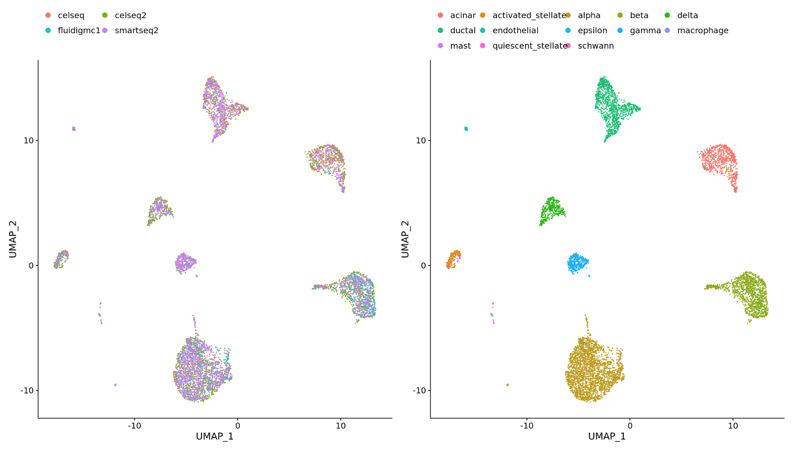
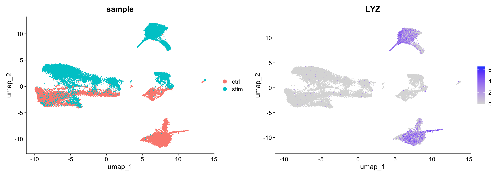
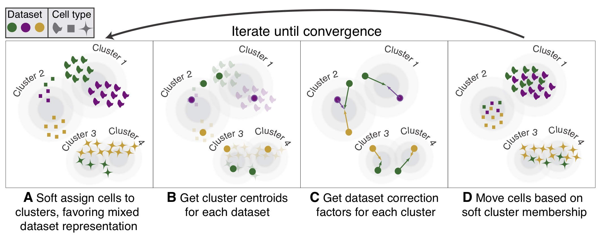
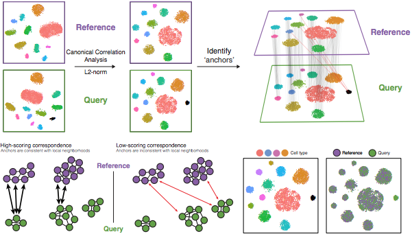

```{r}
#| label: load_libraries_data
#| echo: false
# Load libraries and data
library(Seurat)
library(tidyverse)
seurat_processed <- qs2::qs_read("intermediate/08_seurat_processed.qs")
```

Approximate time: 70 minutes

## Learning objectives 

In this lesson, we will:

- Identify when integration is necessary
- Evaluate potential batch effects in our dataset
- Describe common integration algorithms

## Overview of lesson

When working with multiple samples, integration may **sometimes** be a necessary step. When there is a clear bias due to batch effect (date sequenced, replicate, etc.), it can be difficult to identify what is true biology and what is technical artifacts. Integration is a tool meant to align multiple datasets together. However, integration is **not always necessary**. The key is to assess the biology of your samples to evaluate whether integration is a necessary step for your analysis.

## What is integration?

Integration is the process by which uninteresting batch variables (date sequenced, kit used, platform, etc.) are accounted for to improve clustering of similar bins. The most common instance of this is when multiple samples, sequenced separately, are used for a single analysis. The aim is to **align the datasets** such that similar bins (cell states) are clustered together.

::: {#fig-batch_effect .figure}
{width="60%"}

Example of integrating multiple scRNA-seq datasets generated with different library preparation methods.
::: 

**Why is it important that cells of the same cell type cluster together?** 

We want to identify **cell types which are present in all samples/conditions/modalities** within our dataset, and therefore would like to observe a representation of cells from both samples/conditions/modalities in every cluster. This will enable more interpretable results downstream (i.e. DE analysis, ligand-receptor analysis, differential abundance analysis, etc.).


## To integrate or not to integrate

But how do you know when you should integrate?

We recommend that you always first look at your clustering **without integration** before running any integration methods. This will allow you to identify if there are any batch effects present in your data, and if so, what is driving the batch effect.

For example, if we have two samples that are sequenced separately, we may see a clear split in PCA and UMAP by sample. This is an example of a batch effect, where the technical batch variable (sample) is driving the clustering instead of the biological variable (cell type). Below we see such an example, where we can see that the monocytes (`LYZ` is a marker gene for monocytes) are clustering separately by sample instead of together as one cluster.

::: {#fig-batch_effect_lyz .figure}


Example of how multiple samples can cause a batch effect, where the samples cluster separately instead of by cell type.<br>
_Image source: [Introduction to scRNA-seq](https://hbctraining.github.io/Intro-to-scRNAseq/lessons/08_integration_cca_theory.html)_
::: 

**Do not just always perform integration because you think there might be differences - explore the data.** Condition-specific clustering of the cells would indicate that we need to integrate the cells across conditions to ensure that cells of the same cell type cluster together.

### Exploring our data

At this point we have not run any integration on our dataset, so we can look at the PCA and UMAP to see if there are any batch effects present in our data. Let's create a new R script called `04_integration.R` and place it within our `scripts` directory.

```{r}
#| label: header
#| eval: false
# Integration
# Visium HD spatial transcriptomics workshop
# Author: Harvard Chan Bioinformatics Core
# Created: May 2026
library(Seurat)
library(tidyverse)

seurat_processed <- readRDS("data/seurat_processed.RDS")
```

In our case, we have only one batch condition, which is our samples, `P5CRC` and `P5NAT`. So we can now use the `DimPlot()` function to visualize the PCA and UMAP colored by sample.

```{r}
#| label: fig-pca_umap_by_sample
#| fig-cap: PCA and UMAP colored by sample.
#| fig-width: 10
p1 <- DimPlot(seurat_processed,
              group.by="orig.ident",
              reduction = "full.pca.sketch") +
  NoLegend() + ggtitle("PCA (Projected)")

p2 <- DimPlot(seurat_processed,
              group.by="orig.ident",
              reduction = "full.umap.sketch") +
  ggtitle("UMAP (Projected)")

p1 | p2
```

:::{.callout-tip}
# [**Exercise 1**](09_integration-Answer_key.qmd#exercise-1)
1. Do you see a clear split based on sample in the UMAP and PCA? What could this indicate about the presence of batch effects in our data?
:::

### Distribution of sample per cluster

When we look at the dimensionality reduction plots, we can see that there does appear to be a distinct population of bins that belong to `P5CRC`. Before making any assumptions about the presence of batch effects, we need to investigate this further.

::: callout-note
# Visualize with plots other than UMAP
When working with single-cell data, it may be tempting to make justifications based upon the UMAP visualizations. However, we would encourage you to make use of other visualizations. Barplots, violin plots, boxplots, dotplots and heatmaps are all useful visualizations to confirm your observations from a UMAP in a more quantitative manner.
:::

So here we can make a barplot of the proportion of bins in each cluster by sample to see if there are any clusters that are dominated by one sample.

```{r}
#| label: fig-cell_proportion_barplot
#| fig-cap: Proportion of bins in each cluster by sample.
# Barplot of proportion of cells in each cluster by sample
ggplot(seurat_processed@meta.data) +
    geom_bar(aes(x = seurat_cluster.projected, 
                 fill = orig.ident), 
             position = position_fill())  +
    theme_classic()
```

Notably, we see that that clusters 1 and 11 contain almost exclusively `P5CRC` bins. So let us zoom in on these bins to see if there is a biological explanation for this observation, or if it is a technical artifact that we need to correct for with integration.

::: {.callout-note collapse=true}
# Zoom in on clusters of interest with `DimPlot()` functions

First, we will identify which bins belong to clusters 1 and 11 with the `WhichCells()` function. We will supply that output to the `cells.highlight` argument in `DimPlot()` to highlight these bins on the UMAP.

```{r}
#| label: fig-highlight_clusters
#| fig-cap: Highlight clusters 1 and 11 on the UMAP.
Idents(seurat_processed) <- "seurat_cluster.projected"
p <- DimPlot(seurat_processed,
             cells.highlight = WhichCells(seurat_processed, 
                                          idents = c("1", "11"))) +
  ggtitle("Clusters 1 and 11")
LabelClusters(p, id = "ident",  fontface = "bold", size = 5, 
              bg.colour = "white", bg.r = .2, force = 0)
```

Now bins that have the label of cluster 1 or 11 are colored red while the rest are gray in the UMAP.

We can similarly highlight these bins on the slide as well:

```{r}
#| label: fig-spatial_highlight_clusters
#| fig-cap: Highlight clusters 1 and 11 on the tissue.
#| fig-width: 10
SpatialDimPlot(seurat_processed,
               pt.size.factor = 16,
               image.alpha = 0.2,
               cells.highlight = WhichCells(seurat_processed, 
                                            idents = c("1", "11")))
```

:::

## Possible explanations for batch

Recall that when we first loaded the dataset, we identified the broad cell types that we expected to see in our dataset. Here, we summarize this information once again to help us identify if there is a biological explanation for the presence of these clusters that are dominated by `P5CRC` bins.

Table: Marker genes for broad cell types in our dataset. {#tbl-marker_genes}

| Cell type                   | Marker genes                                             |
|-----------------------------|------------------------------------------------------------|
| B cells                     | IGKC, IGHM, CD79A, MS4A1, MZB1                             |
| Endothelial cells           | PECAM1, VWF, PLVAP, ENG, KLF2                              |
| Fibroblasts                 | COL1A1, COL3A1, DCN, LUM, COL6A2                           |
| Intestinal epithelial cells | CLCA1, FCGBP, MUC2, PIGR, ZG16                             |
| Myeloid cells               | C1QC, SELENOP, SPP1, LYZ, CD68                             |
| Neural cells                | NRXN1, L1CAM, NCAM1, VIP, CALB2                            |
| Smooth muscle cells         | TAGLN, ACTA2, MYH11, MYL9, CNN1                            |
| T cells                     | TRAC, CD3E, TRBC2, IL7R, CD52                              |
| Tumor cells                 | CEACAM6, CEACAM5, EPCAM, KRT8, LCN2                        |


:::{.callout-tip}
# [**Exercise 2**](09_integration-Answer_key.qmd#exercise-2)
2. Is there a biological reason we see clusters that are dominated by `P5CRC` bins? What cell type do you think these clusters may represent?
:::

### Assessing tumor marker genes

Our dataset contains two samples, `P5CRC` and `P5NAT`, which are colorectal cancer (CRC) and normal adjacent tissue (NAT) samples, respectively. Therefore, it makes sense that we may see a population of tumor cells in the `P5CRC` sample that is not present in the other sample. To confirm that the clusters that are dominated by `P5CRC` bins are indeed tumor cells, we can look at the expression of tumor marker genes in clusters 1 and 11.

We are going to use `VlnPlot()` and `FeaturePlot()` to visualize which clusters have higher expression of `CEACAM5` and `CEACAM6`, which are known tumor marker genes in colorectal cancer. 

::: {.panel-tabset}

### CEACAM5

```{r}
#| label: fig-ceacam5
#| fig-cap: CEACAM5 expression shown as a violin plot per cluster as well as on the UMAP embedding.
#| fig-width: 10
p_feature <- FeaturePlot(seurat_processed, 
                         features = "CEACAM5",
                         label = TRUE)

p_vln <- VlnPlot(seurat_processed, 
                 features = "CEACAM5", 
                 pt.size = 0) +
  NoLegend()

p_feature | p_vln
```

### CEACAM6

```{r}
#| label: fig-ceacam6
#| fig-cap: CEACAM6 expression shown as a violin plot per cluster as well as on the UMAP embedding.
#| fig-width: 10
p_feature <- FeaturePlot(seurat_processed, 
                         features = "CEACAM6",
                         label = TRUE)

p_vln <- VlnPlot(seurat_processed, 
                 features = "CEACAM6", 
                 pt.size = 0) +
  NoLegend()

p_feature | p_vln
```

:::

**We see that cluster 1 does indeed have higher expression of the tumor marker genes!**

When annotating cell types, using multiple genes is recommended to give you more confidence in your annotations. We can also make use of the `DotPlot()` function to visualize the expression of both `CEACAM5` and `CEACAM6` at the same time across all clusters. Here, the size of a dot represents the percentage of cells in a cluster that express the gene and the color of the dot represents the average expression of the gene in that cluster.  

```{r}
#| label: dotplot
DotPlot(seurat_processed, 
        features = c("CEACAM5", "CEACAM6"))
```

From this, we have the additional knowledge that there are likely tumor cells among cluster 7 (and some more in 3 and 5). We can also see that there is high (darker purple) expression of these genes in cluster 11 - which we previously identified as a cluster comprised primarily of `P5CRC`.

## Final integration decision

Clusters 1 and 11 are dominated by `P5CRC` bins and have higher expression of tumor marker genes. Therefore, it is likely that these clusters represent tumor cells that are present in the `P5CRC` sample but not in the `P5NAT` sample. 

So the lack of overlap in samples/batch has a biological answer! We would not want to integrate the dataset across samples because we would be trying to force the tumor cells to cluster together with other cell types. However, that is not the biological reality of our dataset, and therefore not in the best interest of our analysis.

## Integration algorithms

In this spatial transcriptomics workflow, integration would be performed on the sketch dataset, which we would then project back to the full dataset. While we may not be running integration on this dataset, here we will describe a few of the most commonly used algorithms for integration in single-cell data analysis. 

::: {.panel-tabset}

### Harmony

[Harmony](https://www.nature.com/articles/s41592-019-0619-0) was developed in 2019 and is an example of **a tool that can handle complex integration tasks**. From [benchmarking studies](https://genomebiology.biomedcentral.com/articles/10.1186/s13059-019-1850-9), it has been shown to perform well for single-cell datasets at integrating datasets with strong batch effects. `Harmony` applies a series of iterative corrections to our PCA space. 

::: {#fig-harmony-overview .figure}
{width=800}

Overview of the Harmony algorithm for batch correction and integration of single-cell datasets.<br>
_Image Source: [Korsunsky et al. (2019)](https://www.nature.com/articles/s41592-019-0619-0)_
:::

The following steps are taken:

1. k-means clustering to identify clusters in PCA space.
2. Calculate a "diversity" score for each cluster, reflecting if it contains a balanced amounts of cells from each of the batches (donor, condition, tissue, technology, etc.)
3. `Harmony` determines how much a cell's batch identity impacts its PC coordinates and applies a correction to "shift" the cell towards the centroid of the cluster it belongs to.
4. Cells are projected again using these corrected PCs and the process is repeated iteratively until convergence. 


`Harmony` notably presents the following advantages ([Korsunsky et al. 2019](https://www.nature.com/articles/s41592-019-0619-0), [Tran et al. (2020)](https://genomebiology.biomedcentral.com/articles/10.1186/s13059-019-1850-9)): 

- Possibility to integrate data across several variables (for example, by experimental batch and by condition)
- Significant gain in speed and lower memory requirements for integration of large datasets
- Interoperability with the `Seurat` workflow

`Harmony` is available within the Seurat workflow with the `RunHarmony()` function, but is also a stand-alone package. For a more detailed breakdown of the `Harmony` algorithm, we recommend checking [this advanced vignette](https://htmlpreview.github.io/?https://github.com/immunogenomics/harmony/blob/master/doc/detailedWalkthrough.html) from the package developers.


### CCA

Integration is a powerful method that **uses shared highly variable genes from each group to identify shared subpopulations across conditions or datasets** ([Stuart and Bulter et al., 2018](https://www.biorxiv.org/content/early/2018/11/02/460147)). The goal of integration is to ensure that the cell types of one condition/dataset align with the same cell types of the other conditions/datasets (e.g. P5CRC intestinal epithelial cells align with P5NAT intestinal epithelial cells).

The integration method that is available in the Seurat package utilizes the **canonical correlation analysis** (CCA); a method that expects "correspondences" or shared biological states among at least a subset of single cells across the groups. The result of this integration approach is a corrected data matrix for all datasets, enabling them to be analyzed jointly in a single workflow. To transfer information from a reference to query dataset, Seurat **does not modify the underlying expression data, but instead projects continuous data across experiments**.

The steps in the `Seurat` integration workflow are outlined in the figure below:

::: {#fig-integration-workflow .figure}


Overview of the Seurat integration workflow using canonical correlation analysis (CCA) and anchors.<br>
_Image Source: [Stuart & Butler et al., 2018](https://doi.org/10.1101/460147)_
:::


**1. Identify shared variable genes**:

Integration aims to take the matrix for each dataset (P5CRC and P5NAT) and identify correlated structures across them and align them in a common space. The **shared highly variable genes from each dataset are used to form the intersection set**, because they are the most likely to represent those genes distinguishing the different cell types present.

_Each dataset can have a different number of cells, but must have the same number of genes._


**2. Perform canonical correlation analysis (CCA):**
	
Next, Seurat will jointly reduce the dimensionality of both datasets using diagonalized canonical correlation analysis (CCA) which is a form of PCA. Similar to principal components in PCA, the CCA will result in canonical correlation vectors. An L2-normalization is applied to the canonical correlation vectors, to use as input for the next step (identifying MNNs).


**3. Find mutual nearest neighbors (MNNs) or anchors:**

In this new shared low-dimensional space, Seurat will identify anchors or mutual nearest neighbors (MNNs) across datasets. These MNNs are pairs of cells that can be thought of as **'best buddies'**.

For each cell in one condition:

- The cell's closest neighbor in the other condition is identified based on gene expression values - its 'best buddy'.
- The reciprocal analysis is performed, and if the two cells are 'best buddies' in both directions, then those cells will be marked as **anchors** to 'anchor' the two datasets together.
	

**4. Filter anchors** to remove incorrect anchors:
	
Assess the similarity between anchor pairs by the overlap in their local neighborhoods (incorrect anchors will have low scores) - do the adjacent cells have 'best buddies' that are adjacent to each other? If not, these are removed from the anchor list.

**5. Integrate the conditions/datasets**:

Using the anchors and corresponding scores, the cell expression values are transformed, allowing for the integration of the conditions/datasets (different samples, conditions, datasets, modalities, etc.). For each cell in the dataset we now have an updated, integrated counts matrix, but only for the variable features used for this analysis.

**If cell types are present in one dataset, but not the other, then the cells will still appear as a separate sample-specific cluster.**

In the [Introduction to scRNA-seq workshop](https://hbctraining.github.io/Intro-to-scRNAseq-Quarto/lessons/08_integration_cca_theory.html), there are more detailed instructions on how to run a CCA analysis.


:::

***

[Next Lesson >>](10_seurat_cheatsheet.qmd)

[Back to Schedule](../schedule/schedule.qmd)