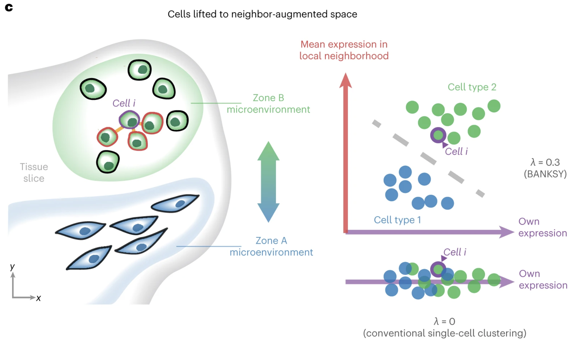
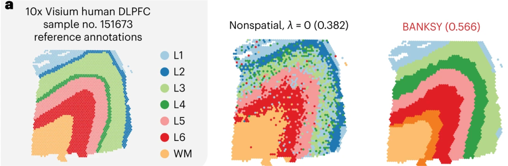
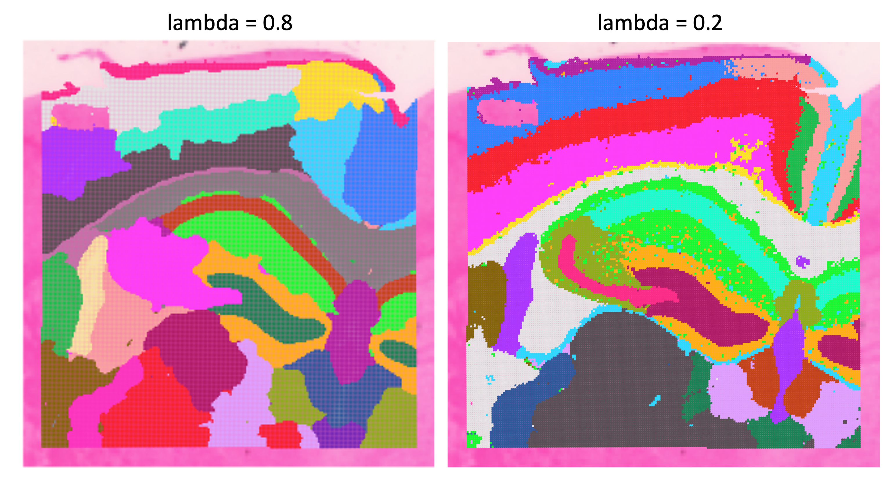

```{r}
#| label: load_libraries_data
#| echo: false
# Load libraries and data
library(Seurat)
library(Banksy)
library(SeuratWrappers)
library(tidyverse)
library(harmony)
library(patchwork)
set.seed(12345)

# Set parallelization (multithreading) to speed up calculations
plan("multicore", workers = parallel::detectCores() - 1)

# Increases the size of the default vector (8GB)
options(future.globals.maxSize = 8000 * 1024^2)

# Load dataset
seurat_processed <- qs2::qs_read("intermediate/08_seurat_processed.qs")
```

Approximate time: 40 minutes

## Learning objectives 

In this lesson, we will:

- Calculate a BANKSY counts matrix which incorporates neighborhood structure
- Run Harmony integration
- Evaluate spatially-constrained clusters

## Overview of lesson

At this point in the analysis, we have clusters and UMAP coordinates calculated based **solely upon the gene expression**. As this is a spatial dataset, we also have the ability to incorporate the location of bins, or the neighborhood structure, in the clustering process. Here, we will make use of the BANKSY method that adds the local structure as information to ultimately calculate new clusters that are spatially constrained.

## BANKSY

::: columns

::: column
In the standard single-cell workflow, our clusters are identified solely based upon the similarity of gene expression between bins. However, this approach does not take into account the spatial relationship and how close bins are in proximity to one another. The idea being that we would expect bins of similar expression and cell type to be nearby.

[BANKSY](https://www.nature.com/articles/s41588-024-01664-3) is an algorithm that allows you to calculate scores that consider both the gene expression and spatial proximity of bins to one another. How much consideration can be given to the spatial locations is modulated with a `lambda` value. This `lambda` value controls the balance between gene expression and location.  

Therefore, BANKSY is a powerful way to include the full extent of data in our dataset to group bins together.
:::

::: column
::: {#fig-BANKSY_schematic .figure}


Schematic of how BANKSY identifies cell type clusters based upon both gene expression and spatial proximity.<br>
_Image source: [Singhar et al. (2024)](https://www.nature.com/articles/s41588-024-01664-3)_
::: 
:::

:::

One of the examples used in the original manuscript makes use of the layered structure of the brain's cortical structure. Here, we can see the differences from the annotated dataset compared to two different methods of clustering. The middle represents clustering based upon solely gene expression, similar to the Leiden clusters we have already calculated. To contrast, the right figure shows clusters generated from BANKSY. We can see that the bins are more cleanly grouped in spatial location.

::: {#fig-BANKSY_cortical_layers .figure}
{width=600}

Three different visuals of the brain cortical layers, the left shows the reference annotation, middle is clustering based solely on gene expression, and right shows clusters assigned with BANKSY.<br>
_Image source: [Singhar et al. (2024)](https://www.nature.com/articles/s41588-024-01664-3)_
::: 

### Set-up for BANKSY

To start, we are going to open a new script and save it as `05_BANKSY.R` to our `scripts` directory. Then, we will load all the libraries necessary for this analysis as usual.

```{r}
#| label: analysis_setup
#| eval: false
# BANKSY Spatially Derived Clustering
# Visium HD spatial transcriptomics workshop
# Author: Harvard Chan Bioinformatics Core
# Created: May 2026

# Load libraries
library(Seurat)
library(Banksy)
library(SeuratWrappers)
library(tidyverse)
library(future)
library(harmony)
library(patchwork)
# Set seed for reproducibility
set.seed(12345)

# Increases the size of the default vector (8GB)
options(future.globals.maxSize = 8000 * 1024^2)
# Set parallelization (multithreading) to speed up calculations
library(future)
plan(multisession, workers = parallel::detectCores() - 1)

# Load dataset
seurat_processed <- readRDS("data/seurat_processed.RDS")
```

Before we jump in and use the `RunBanksy()` function, we first need to understand the inputs required. In doing so, we will update our Seurat object to include information required by the algorithm. 


| Parameter      | Description                                                                                                                                                |
|----------------|------------------------------------------------------------------------------------------------------------------------------------------------------------|
| `group`        | Allows us to run BANKSY on multiple samples, enabling the function to understand that overlapping spatial locations can come from different slides.       |
| `split.scale`  | (`True` or `False`) Whether to use within-group scaling parameter, accounting for minor differences between datasets.   |
| `dimx`, `dimy` | The x and y coordinates of the bins on the tissue slide.                                                                                                    |
| `k_geom`       | Number of bins to consider for the local neighborhood. Larger values will yield larger domains.                                                           |
| `lambda`       | Influence of the neighborhood. Larger values yield more spatially coherent domains. The authors recommend using 0.8 to identify broader spatial domains. |


Since we have more than one slide, we will make use of both the `group` and `split.scale` arguments. Setting `split.scale = TRUE` will standardize the calculations such that [if batch correction is necessary](https://github.com/prabhakarlab/Banksy/issues/31), the results will be improved. This will ideally result in clusters that are well represented across multiple slides.

The next parameter we need to account for are `dimx` and `dimy`. The `RunBanksy()` function expects that the coordinates for each bin are included in the `@meta.data` slot of the provided Seurat object. Therefore, we need to grab the coordinates for every bin in the dataset and add it as a column.

The easiest way to grab the coordinates is the `GetTissueCoordinates()` function:

```{r}
#| label: get_tissue_coordinates
# Store the cell barcode as a column
# Sometimes when you wrangle dataframes, you can lose the rownames
seurat_processed$cell <- rownames(seurat_processed@meta.data)

# CRC and NAT sample coordinates
coords_crc <- GetTissueCoordinates(seurat_processed, 
                                   image = "P5CRC.008um")
coords_nat <- GetTissueCoordinates(seurat_processed, 
                                   image = "P5NAT.008um")

# Merge P5NAT and P5CRC coordinates into one dataframe
coords <- rbind(coords_crc, coords_nat)
```

Why did we have to run `GetTissueCoordinates()` twice? This is because this function will only return the coordinates for one image at a time. So we need to specify the `image` for each sample and then merge together to create a merged dataframe with x and y coordinates for each sample.

```{r}
#| label: head_coordinates
#| eval: false
# View first few rows of coordinates (x, y)
coords %>% head()
```

```{r}
#| label: tbl-coordinates
#| tbl-cap: Resulting dataframe of `x` and `y` coordinates from the `GetTissueCoordinates()` function.
#| echo: false
# Inspect the coordinates data frame
coords %>% 
  head() %>%
  knitr::kable()
```

Next we are going to add these coordinates into our metadata, this is so that we can directly call this column from the `RunBanksy()` function.

```{r}
#| label: join_coordinates
#| eval: false
# Join together metadata with coordinates
seurat_processed@meta.data <- left_join(x = seurat_processed@meta.data, 
                                        y = coords, 
                                        by = "cell")
seurat_processed@meta.data %>% head()
```

```{r}
#| label: tbl-join_coordinates
#| tbl-cap: Joined `@meta.data` and `coords` dataframes.
#| echo: false
seurat_processed@meta.data <- left_join(x = seurat_processed@meta.data, 
                                        y = coords, 
                                        by = "cell")
seurat_processed@meta.data %>% 
  head() %>%
  knitr::kable()
```

But wait, the rownames with the bin barcodes are missing! It is vital that the rownames of our Seurat object align with what is stored in `Cells()`. So we are going to add the rownames back into our metadata, which is why we stored them as a column in the metadata earlier.

```{r}
#| label: add_cell_barcode_to_rownames
# Add cell barcodes back to rownames
rownames(seurat_processed@meta.data) <- seurat_processed$cell
```

::: {.callout-note collapse="true"}
# Missing rownames in `@meta.data`
If the rownames inside your Seurat object's `@meta.data` are missing, you will get errors that are not very informative. This is due to the fact that Seurat will check if your rownames are the same as what is stored in `Cells()`:

```{r}
#| label: check_rownames
# Check that seurat metadata rownames are the same as Cells()
all(rownames(seurat_processed@meta.data) == Cells(seurat_processed))
```

Therefore, it is a good idea to store the barcode/cell IDs as a column in your metadata so that you can always set the rownames if they get lost during a data manipulation step.

:::

### Running BANKSY

The last thing we need to do before running BANKSY is to set values for `lambda`, `use_agf`, and `k_geom`, where:

- `k_geom` - Defines how many nearest neighbors to use when looking at neighboring bins.
- `use_agf` - Toggles whether or not we want to use the "Azimithal Gabor filter" which are values that constrain bin niches.
- `lambda` - Determines how much weight to assign to the spatial locations. The higher the value, the more weight is given to the spatial structure of the tissue.


Here we can see an example of what happens when different `lambda` values are set before clustering for a brain sample:

::: {#fig-BANKSY-values .fig}
{width=600}

Results of setting `lambda` to different scores on a brain dataset to show how a larger `lambda` results in more weight to the spatial structure of the tissue.<br>
_Image source: [Spatial Nanocourse](https://hbctraining.github.io/spatial_nanocourse/lessons/visium_hd.html)_
:::

::: callout-important
# RAM and memory
We have been running these analyses on laptops/computers with local resources throughout this workshop. Realistically, for a spatial dataset, you would be using either a high-performance computing cluster or a cloud-based platform (Google or AWS) which provides access to much more RAM and memory for such large datasets. 

This BANKSY step is a great example of the limitations of running these analyses locally. Not everyone will be able to run this step to completion due to a lack of resources.

**If you are unable to run this BANKSY step, follow along with the explanation without running the code. We have provided the BANKSY processed object for you to load in at the appropriate step.**

_And this is on a cropped slide, not the full dataset!_

:::

::: {.callout-note collapse="true"}
# O2 is Harvard Medical School's high performance compute cluster

Because of these memory limitations, you maybe be interested in running R on the O2 cluster through the either the command-line or, more likely, through the O2 Portal. The O2 Portal provides an R Studio environment for you to work within, but it allows you to leverage the the memory available on the high-performance computing cluster. We have materials for [running R on O2 and also through the O2 Portal](https://hbctraining.github.io/BMI714_Intro_to_HPC/schedule/workshop_schedule.html). 

:::

The authors of BANKSY recommend setting `lambda = 0.8` which is what we will also use.

```{r}
#| label: run_banksy
#| eval: false
# Run Banksy from SeuratWrappers
seurat_banksy <- RunBanksy(seurat_processed, 
                           lambda = 0.8, 
                           k_geom = 15, 
                           use_agf = TRUE,
                           dimx = 'x',
                           dimy = 'y', 
                           group = "orig.ident", 
                           split.scale = TRUE,
                           assay = 'Spatial.008um', 
                           slot = 'data',
                           verbose = TRUE)
```

```{r}
#| label: load_full_banksy_results
#| echo: false
#qs2::qs_save(seurat_banksy, "intermediate/09_seurat_banksy_1.qs")
seurat_banksy <- qs2::qs_read("intermediate/09_seurat_banksy_1.qs")
```

Now we can investigate what has changed in our `seurat_banksy` object.  Most notably, we have a new `Active assay: BANKSY`. 

```{r}
#| label: banksy_callout
# Print seurat object after running BANKSY
seurat_banksy
```

### BANKSY matrix

The `RunBanksy()` step generated a **new counts matrix** from the original counts matrix. In the previous step, BANKSY calculated two different scores (matrices) for each highly variable gene. Ultimately, these results are all concatenated together to create a BANKSY count matrix.

If we take a look at the beginning, middle and end of the `Features()` in the BANKSY matrix we can see each component of the 3 matrices:

```{r}
#| label: banksy_features
# First features in BANKSY matrix
Features(seurat_banksy)[1:6]

# Middle features in BANKSY matrix
Features(seurat_banksy)[2000:2006]

# Last features in BANKSY matrix
Features(seurat_banksy)[4000:4006]
```

As mentioned before, this is actually three different matrices stacked on top of one another:

1. **Original counts:** These are the original, normalized counts for the top highly variable genes

2. **Weighted mean expression (m0):** The average gene expression of neighboring cells, where closer neighbors are _weighted_ more heavily than distant ones. This gives each cell a representation of its local micro-environment.

3. **Azimuthal Gabor filter (m1):** Evaluates the symmetry of gene expression around the bin. This provides a value for whether or not a cell is surrounded by similar cells or at the boundary of a different spatial niche. A higher value indicates that the cell is likely at the boundary between different neighborhoods.

## Calculations on BANKSY matrix

At this point, we still do not have our spatially constrained clusters. But now that we have our BANKSY matrix, we can run a simplified clustering workflow, similar how we calculated clusters in the [previous lesson](08_clustering.qmd).

```{r}
#| label: instructor_run_all_steps
#| eval: false
#| echo: false
# # PCA
# seurat_banksy <- RunPCA(seurat_banksy, 
#                         assay = "BANKSY", 
#                         reduction.name = "pca.banksy", 
#                         features = rownames(seurat_banksy), 
#                         npcs = 30)
# 
# # Harmony batch correction
# seurat_banksy <- RunHarmony(seurat_banksy,
#                             group.by.vars = "orig.ident",
#                             reduction = "pca.banksy",
#                             reduction.save = "harmony.banksy",
#                             assay.use = "BANKSY")
# 
# 
# # Find k-Nearest Neighbors
# seurat_banksy <- FindNeighbors(seurat_banksy, 
#                                reduction = "harmony.banksy", 
#                                dims = 1:30)
# 
# # Leiden clustering
# seurat_banksy <- FindClusters(seurat_banksy, 
#                               algorithm = 4,
#                               cluster.name = "banksy_cluster",
#                               resolution = 0.65,
#                               random.seed = 12345)
# 
# # Change default assay from BANKSY
# DefaultAssay(seurat_banksy) <- "Spatial.008um"
# 
# # Delete BANKSY assay by setting it to NULL
# seurat_banksy[["BANKSY"]] <- NULL
# 
# # Save processed BANKSY seurat object
# qs2::qs_save(seurat_banksy, "intermediate/09_seurat_banksy_2.qs")
```

```{r}
#| label: instructor_load_process_banksy
#| echo: false
# Load Banksy object
seurat_banksy <- qs2::qs_read("intermediate/09_seurat_banksy_2.qs")
```

:::{.callout-tip}
# [**Exercise 1**](11_banksy_clustering-Answer_key.qmd#exercise-1)
1. What steps/functions did we use to calculate clusters previously?
:::

### Dimensionality reduction

With this new matrix, we are once again going to calculate PCA, this time storing the results as `pca.banksy`. We want to run this on all the features in our BANKSY matrix to include the spatially weighted scores in the calculation.

```{r}
#| label: RunPCA
#| eval: false
# Run PCA
seurat_banksy <- RunPCA(seurat_banksy, 
                        assay = "BANKSY", 
                        reduction.name = "pca.banksy", 
                        features = Features(seurat_banksy), 
                        npcs = 30)
```


With this new PCA, we can visualize the distribution of bins to evaluate whether or not integration is necessary. The batch variable we may need to account for is `orig.ident`, or samples. Additionally, we can pick a marker gene to determine whether there is a split (batch effect) in the data. For this example, we will be using the gene `IGKC`, a known B cell marker gene.

```{r}
#| label: fig-pca_banksy
#| fig-cap: PCA plot of PC1 vs PC2 (calculated on BANKSY) with bins colored by sample and B cell marker gene IGKC.
#| fig-width: 10
# BANKSY PCA colored by sample
p_orig <- DimPlot(seurat_banksy,
                  group.by = "orig.ident",
                  reduction = "pca.banksy") 

# BANKSY PCA colored by IGKC expression
p_igkc <- FeaturePlot(seurat_banksy,
                        feature = "IGKC",
                        reduction = "pca.banksy")

# Plot PCA space side-by-side
p_orig + p_igkc
```

There appears to be 2 distinct populations of B cells in our PCA space, where the `orig.ident` is driving the differences in those bins. This is a clear indication that integration will be necessary to resolve the batch effect in the data.

### Integration

We are going to use the [Harmony algorithm](https://www.nature.com/articles/s41592-019-0619-0) to correct our dataset for batch. Starting from the `pca.banksy` values, the `RunHarmony()` function will iteratively adjust the PCA space such that we no longer see a divide demarkated by the batch variable specified in the dataset. We are going to store the resultant latent space, or dimensionality reduction, as `harmony.banksy` within the Seurat object.

This step may take several iterations to run, but it should converge within a few minutes. 

```{r}
#| label: RunHarmony
#| eval: false
# Harmony batch correction
seurat_banksy <- RunHarmony(seurat_banksy,
                            group.by.vars = "orig.ident",
                            reduction = "pca.banksy",
                            reduction.save = "harmony.banksy",
                            assay.use = "BANKSY")
```

Once the `RunHarmony()` function has completed successfully, we have a new latent space called `harmony.banksy`. The simplest way to view these values is to consider it a "corrected PCA" and treat is the same way you would use a PCA space. Therefore, we can visualize the `harmony.banksy` space and see if there is a strong effect with `orig.ident` or the B cell marker IGKC.

```{r}
#| label: fig-harmony_banksy
#| fig-cap: Latent space plot after integration with Harmony, with bins colored by sample and B cell marker gene IGKC.
#| fig-width: 10
# Harmony BANKSY PCA colored by sample
p_orig <- DimPlot(seurat_banksy,
                  group.by = "orig.ident",
                  reduction = "harmony.banksy") 

# Harmony BANKSY PCA colored by IGKC expression
p_igkc <- FeaturePlot(seurat_banksy,
                        feature = "IGKC",
                        reduction = "harmony.banksy")

# Plot latent space side-by-side
p_orig + p_igkc
```

There is no longer a split within the B cell populations, which indicates that we are likely good to proceed further in the workflow.

### Clustering

With this Harmony integrated space, we can use the `FindNeighbors()` and `FindClusters()` functions to perform clustering. We will be using the same `resolution = 0.65` from the previous step to make equivalent comparisons between the spatially-weighted clusters against the transcript-based clusters later on.

```{r}
#| label: find_neighbors_clusters
#| eval: false
# Find k-Nearest Neighbors
seurat_banksy <- FindNeighbors(seurat_banksy, 
                               reduction = "harmony.banksy", 
                               dims = 1:30)

# Leiden clustering
seurat_banksy <- FindClusters(seurat_banksy, 
                              algorithm = 4,
                              cluster.name = "banksy_cluster",
                              resolution = 0.65,
                              random.seed = 12345)
```

At this point, we no longer need access to the BANKSY assay as all the relevant information has now been stored as:

- `banksy_clusters` in `@meta.data`
- `pca.banksy` in `@reductions`
- `harmony.banksy` in `@reductions`

So to conserve memory on our laptops (the Seurat object is ~14 GB!!), we are going to delete the BANKSY assay from our Seurat object.

```{r}
#| label: conserve_memory
#| eval: false
# Change default asasy from BANKSY
DefaultAssay(seurat_banksy) <- "Spatial.008um"

# Delete BANKSY assay by setting it to NULL
seurat_banksy[["BANKSY"]] <- NULL
```

::: callout-important
# Loading pre-generated Seurat object
If you were unable to run the BANKSY step from earlier, we have provided the RDS file that includes the results for every step run until this point:

```{r}
#| label: load_seurat_banksy
#| eval: false
# Load pre-generated seurat object with relevant BANKSY results
seurat_banksy <- readRDS("data/intermediate_seurat/seurat_banksy.rds")
```

:::

Now is also a great time to assess how well the integration step worked when looking at each of our clusters. As we would hope, most of the clusters are comprised of both samples:

```{r}
#| label: fig-cell_proportion_barplot
#| fig-cap: Proportion of bins in each cluster by sample for BANKSY clusters.
# Barplot of proportion of cells in each cluster by sample
ggplot(seurat_banksy@meta.data) +
    geom_bar(aes(x = banksy_cluster, 
                 fill = orig.ident), 
             position = position_fill())  +
    theme_classic()
```

## Comparing clustering results

We have **two different clustering results**, one was calculated solely on the gene expression (`seurat_clusters.projected`) and the other with spatially-conscious BANKSY scores (`banksy_cluster`). Neither one of these results is "_more correct_" than the other, rather they provide different pieces of information that we can use to gain insights into our dataset. 

### Spatial overlay

First, let us see how each of the clusters appear on the spatial slide with `SpatialDimPlot()`

```{r}
#| label: fig-spatial_clusters
#| fig-cap: "Spatial overlay of both BANKSY derived clusters and gene expression derived clusters for both samples."
#| fig-width: 10
#| fig-height: 8
# Visualize the spatial overlay of both BANKSY derived clusters and
# gene expression derived clusters for both samples
SpatialDimPlot(seurat_banksy, 
               group.by = c("banksy_cluster",
                            "seurat_cluster.projected"), 
               pt.size.factor = 15, 
               image.alpha = 0)
```

What differences do you notice between the two clustering results?

::: {.callout-note collapse="true"}
# Alternative visualization

Sometimes when you have many clusters, it can be challenging to visualize each cluster at once. So here, we provide the code to use `facet_wrap()` to create separate figures for each cluster to more easily view each cluster:

```{r}
#| label: fig-facet_wrap_clusters
#| fig-cap: Spatial overlay of BANKSY derived cluster, highlighting each cluster in a separate plot.
#| fig-height: 10
#| fig-width: 10
# Grab x and y coordinates for plotting
# Also get the sample ID and the banksy cluster score for each bin
df <- FetchData(seurat_banksy,
                vars = c("x", "y", 
                         "orig.ident",
                         "banksy_cluster"))

# Subset to one sample (P5CRC)
ggplot(df %>% subset(orig.ident == "P5CRC"),
       # Plot spatial coordinates and color by cluster
       aes(x = x, y = y,
           color = banksy_cluster)) +
  geom_point(size = 0.05) +
  theme_bw() +
  # Create separate plots for each cluster
  facet_wrap(~banksy_cluster) +
  NoLegend()
```

:::

For one, we can see that there is less "noise" in the `seurat_banksy` clusters, where bins of a cluster are not as scattered throughout the slide. This is what would be expected from the BANKSY algorithm. For example, if we compare the outer rim of the tissue, the bins are more connected in the BANKSY representation compared to the gene-expression clustering.

First we highlight the bins from cluster 9 from the gene-expression based clustering, `seurat_cluster.projected`: 

```{r}
#| label: fig-spatial_clusters_gene_cluster9
#| fig-cap: "Spatial overlay of gene expression derived clusters, highlighting cluster 9."
#| fig-width: 10
#| fig-height: 3
# Cluster 9 from seurat_cluster.projected 
# Highlighted on spatial slide
Idents(seurat_banksy) <- "seurat_cluster.projected"
SpatialDimPlot(seurat_banksy,
               pt.size.factor = 15,
               cells.highlight = WhichCells(seurat_banksy,
                                            idents = 9)) +
  plot_annotation(title = "Seurat cluster 9 (projected)")  
```

And contrast it against the analagous BANKSY cluster 12:

```{r}
#| label: fig-spatial_clusters_banksy_cluster12
#| fig-cap: "Spatial overlay of BANKSY derived clusters, highlighting cluster 12."
#| fig-width: 10
#| fig-height: 3
# Cluster 12 from banksy_cluster
# Highlighted on spatial slide
Idents(seurat_banksy) <- "banksy_cluster"
SpatialDimPlot(seurat_banksy,
               pt.size.factor = 15,
               cells.highlight = WhichCells(seurat_banksy,
                                            idents = 12)) +
  plot_annotation(title = "BANKSY cluster 12")
```

The bins are less scattered throughout the slide with the BANKSY cluster. Additionally, bins in close proximity to one another are more likely to be part of the same cluster.

### UMAP

We can also take this opportunity to visualize the BANKSY clusters on the UMAP coordinates we previously computed.

```{r}
#| label: fig-umap
#| fig-cap: UMAP of both BANKSY derived clusters and gene expression derived clusters.
#| fig-width: 14
#| fig-height: 6
# Compare the UMAPs of the BANKSY derived clusters and gene expression derived clusters
DimPlot(seurat_banksy, 
        group.by = c("banksy_cluster",
                     "seurat_cluster.projected"),
        reduction = "full.umap.sketch",
        label = TRUE)
```

On the UMAP, cluster 1 in `seurat_cluster.projected` appears to be split into two groups in `banksy_cluster`. This suggests that, based on gene expression alone, these bins represent the same cell type, but _BANKSY identifies a spatial distinction_ between them. If we return to the spatial overlay, we see that cluster 1 is primarily located in the left-hand region of `P5CRC`. In contrast, the corresponding `banksy_clusters` show a clear spatial divide, with this region split into three subclusters along a top–bottom axis.

Together, this would indicate that cluster 1 broadly corresponds to tumor bins (as we identified in the [integration lesson](09_integration.qmd)). The spatial context further divides these tumor cells into distinct subtypes.

Keep in mind that that this UMAP still uses the original `UMAP_1` and `UMAP_2` coordinates from the initial dimensionality reduction workflow; we are not using UMAP coordinates derived from the BANKSY results.

:::{.callout-tip}
# [**Exercise 2**](11_banksy_clustering-Answer_key.qmd#exercise-2)
2. What does the UMAP look like when use the BANKSY derived Harmony latent space to calculate UMAP coordinates?
:::

## Assess clustering

Just like we saw in the [clustering lesson](08_clustering.qmd), we can once again answer the question of how well these BANKSY cluster align with the expected cell types.

Table: Marker genes for broad cell types in our dataset. {#tbl-marker_genes}

| Cell type                   | Marker genes                                             |
|-----------------------------|------------------------------------------------------------|
| B cells                     | IGKC, IGHM, CD79A, MS4A1, MZB1                             |
| Endothelial cells           | PECAM1, VWF, PLVAP, ENG, KLF2                              |
| Fibroblasts                 | COL1A1, COL3A1, DCN, LUM, COL6A2                           |
| Intestinal epithelial cells | CLCA1, FCGBP, MUC2, PIGR, ZG16                             |
| Myeloid cells               | C1QC, SELENOP, SPP1, LYZ, CD68                             |
| Neural cells                | NRXN1, L1CAM, NCAM1, VIP, CALB2                            |
| Smooth Muscle cells         | TAGLN, ACTA2, MYH11, MYL9, CNN1                            |
| T cells                     | TRAC, CD3E, TRBC2, IL7R, CD52                              |
| Tumor cells                 | CEACAM6, CEACAM5, EPCAM, KRT8, LCN2                        |

So now, for example, we can see how the marker genes for Smooth Muscle cells appear in our `seurat_banksy` clusters:

```{r}
#| label: fig-vln_endothelial_marker
#| fig-cap: Violin plot of `ACTA2` and `MYH11` for each BANKSY cluster to potentially identify populations of Smooth Muscle cells.
# Create violin plots for two Smooth Muscle marker genes
VlnPlot(seurat_banksy,
        features = c("ACTA2", "MYH11"),
        pt.size = 0,
        ncol = 1) +
  NoLegend()
```

We can clearly see that there is an uptick of expression of both genes in cluster 9 - which is an indication that cluster 9 is likely comprised of Smooth Muscle cells.

::: callout-tip
# [**Exercise 3**](11_banksy_clustering-Answer_key.qmd#exercise-3)

3. Use the `DotPlot()` function in conjunction with `marker_list` to see if clusters correspond well with cell types.

```{r}
#| label: marker_list
# Create marker list
marker_list <- list(
  "B cells" = c("IGKC", "IGHM", "CD79A", "MS4A1", "MZB1"),
  "Endothelial cells" = c("PECAM1", "VWF", "PLVAP", "ENG", "KLF2"),
  "Fibroblasts" = c("COL1A1", "COL3A1", "DCN", "LUM", "COL6A2"),
  "Intestinal epithelial cells" = c("CLCA1", "FCGBP", "MUC2", "PIGR", "ZG16"),
  "Myeloid cells" = c("C1QC", "SELENOP", "SPP1", "LYZ", "CD68"),
  "Neural cells" = c("NRXN1", "L1CAM", "NCAM1", "VIP", "CALB2"),
  "Smooth muscle cells" = c("TAGLN", "ACTA2", "MYH11", "MYL9", "CNN1"),
  "T cells" = c("TRAC", "CD3E", "TRBC2", "IL7R", "CD52"),
  "Tumor cells" = c("CEACAM6", "CEACAM5", "EPCAM", "KRT8", "LCN2")
)
```

4. Roughly identify which clusters correspond to which cell types to provide better context for future analyses.

:::

## Save!

Lastly, let's go ahead and save our Seurat object before we go any further:

```{r}
#| label: save_seurat
#| eval: false
# Save seurat_banksy
saveRDS(seurat_banksy, "data/seurat_banksy.RDS")
```

***

[Next Lesson >>](12_deconvolution.qmd)

[Back to Schedule](../schedule/schedule.qmd)