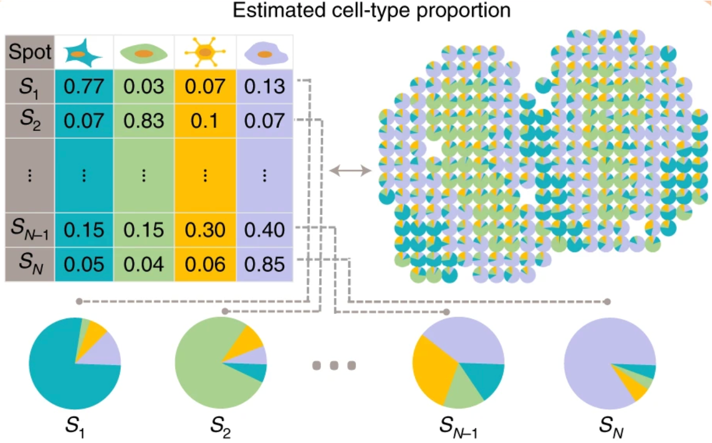
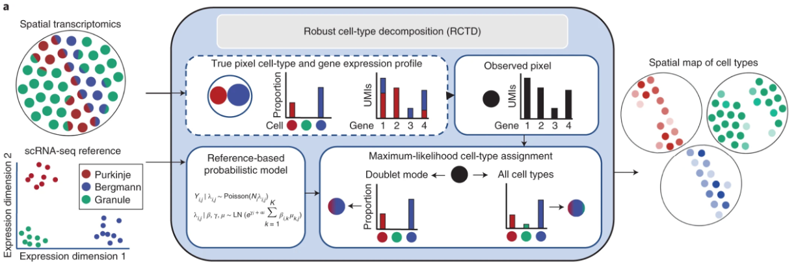
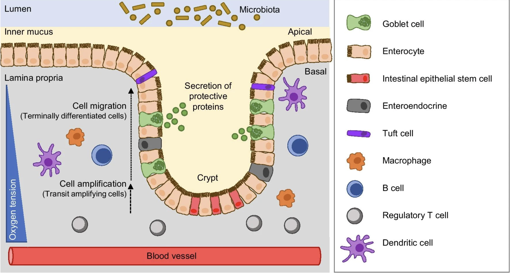
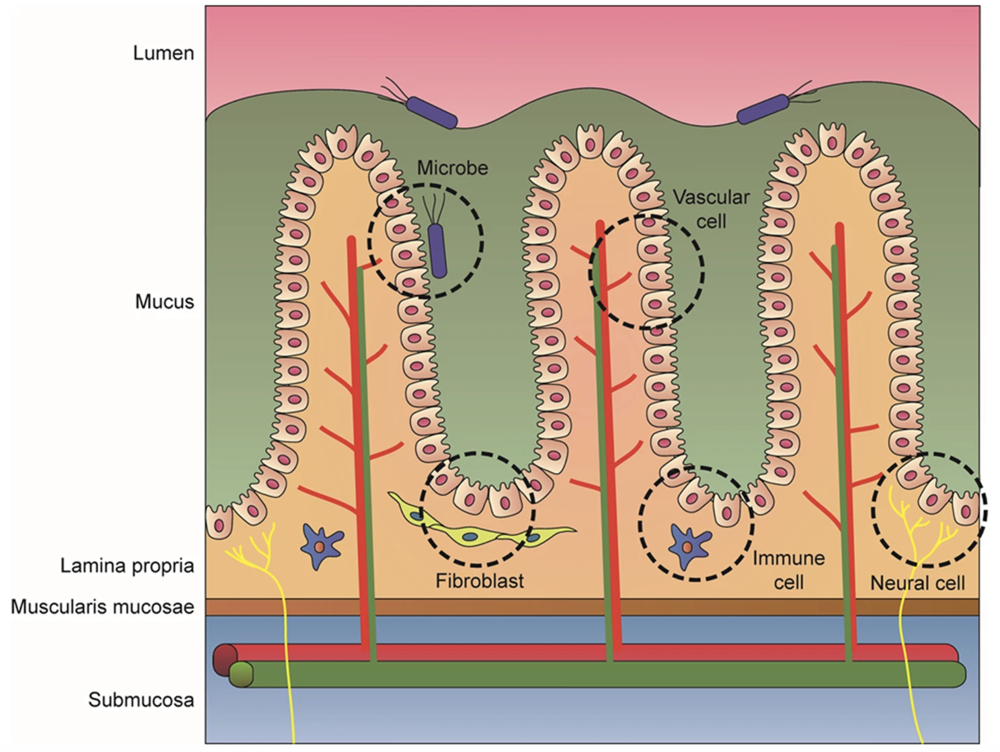

```{r}
#| label: load_libraries_data
#| echo: false
# Load libraries and data
library(Seurat)
library(tidyverse)
library(spacexr)

# Set parallelization (multithreading) to speed up calculations
plan("multicore", workers = parallel::detectCores() - 1)

# Increases the size of the default vector (8GB)
options(future.globals.maxSize = 8000 * 1024^2)

# Load dataset
seurat_banksy <- qs2::qs_read("intermediate/09_seurat_banksy_2.qs")
```

Approximate time: 40 minutes

## Learning objectives 

In this lesson, we will:

- Load and investigate our reference dataset used for cell type annotation
- Convert our Seurat object into an RCTD data structure
- Deconvolve bins to assign cell types and assess the annotation

## Overview of lesson

While the clusters are helpful in identifying groups of bins that are similar to one another, we have not yet determined the cell type for each bin. For sequencing-based methods, deconvolution is a great first step in determining the cell type for each spot, given that a bin may have multiple cells contained within it. We will be using the method Robust Cell Type Deconvolution (RCTD) to assign cell type labels for each bin. These deconvolution outputs are reused in subsequent analyses, such as cell–cell communication.

## What is deconvolution?

The single-digit micron resolution is a big technological improvement over Visium's original ∼55μm spots. Because a single spot could include several cell types, the dataset is not straightforward to annotate. As a result, many methods **model each spot as a mixture**, assigning proportion values for each cell type within that spot. Each spot is represented as a piechart showing proportions of the cell type composition.

::: {#fig-svg_schematic .fig}

{width="50%"}

Schematic showing how, in sequencing-based spatial transcriptomics, each bin may be a mixture of cells and cell types.
_Image source: [Ma et al. (2022)](https://www.nature.com/articles/s41587-022-01273-7)_
:::

While Visium HD reduces bin size to approach single-cell resolution, it is important to note that this sequencing-based spatial transcriptomics captures RNA from a defined spatial area rather than from isolated cells. As a result, transcripts from multiple cells overlapping in a bin would be pooled and sequenced together. This means that even small bins may contain mixed cellular signals, which has important implications for downstream analyses, such as differential gene expression.

::: callout-important
# Imaging-based technologies
It is important to note that up until this point, the entire workflow we have been using would work for either imaging- or sequencing-based spatial technologies. **Deconvolution is not an appropriate step for imaging-based technologies.**

This is because when we work with imaging-based technologies, we are using _single-cells_ after segmentation. Therefore it does not make sense to model a mixture of cell types when the input is single cells. As a result, the annotation for these datasets follows a similar workflow as celltyping a single-cell experiment. 

To annotate your dataset, we recommend to do a mixture of the following:

- Use [marker genes from the literature](https://hbctraining.github.io/Intro-to-scRNAseq/lessons/11_clustering_quality_control.html#exploring-known-cell-type-markers) that are specific to a cell type
- Identify [top genes per cluster](https://hbctraining.github.io/Intro-to-scRNAseq/lessons/13_marker_identification.html) to map cell types to clusters
- Apply automatic celltyping algorithms (i.e [Azimuth](https://azimuth.hubmapconsortium.org/), [CellTypist](https://www.celltypist.org/encyclopedia/Immune/v2), [SingleR](https://bioconductor.org/packages/devel/bioc/vignettes/SingleR/inst/doc/SingleR.html), etc.)
:::


### Robust Cell Type Deconvolution (RCTD)

We will carry out our deconvolution in a new script called `06_deconvolution.R`, which will be kept in our `scripts` directory. At the top of the script, we will add a header, call our libraries and load our Seurat object.

```{r}
#| label: load_data
#| eval: false
# Deconvolution with RCTD
# Visium HD spatial transcriptomics workshop
# Author: Harvard Chan Bioinformatics Core
# Created: May 2026

# Load libraries
library(Seurat)
library(tidyverse)
library(spacexr) # Contains RCTD function

# Set parallelization (multithreading) to speed up calculations
plan("multicore", workers = parallel::detectCores() - 1)

# Increases the size of the default vector (8GB)
options(future.globals.maxSize = 8000 * 1024^2)

# Load dataset
seurat_banksy <- readRDS("data/intermediate_seurat/seurat_banksy.rds")
```

To perform accurate annotation of cell types, we must also take into consideration that our 8µm x 8µm bins may contain **multiple cells**. The method [Robust Cell Type Deconvolution](https://www.nature.com/articles/s41587-021-00830-w) (RCTD) has been shown to accurately annotate spatial datasets from a variety of technologies, while taking into consideration that a single bin may exhibit multiple cell type profiles.

::: {#fig-BANKSY_schematic .figure}
{width=700}

Schematic of how RCTD creates a probabilistic model to represent bins as a mixture of cell types in spatial datasets.<br>
_Image source: [Cable et al., 2021](https://www.nature.com/articles/s41587-021-00830-w)_
::: 

The overarching process of RCTD involves several steps:

1. RCTD calculates the average gene expression for each cell type in a reference single-cell RNA sequencing dataset.
2. Each bin/pixel in the query spatial transcriptomics data is treated as containing an unknown mix of multiple cell types.
3. RCTD fits each pixel as a combination of different cell types, where each cell type contributes a proportion of the gene counts observed.
4. For each pixel and gene, the observed gene counts are assumed to follow a Poisson distribution in the probability model.
5. Estimates for cell type proportions in each pixel are calculated with a maximum-likelihood estimate (MLE).
6. Lastly, RCTD can be run in two ways:
   - **Standard mode**: no limit on the number of cell types per pixel.
   - **Doublet mode**: restricts each pixel to a maximum of one or two cell types.

RCTD uses an **annotated scRNA-seq dataset (reference) and our spatial dataset (query)** as input. Creating these objects will be the first step of this analysis.

## Reference dataset

 For our reference, we will use the [paired scRNA-seq FLEX dataset](https://www.10xgenomics.com/platforms/visium/product-family/dataset-human-crc) that was generated from the same patients as the original study. The code for how this object was created can be found [here](Aside_gen_reference_rctd.qmd).

First, let us load in the reference Seurat object that we downloaded with the spatial dataset at the beginning of the workshop.

```{r}
#| label: load_ref
# Load Seurat reference dataset
seurat_ref <- readRDS("data/crc_flex_ref_downsample.RDS")
seurat_ref
```

We can take a look at the unique cell types in the reference dataset by plotting the UMAP of the reference dataset. These are stored in column `Level1` and should give us a better understanding of the make-up of our dataset by cell type.

```{r}
#| label: fig-umap_reference
#| fig-cap: UMAP of reference dataset to be used for deconvolution.
# Set idents
Idents(seurat_ref) <- "Level1"

# UMAP of reference dataset
p <- DimPlot(seurat_ref) +
  ggtitle("RCTD Reference Dataset")
# Add cluster labels
LabelClusters(p,
              id = "ident",
              fontface = "bold",
              size = 3, 
              bg.colour = "white",
              bg.r = .2,
              force = 0)
```

## Running RCTD

As mentioned earlier, there are two main inputs that must be supplied to RCTD:

- **Reference**: an object containing the raw counts and cell type column in metadata.
- **Query**: a spatial transcriptomics object that we want to deconvolve against the reference.

We are going to create some custom RCTD objects out of our original Seurat object for RCTD. This will essentially create a new _data structure_ that fits with what the `Run.RCTD()` function expects. 

### Create reference

Now that we better understand the reference, we are going to make an RCTD object out of it. We will use the `Reference()` function to cast our Seurat object into the correct format.  We supply the following three parameters:

- `counts` = raw counts matrix
- `cell_types` = cell type annotation
- `nUMI` = total number of counts per cell (`nCount`)

```{r}
#| label: gen_reference
# Raw counts of reference dataset
counts <- seurat_ref[["RNA"]]$counts

# cell type annotation of reference dataset (must be a factor)
cluster <- seurat_ref$Level1
cluster <- as.factor(cluster)

# Total counts of each cell
nUMI <- seurat_ref$nCount_RNA

# Create the RCTD reference object
reference <- Reference(counts = counts, 
                       cell_types = cluster, 
                       nUMI = nUMI)
```

::: {.callout-note collapse="true"}
# Structure of `reference`

When we look at the structure of this `reference` object, we can see that we have our `nUMI`, `counts` and `cell_types` in this object.

```{r}
#| label: str_reference
str(reference)
```

:::

### Create query


**Deconvolution is very computationally expensive!** So we can once again make use the `sketch` workflow to downsample our dataset in a careful manner. Additionally, we are going to split our Seurat object into a _single sample_ `P5CRC`. There are extensions of the RCTD package in order to take into account [replicates and multiple samples](https://raw.githack.com/dmcable/spacexr/master/vignettes/replicates.html) which we will not use at this time due to time constraints.

```{r}
#| label: subset_crc
# Subset to P5CRC sample
crc <- subset(seurat_banksy, 
              subset = (orig.ident == "P5CRC"))

# Inspect the Seurat object
crc
```

We cannot use the same sketch information from the [previous lessons](06_normalization_and_sketch.qmd) since this is one sample (and not both). Therefore, we are going to quickly run through the sketch workflow one more time. However, we will not be running the entire workflow, as we only need the PCA scores to project back to the larger dataset.

```{r}
#| label: crc_sketch_workflow
#| eval: false
# Create sketch of CRC subset
# Set default assay
DefaultAssay(crc) <- 'Spatial.008um'

# HVGs are required input for SketchData
crc <- FindVariableFeatures(object = crc,
                            assay = "Spatial.008um")

# Calculate leverage score
crc <- SketchData(
  object = crc,
  ncells = 5000,
  method = "LeverageScore",
  sketched.assay = "sketch_crc",
  var.name = "leverage.score_crc")

# Run through processing workflow
# Stop at PCA
crc <- FindVariableFeatures(crc)
crc <- ScaleData(crc)
crc <- RunPCA(crc,
              reduction.name = "pca.sketch_crc")
```

```{r}
#| label: instructor_crc_processed
#| echo: false
# qs2::qs_save(crc, "intermediate/12_crc_sketch.qs")
crc <- qs2::qs_read("intermediate/12_crc_sketch.qs")
```

RCTD requires another unique data structure as input to run. So we will create our query object with `SpatialRNA()` by suppling the spatial coordinates and raw counts for the bins. Note that we do not have to supply any cell type information, like we did with the reference object earlier. This is because we don't have any cell type information yet! That is the output we are hoping to generate from running RCTD.

```{r}
#| label: query_rctd
# Get raw counts of downsampled sketch assay
DefaultAssay(crc) <- "sketch_crc"
counts_sketch <- crc[["sketch_crc"]]$counts

# Grab barcodes for sketched bins
cells_sketch <- colnames(crc[["sketch_crc"]])

# Spatial coordinates for each bin in sketch assay
coords <- GetTissueCoordinates(crc)[cells_sketch, c("x", "y")]

# Grab nUMI per sketch bin
nUMI_sketch <- crc@meta.data[cells_sketch, "nCounts_Spatial.008um"]

# Create the RCTD query object
query <- SpatialRNA(coords = coords, 
                    counts = counts_sketch, 
                    nUMI = nUMI_sketch)
```

::: {.callout-note collapse="true"}
# Structure of `query`

When we look at the structure of this `query` object, we can see that we have our `nUMI`, `counts` and `coords` in this object.

```{r}
#| label: str_query
str(query)
```

:::

### Run RCTD

Now that we have created our reference and query objects, we will create an `RCTD` object and use thee `run.RCTD()` function. **This should take 5-10 minutes to run.**

```{r}
#| label: run_RCTD
#| eval: false
# Set-up for RCTD run by supplying both query and reference
RCTD <- create.RCTD(spatialRNA = query, 
                    reference = reference, 
                    max_cores = parallel::detectCores() - 1)
# Run deconvolution
# This step may take 5-10 minutes to run
RCTD <- run.RCTD(RCTD, doublet_mode = "doublet")
```

```{r}
#| label: instructor_load_rctd
#| echo: false
# qs2::qs_save(RCTD, "intermediate/12_RCTD_crc.qs")
RCTD <- qs2::qs_read("intermediate/12_RCTD_crc.qs")
```

Note that RCTD can take longer when you have more cell types, which is the reason we used the `Level1` annotation of cell types over `Level2` from the reference dataset.

### RCTD results

The resulting dataframe from RCTD will contain the following columns according to the [documentation](https://mirror.accum.se/mirror/bioconductor.org/packages/devel/bioc/vignettes/spacexr/inst/doc/rctd-tutorial.html):

| Column       | Description                                                                                   |
|--------------|--------------------------------------------------------------------------------------------------------|
| `spot_class` | RCTD’s classification (doublet mode):<br>• `singlet` – 1 cell type on pixel<br>• `doublet_certain` – 2 cell types on pixel<br>• `doublet_uncertain` – 2 cell types on pixel, but only confident of 1<br>• `reject` – no prediction given for pixel |
| `first_type` | First cell type predicted on the bin; defined for all `spot_class` values except `reject`.           |
| `second_type`| Second cell type predicted on the bin for doublet `spot_class` (`doublet_certain`, `doublet_uncertain`); not a confident prediction in the `doublet_uncertain` case. |


The results of deconvolution are stored in the `results$results_df` slot of the `RCTD` object:

```{r}
#| label: rctd_results
#| eval: false
# Grab results dataframe and view first few rows
df_rctd_results <- RCTD@results$results_df
df_rctd_results %>%
  head()
```

```{r}
#| label: tbl-rctd_results
#| tbl-cap: Table of RCTD results for each bin, showing first and second type predictions for each bin.
#| echo: false
# Grab results dataframe and view first few rows
df_rctd_results <- RCTD@results$results_df
df_rctd_results %>% head() %>% knitr::kable()
```

We can also visualize the number of identifications established for each `first_type`:

```{r}
#| label: fig-barplot_n_first_type_sketch
#| fig-cap: Number of sketched bins assigned to a cell type with RCTD.
# Number of cell types annotated to each bin in sketch assay
ggplot(df_rctd_results,
       aes(x = first_type, 
           fill = first_type)) +
  geom_bar() +
  theme_bw() + NoLegend() +
  ggtitle("P5CRC: RCTD First Type Results") +
  theme(axis.text.x = element_text(angle = 90,
                                   vjust = 0.5,
                                   hjust=1))
```

Just by looking at the total number of bins, this is a good reminder that we only have the RCTD results for the 5,000 bins we sketched to.

### Project RCTD results on all bins

Let us take a look at how many rows (bins) we have these annotations for:

```{r}
#| label: nrow_rctd
nrow(df_rctd_results)
```

But didn't our `sketch` assay include 5,000 bins? RCTD runs its own QC step that filters out bins with low expression or _rejects_ bins where it is unable to map a cell type from the reference dataset. This is why we have fewer bins than we expected. So we are going to do some data wrangling to ensure that we keep track of all information. Including those ~200 bins without `first_type` labels. In a future step, we will set the label for these bins to be `unassigned`.

To do so, we are first going to do some wrangling to the results dataframe:

1. Append `_sketch` to all column names
2. Remove factors (to avoid downstream errors)

```{r}
#| label: sketch_rctd_df
# Update column names to have _sketch
# Add "sketch" to column names
colnames(df_rctd_results) <- paste0(colnames(df_rctd_results), 
                                    "_sketch")

# Create column "cell" to merge on
# Removing factors for easier merging later
df_rctd_results <- df_rctd_results %>%
  mutate(cell = rownames(df_rctd_results)) %>%
  mutate(first_type_sketch = as.character(first_type_sketch),
         second_type_sketch = as.character(second_type_sketch),
         spot_class_sketch = as.character(spot_class_sketch))

# Make sure columns were generated
colnames(df_rctd_results)
```

Now, let us merge this information into our Seurat object. This step is necessary because in order to `ProjectData()`, we need the RCTD results to live in our `@meta.data` slot.

```{r}
#| label: merge_rctd
# Create cell barcode in metadata
crc$cell <- rownames(crc@meta.data)
meta <- crc@meta.data

# Merge together RCTD results and metadata
meta <- left_join(x = meta, 
                  y = df_rctd_results,
                  by = "cell")
rownames(meta) <- meta$cell

# Put meta into crc Seurat object
crc@meta.data <- meta
```

## Project back to full dataset

Now, we can run the `ProjectData()`, just like we did last time in order to project out RCTD results to the full CRC dataset.

```{r}
#| label: failed_project_data
#| error: true
# Project back first_type to new column called first_type
# This will fail
crc <- ProjectData(
  object = crc,
  assay = "Spatial.008um",
  sketched.assay = "sketch_crc",
  full.reduction = "pca_crc",
  sketched.reduction = "pca.sketch_crc",
  dims = 1:30,
  refdata = list(spot_class = "spot_class_sketch",
                 first_type = "first_type_sketch",
                 second_type = "second_type_sketch"))
```

Why did we get an error when we tried to get RCTD labels for the entire dataset? This is because we have those `NA` values for bins in the sketch assay. The `ProjectData()` function expects actual values for every sketched bin. Therefore, to get around this issue, we are going to label those bins as `unassigned` in the metadata.

```{r}
#| label: set_unassigned
# Set value of unassigned to sketch bins that do not have values
# This is because ProjectData will throw errors otherwise
cols <- c("spot_class_sketch", 
          "first_type_sketch", 
          "second_type_sketch")

# Iterate through each column to set "unassigned" to NA values
for (col in cols) {
  # Find rows that are in sketch_cells and are NA
  na_rows <- cells_sketch[is.na(crc@meta.data[cells_sketch, col])]
  # Assign the value to unassigned
  crc@meta.data[na_rows, col] <- "unassigned"
}
```

::: {.callout-note collapse="true"}
# Number of unassigned bins

We can use the `table()` function to quickly see how many unassigned bins we have in our dataset:

```{r}
#| label: table_unassigned
# Show the number of bins assigned to each cell type, including unassigned
table(crc@meta.data$first_type_sketch)
```

:::

At this point, we have assigned labels for each bin in the sketch assay. So we can once again run `ProjectData()` and this time get cell type labels for each bin in our dataset.

```{r}
#| label: project_data
#| eval: false
# Project back first_type to new column called first_type
crc <- ProjectData(
  object = crc,
  assay = "Spatial.008um",
  sketched.assay = "sketch_crc",
  full.reduction = "pca_crc",
  sketched.reduction = "pca.sketch_crc",
  dims = 1:30,
  refdata = list(spot_class = "spot_class_sketch",
                 first_type = "first_type_sketch",
                 second_type = "second_type_sketch"))
```

```{r}
#| label: instructor_crc_rctd
#| echo: false
# qs2::qs_save(crc, "intermediate/12_crc_RCTD_seurat.qs")
crc <- qs2::qs_read("intermediate/12_crc_RCTD_seurat.qs")
```

## Visualize RCTD results

Now that we have `first_type` values associated with each bin, we can visualize our dataset in a variety of different ways.

### Barplot

We can get an overview of how many bins we have with a barplot. As we might expect, the number of unassigned bins increased as we extrapolate the labels out to the larger dataset.

```{r}
#| label: fig-barplot_n_first_type
#| fig-cap: Number of bins assigned to a cell type with RCTD after `ProjectData()`.
# Barplot of first_type labels after ProjectData()
ggplot(crc@meta.data,
       aes(x = first_type, fill = first_type)) +
  geom_bar() +
  theme_bw() + NoLegend() +
  ggtitle("P5CRC: Projected First Type RCTD") +
  theme(axis.text.x = element_text(angle = 90, vjust = 0.5, hjust=1))
```

This visual primes us to expect that the majority of the bins in our dataset are intestinal epithelial cells. From the original publication, we also know that these epithelial cells can be broken down even further into goblet and enterocytes (from `Level2` annotation of the reference dataset).

### Spatial overlay

We can also see how the bins are located on the slide itself.

```{r}
#| label: fig-spatial_first_type
#| fig-cap: Spatial overlay of the first type RCTD results after `ProjectData()`.
# Spatial plot of first_type labels after ProjectData()
SpatialDimPlot(crc,
               group.by = "first_type",
               pt.size.factor = 15,
               image.alpha = 0.5)
```


::: {.callout-note collapse="true"}
# Alternative spatial visualization

Sometimes it can be difficult to see patterns for a given cell type when all of the cell types are present in the same plot. Due to this difficulty, we can also facet our different cell types into their own plots:

```{r}
#| label: fig-spatial_first_type_split
#| fig-cap: "Spatial overlay of the first type RCTD results after `ProjectData()` split by first_type."
#| fig-width: 12
#| fig-height: 9
# Grab x, y coordinates and first_type cell type labels
df <- FetchData(crc,
                vars = c("x", "y", 
                         "first_type"))

# Create scatterplot
ggplot(df,
       aes(x = x, y = y,
           color = first_type)) +
  geom_point(size = 0.05) +
  theme_bw() +
  # Split by cell type label
  facet_wrap(~first_type) +
  NoLegend()
```

:::

As we previously noted, the left-most region on th `P5CRC` slide is comprised primarily of tumor cells. There are some myeloid and fibroblast cells mixed throughout this region as well. The rest of the tissue contains mostly epithelial cells, which is to be expected when we consider the layered structure of the colon.

::: {#fig-colon_schematic_cell_type .fig}
{width="60%"}

Schematic showing the cell type structure of the colon, where the epithelial layer lines the surface to form a barrier between the gut microbiome and the underlying immune compartment.<br>
_Image source: [Ternet et al. (2021)](https://link.springer.com/article/10.1186/s12964-021-00712-3)_
:::

The colon wall is organized into distinct layers. The innermost surface facing the gut cavity is lined by epithelial cells (goblet, enterocyte, tuft cells), which form a structure known as Crypts of Lieberkühn. These cells form a barrier, selectively allowing interactions between the gut microbiome and the inner regions of the tissue (mucosa). Here, the immune component (T and B cells) are present. Right underneath there is another layer of muscle cells, known as the muscularis mucosae, which is responsible for the folded structure of the colon. Together, these layers allow the colon to control what passes from the gut cavity into the rest of the tissue.

::: {#fig-colon_schematic_immune_cell_type .fig}
{width="60%"}

Schematic showing the cell type structure of the colon, where inner layers are comprised on immune, neuronal, and muscle cells.<br>
_Image source: [Min et al. (2020)](https://www.nature.com/articles/s12276-020-0386-0)_
:::

This is consistent with what we observe in our own dataset, where the immune cells (B and T cells) are found deeper within the tissue rather than at the surface. Recall that this is the `P5CRC` sample, meaning that the structure will not be exactly as shown in these schematics due to the abnormalities caused by cancer. In the P5NAT sample, we will be able to more clearly see the normal colon structure outlined here.

### UMAP

We can now see how the cell types fall on our UMAP space.

```{r}
#| label: fig-UMAP_first_type
#| fig-cap: UMAP of the first type RCTD results after `ProjectData()`.
# UMAP of reference dataset
Idents(crc) <- "first_type"
p <- DimPlot(crc,
             reduction = "full.umap.sketch") +
  ggtitle("P5CRC RCTD First Type")
LabelClusters(p, id = "ident",  fontface = "bold", size = 3, 
              bg.colour = "white", bg.r = .2, force = 0)
```

As we might expect, the immune populations (myeloid, T and B cells) appear close to one another in UMAP space due to the similarity of their gene expression. The most distinctly clustered populations are the tumor and epithelial bins, which have very different gene expression patterns compared to the rest of the cell types in the dataset.

## P5CRC and P5NAT results

We have run RCTD of the full dataset for both P5CRC and P5NAT for you all to load and run the rest of the workshop with:

```{r}
#| label: instructor_gen_rctd
#| eval: false
#| echo: false
# # Load RCTD results (run on FAS)
# df_rctd <- read.csv("intermediate/12.1_rctd_all_samples.csv") %>%
#   dplyr::rename("cell" = "X")
# 
# # Join RCTD and metadata together
# meta <- left_join(seurat_banksy@meta.data,
#                   df_rctd,
#                   by = "cell")
# rownames(meta) <- meta$cell
# 
# # Set NA to unassigned
# meta[is.na(meta$first_type), "first_type"] <- "unassigned"
# meta[is.na(meta$second_type), "second_type"] <- "unassigned"
# meta[is.na(meta$spot_class), "spot_class"] <- "unassigned"
# 
# seurat_banksy@meta.data <- meta
# 
# qs2::qs_save(seurat_banksy, "intermediate/12_seurat_RCTD.qs")
# saveRDS(seurat_banksy, "data/intermediate_seurat/seurat_RCTD.rds")
```

```{r}
#| label: load_seurat_rctd
#| eval: false
# Load Seurat object with P5CRC and P5NAT cell type annotations
seurat_rctd <- readRDS("data/intermediate_seurat/seurat_RCTD.rds")
```

```{r}
#| label: instructor_load_seurat_rctd
#| echo: false
# Load Seurat object with P5CRC and P5NAT cell type annotations
seurat_rctd <- qs2::qs_read("intermediate/12_seurat_RCTD.qs")
```

```{r}
#| label: fig-spatial_first_type_both_samples
#| fig-cap: Spatial overlay of the first type RCTD results after `ProjectData()` for both samples.
#| fig-width: 12
#| fig-height: 4
# Spatial plot of first_type labels after ProjectData()
SpatialDimPlot(seurat_rctd,
               group.by = "first_type",
               pt.size.factor = 15,
               image.alpha = 0)
```

:::{.callout-tip}
# [**Exercise 1**](12_deconvolution-Answer_key.qmd#exercise-1)

1. What is the sample-specific proportion for each `first_type`? Create a ggplot barplot showing the proportions of each cell type. _Hint: Refer back to the code we used [here](09_integration.qmd#fig-cell_proportion_barplot)_.

2. Create a dotplot using the known marker genes for each cell type to see if the `first_type` labels align with known cell type genes.

```{r}
#| label: marker_list
marker_list <- list(
  "B cells" = c("IGKC", "IGHM", "CD79A", "MS4A1", "MZB1"),
  "Endothelial cells" = c("PECAM1", "VWF", "PLVAP", "ENG", "KLF2"),
  "Fibroblasts" = c("COL1A1", "COL3A1", "DCN", "LUM", "COL6A2"),
  "Intestinal epithelial cells" = c("CLCA1", "FCGBP", "MUC2", "PIGR", "ZG16"),
  "Myeloid cells" = c("C1QC", "SELENOP", "SPP1", "LYZ", "CD68"),
  "Neural cells" = c("NRXN1", "L1CAM", "NCAM1", "VIP", "CALB2"),
  "Smooth muscle cells" = c("TAGLN", "ACTA2", "MYH11", "MYL9", "CNN1"),
  "T cells" = c("TRAC", "CD3E", "TRBC2", "IL7R", "CD52"),
  "Tumor cells" = c("CEACAM6", "CEACAM5", "EPCAM", "KRT8", "LCN2")
)
```

Do we generally agree with the annotation that was done with RCTD based upon these results?

:::

***

[Next Lesson >>](13_dge_pathway.qmd)

[Back to Schedule](../schedule/schedule.qmd)