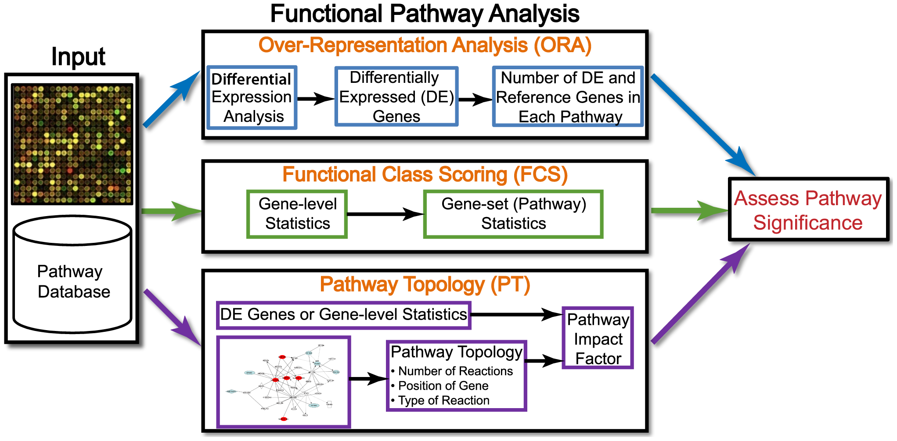
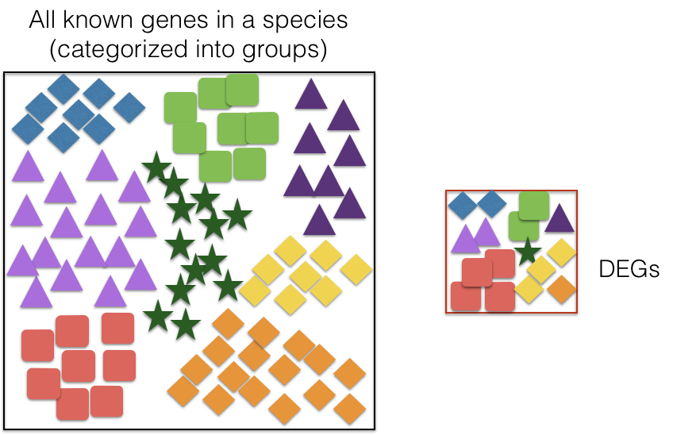

```{r}
#| label: load_libraries_data
#| echo: false
# Load libraries and data
library(Seurat)
library(tidyverse)
library(EnhancedVolcano)

# ORA and GSEA libraries
library(tidyverse)
library(clusterProfiler)
library(org.Hs.eg.db)
library(msigdbr)

set.seed(12345)

seurat_rctd <- qs2::qs_read("intermediate/12_seurat_RCTD.qs")
```

Approximate time: 90 minutes

## Learning objectives 

In this lesson, we will:

- Run differential gene expression analysis using a Wilcoxon test
- Calculate over-represented pathways
- Identify gene set enrichment scores for pathways

## Overview of lesson

By now, we have meaningful annotations for most of our bins for both samples. So now we can start to ask the question of how gene expression changes between sample conditions (NAT and CRC). Running a differential gene expression analysis is a great way to evaluate the significance of change between populations. However, looking at a table of genes can be overwhelming! So we can take the output from the DGE analysis to identify pathways that are enriched in one condition compared to another. This provides a mechanistic insight into the biological processes that differ between samples.

## Differential gene expression (DGE)

What if we were interested in a particular cell type and **understanding how gene expression changes across the different conditions?** To answer this, we will perform a differential gene expression analysis. Let's start by creating a new R script called `08_DGE_and_functional_analysis.R` and place it within our `scripts` directory.

```{r}
#| label: load 
#| eval: false
# DGE and pathway analysis
# Visium HD spatial transcriptomics workshop
# Author: Harvard Chan Bioinformatics Core
# Created: December 2025

# Load libraries
library(Seurat)
library(tidyverse)
library(EnhancedVolcano)

# ORA libraries
library(tidyverse)
library(clusterProfiler)
library(org.Hs.eg.db)
library(msigdbr)

set.seed(12345)
# Load dataset
seurat_rctd <- readRDS("data/intermediate_seurat/seurat_RCTD.rds")
```

For instance, maybe we are interested in seeing how the Myeloid population changes in gene expression between the CRC and NAT samples. To start identifying these changes, we are going to first subset the dataset to Myeloid bins based upon the annotation generated by RCTD.

```{r}
#| label: subset_myeloid
# Subset to Myeloid cells
seurat_myeloid <- subset(seurat_rctd,
                       first_type == "Myeloid")
Idents(seurat_myeloid) <- "orig.ident"
```

### `FindMarkers()`

The `FindMarkers()` function in the Seurat package is used to perform differential expression analysis between groups of cells. We will provide arguments to specify `ident.1` and `ident.2`, the two groups of cells we are interested in comparing. This function is commonly used at the [cell type annotation step](https://hbctraining.github.io/Intro-to-scRNAseq/lessons/13_marker_identification.html), but can also be used to calculate differentially expressed genes between experimental conditions.

::: {#fig-findmarkers .fig}
{width=350}

Schematic showing how the `FindMarkers()` function calculates differential genes.<br>
_Image source: [Introduction to scRNA-seq](https://hbctraining.github.io/Intro-to-scRNAseq/lessons/13_marker_identification.html)_
:::


We can use this same function to compare two groups of cells which represent different conditions by modifying the `ident` values provided. The `FindMarkers()` function has **several important arguments** we can provide when running it. To view what these parameters are, we can access the help page on this function:

```{r}
#| label: FindMarkers_help
#| eval: false
?FindMarkers
```

Below we have described in more detail what each of these arguments do:

| Parameter         | Description                                                                                                                                                                                  | Default |
|-------------------|----------------------------------------------------------------------------------------------------------------------------------------------------------------------------------------------|---------|
| `logfc.threshold` | The minimum log2 fold change for average expression of a gene in `ident.1` vs `ident.2`.                                                 | 0.25    |
| `min.diff.pct`    | The minimum percent difference between the percent of cells expressing the gene in the group and the percent of cells expressing the gene in all other groups combined.                    | —       |
| `min.pct`         | Only test genes that are detected in a minimum fraction of cells in either of the two populations; speeds up the function by skipping very infrequently expressed genes.                    | 0.1     |
| `ident.1`         | The group of interest; this function evaluates one group at a time, and `ident.1` must correspond to a value set in `Idents()`.                                                              | —       |
| `ident.2`         | The comparison group; specifies the group against which `ident.1` is compared.                                                                                                              | —       |


```{r}
#| label: FindMarkers
#| eval: false
# Calculate DGEs with wilcox test
dge <- FindMarkers(seurat_myeloid,
                   ident.1 = "P5CRC",
                   ident.2 = "P5NAT")
dge$gene <- rownames(dge)
dge %>% head()
```

```{r}
#| label: tbl-FindMarkers
#| tbl-cap: "Wilcoxon test results from comparing P5CRC and P5NAT Myeloid bins."
#| echo: false
# Calculate DGEs
dge <- FindMarkers(seurat_myeloid,
                   ident.1 = "P5CRC",
                   ident.2 = "P5NAT")
dge$gene <- rownames(dge)
dge %>% head() %>% knitr::kable()
```

**The output from the `FindMarkers()` function** is a dataframe containing a ranked list of differentially expressed genes listed by gene ID and associated statistics. We describe some of these columns below:

| Column      | Description                                                                                                                  |
|------------|------------------------------------------------------------------------------------------------------------------------------|
| `gene`     | The gene symbol.                                                                                                             |
| `p_val`    | The p-value not adjusted for multiple test corrections. **This should not be used to identify significant (see `p_val_adj`)**                                                                     |
| `avg_logFC`| The average log-fold change between sample groups, calculated as: $$\frac{gene\_avg_{ident.1}}{gene\_avg_{ident.2}}$$ Positive values indicate that the gene is more highly expressed in `ident.1`. |
| `pct.1`    | The percentage of cells where the gene is detected in `ident.1` (P5CRC).                                                     |
| `pct.2`    | The percentage of cells where the gene is detected on average in `ident.2` (P5NAT).                                             |
| `p_val_adj`| The adjusted p-value, based on Bonferroni correction using all genes in the dataset, used to determine significance.         |

::: callout-important
# Inflated p-values
These tests treat each cell as an independent replicate and ignore inherent correlations between cells originating from the same sample. This results in highly **inflated p-values** for each gene. [Studies have shown](https://academic.oup.com/bib/article/23/5/bbac286/6649780?login=false) a large number of [false positive associations](https://www.nature.com/articles/s41467-021-25960-2) with these results.
:::

### Visualizing results

Now that we have our DGE results, we can visualize the genes in a variety of different ways to better understand what is happening with our data.

**Volcano plot**

To get a first look at the differences in each condition, we can generate a volcano plot using the `EnhancedVolcano()` function. This is a visualization that allows us to quickly see trends in the significant genes. The x-axis represents the average log2-fold change value, showing the degree of difference between the two conditions. On the y-axis, we see our p_val_adj column represented after a negative log10 transformation is applied to better see the spread of the adjusted p-values.

**Volcano plots provide a great overview of which genes are up-regulated (positive on the x-axis) or down-regulated (negative on the x-axis).** These results are all relative to `ident.1` (P5CRC).

```{r}
#| label: fig-volcano
#| fig-cap: "Volcano plot of `FindMarkers()` differentially expressed genes for Myeloid bins."
#| fig-height: 7
#| fig-width: 10
# Volcano plot
EnhancedVolcano(dge,
                lab = dge$gene,
                x = "avg_log2FC",
                y = "p_val_adj",
                title = "FindMarkers Myeloid Results",
                subtitle = "CRC vs NAT")
```

**Violin plots**

While looking at the overall trends in the data is a great starting point, we can also look at genes that have large differences between CRC and NAT. To do this, we can pull the top 6 genes:

```{r}
#| label: top_genes
# Filter significant genes
dge_sig <- dge %>% subset(p_val_adj < 0.05)

# Get the gene names and get the first 6 values
genes <- dge_sig %>%
  pull(gene) %>%
  head(6)
genes
```

And then plot them using the `VlnPlot()` function:

```{r}
#| label: fig-vln
#| fig-cap: "Violin plot of top 6 genes in the Myeloid population."
# Violin plot expression of genes per condition
VlnPlot(seurat_myeloid, 
        genes,
        group.by = "orig.ident")
```

This can also be a helpful way in identifying the directionality of the log-fold change! `SRGN` had a positive `avg_log2FC` score and we can see there is more expression of this gene in condition `P5CRC`.

**UMAP plot**

We can look at the distribution of gene expression for each of the top 6 genes with a better understanding of where the cells for each condition exist in UMAP space.

```{r}
#| label: fig-featureplot
#| fig-cap: "Expression of top DE genes on the UMAP coordinates."
#| fig-height: 6
#| fig-width: 10
# UMAP of gene expression
FeaturePlot(seurat_myeloid, 
            genes, 
            reduction = "full.umap.sketch",
            ncol = 3)
```

These visuals would be most helpful if we had re-run PCA, UMAP, and clustering on this myeloid subpopulation. In doing so, we would be able to associate clusters to different subtypes of myeloid cells, which would inform the biological context of change in these genes.

**Spatial plot**

We also have the spatial coordinates for these bins, so we can plot the expression of these genes on our slides:

```{r}
#| label: fig-spatialfeatureplot
#| fig-cap: "Expression of top DE gene on the tissue."
# Spatial plot of gene expression
SpatialFeaturePlot(seurat_myeloid, 
                   genes[1], 
                   image.alpha = 0.1, 
                   pt.size.factor = 20)
```

:::{.callout-tip}
# [**Exercise 1**](13_dge_pathway-Answer_key.qmd#exercise-1)
1. Pick a different cell type and run `FindMarkers()`. Name the population you chose and print the top 6 genes in the results.
:::


## Functional Analysis

When it comes to functional analysis there are **various analyses** that can be done:

- Determine whether there is enrichment of known biological functions, interactions or pathways
- Identify genes' involvement in novel pathways or networks by grouping genes together based on similar trends
- Use global changes in gene expression by visualizing all genes being significantly up- or down-regulated in the context of external interaction data

Generally, for any differential expression analysis, it is useful to interpret the resulting gene lists using freely available web- and R-based tools.  While tools for functional analysis span a wide variety of techniques, they can loosely be categorized into [three main types](https://journals.plos.org/ploscompbiol/article?id=10.1371/journal.pcbi.1002375): over-representation analysis, functional class scoring and pathway topology. 

::: {#fig-findmarkers .fig}
{width=600}

Different methods of assessing pathways.<br>
_Image source: [Khatri et al. (2012)](https://journals.plos.org/ploscompbiol/article?id=10.1371/journal.pcbi.1002375)_
:::


In this lesson, we will walk you through both an over-representation analysis and gene set enrichment analysis (GSEA) using an R Bioconductor package called [`clusterProfiler`](https://bioconductor.org/packages/release/bioc/vignettes/clusterProfiler/inst/doc/clusterProfiler.html).


## Over-representation analysis

Over-representation analysis (ORA) is used to determine which _a priori_ defined gene sets are more present (over-represented) in a subset of “interesting” genes than what would be expected by chance [(Huang et al. 2009)](https://pmc.ncbi.nlm.nih.gov/articles/PMC2615629/). Most genes in the genome have some pre-existing annotation associated with it, which has been compiled through a combination of manual curation and computational algorithms. There are a number of existing databases which define genes using a controlled vocabulary and then categorize genes into groups (gene sets) based on shared function, involvement in a pathway or presence in a specific cellular location, etc. A very commonly used gene annotation resource is the [Gene Ontology (GO) database](https://geneontology.org/), and is what we will use in our workflow.

We then use those categorizations to assess whether or not the enrichment observed amongst our DE gene results when compared to the larger universe of genes is significant. 

::: {#fig-findmarkers .fig}
{width=500}

Showcasing the universe of all genes compared to the significant differentially expressed genes used as input for over-representation analysis.
:::

### Hypergeometric test

The statistical test that will determine whether something is actually over-represented is the *Hypergeometric test*.

Hypergeometric distribution is a probability distribution that describes the probability of some number of genes (*k*) being associated with "Functional category 1", for all genes in our gene list (*n*), compared to the number of genes (*K*) associated with "Functional category 1" from a population of all of the genes in entire genome (*N*).

The calculation of probability of *k* successes follows this formula:

$$
p = 1 - \sum_{i=0}^{k-1} \frac{\binom{N}{k} \binom{N-K}{n-k}}{\binom{N}{n}}
$$

This test will result in a p-value that will be adjusted to consider  multiple testing correction for each category tested.

### Running ORA with clusterProfiler

Now that we know more about what ORA is doing, let's take our significant genes and see if there are any GO terms over-represented that align with what we expect to be happening in Myeloid cells in response to cancer.

We will take **the results from the FindMarkers DE** and run different **functional analysis** methods to obtain some biological insight. We will create vectors containing our gene symbols for the background and query set of genes. We will query the up- and down-regulated gene sets separately, but note that you can also use the entire significant list as a query input.

```{r}
#| label: subset_upregulated_genes
# Create background dataset for hypergeometric testing using all tested genes for significance in the results
all_genes <- as.character(dge$gene)

# Extract significant results for up-regulated genes
sigUp <- dplyr::filter(dge_sig, 
                       p_val_adj < 0.05, 
                       avg_log2FC > 0)

# Convert the genes to a character vector
sigUp_genes <- as.character(sigUp$gene)

# Inspect the significantly up-regulated genes
sigUp_genes %>% head()
```

Finally, we can perform the GO enrichment analysis with `enrichGO()`, focusing on the `BP` biological processes pathways:

```{r}
#| label: GO_upregulated
# Run GO enrichment analysis 
egoUp <- enrichGO(gene = sigUp_genes, 
                  universe = all_genes,
                  keyType = "SYMBOL",
                  OrgDb = org.Hs.eg.db, 
                  ont = "BP", 
                  pAdjustMethod = "BH", 
                  qvalueCutoff = 0.05, 
                  readable = TRUE)
```

::: {.callout-note collapse="true"}
# `enrichGO()` parameters
**Note 1:** The different organisms with annotation databases available to use with the `OrgDb` argument can be found [here](https://bioconductor.org/packages/release/BiocViews.html#___OrgDb).

**Note 2:** The `keyType` argument may be coded as `keytype` in different versions of `clusterProfiler`.

**Note 3:**  The `ont` argument can accept either `"BP"` (Biological Process), `"MF"` (Molecular Function), and `"CC"` (Cellular Component) subontologies, or `"ALL"` for all three.
:::

### Exploring results from an over-representation analysis

Let's take a look at what terms are identified as over-represented in the up-regulated genes.

```{r}
#| label: view_GO_upregulated
#| eval: false
# Output results from GO analysis to a table
cluster_summaryUp <- data.frame(egoUp)

# View GO upregulated output
View(cluster_summaryUp)
```

```{r}
#| label: tbl-GO_upregulated
#| tbl-cap: Upregulated GO BP enriched pathways in P5CRC.
#| echo: false
# GO upregulated data table
cluster_summaryUp <- data.frame(egoUp)
cluster_summaryUp %>% head() %>% knitr::kable()
```

In the first few columns, we see the GO identifier and the descriptive term name. In the next two columns that follow, we observe `GeneRatio` and `BgRatio`. These values allows us to compare the overlaps to the background. Here we describe what each of the columns represent in the results:

| Term             | Math Expression                | Description                                                                                                                                                                                                 |
|------------------|--------------------------------|-------------------------------------------------------------------------------------------------------------------------------------------------------------------------------------------------------------|
| **BgRatio**      | $\dfrac{K}{N}$                 | The total number of genes in the GO term gene set (*K*), divided by the total number of genes in the universe (*N*).                                                                                       |
| **GeneRatio**    | $\dfrac{k}{n}$                 | The total number of genes in our significantly up‑regulated DE gene set that are part of a given GO term (*k*), divided by the total number of genes in our significantly up‑regulated DE gene set (*n*). |
| **Fold Enrichment** | $\dfrac{k/n}{K/N}$          | How many-fold enriched the **GeneRatio** is compared to the **BgRatio**.                                                                                                                                   |
| **p.adjust**     | –                              | Multiple-testing adjusted p-value (results are typically ordered by this column).                                                                                                                          |
| **geneID**       | –                              | Gene symbols of the genes overlapping between the DE gene set and the GO term, separated by a "/".                                                                                                                                                                    |

In the `P5CRC` sample, we can see that the top differential pathway is "inflammatory response" among the Myeloid bins. This makes sense as the Myeloid cells (Macrophages, Dendritic cells, etc) modulate the immune response in a system. In the case of cancer, it makes sense that there is an increased inflammatory signal in this population compared to the healthy, adjacent tissue.

::: callout-tip
# [**Exercise 2**](13_dge_pathway-Answer_key.qmd#exercise-2)
2. Run an ORA analysis on the cell type that you calculated DE results for in the previous exercise. What is the top pathway that appears?
:::

### Visualizing over-representation analysis results
`clusterProfiler` has a variety of options for viewing the over-represented GO terms. We will explore the dotplot in this lesson.

The **dotplot** shows statistics associated with a user-selected top number of significant terms. The color of the dots represents the adjusted p-values for these terms and size of the dots corresponds to the total count of significantly DE genes annotated with the GO term (Count). This plot displays the top 20 GO terms ordered by gene ratio, not adjusted p-value.

```{r fig.width=15}
#| label: fig-dotplot_GO_upregulated
#| fig-cap: "Dotplot of the top 20 significant, upregulated biological processes pathways."
#| fig-height: 8
# Create a dotplot of GO results 
dotplot(egoUp,
        showCategory = 20)
```

## Gene Set Enrichment Analysis (GSEA)

While over-representation analysis is helpful and commonly used, it does require you to subset your gene list using an arbitrary threshold. There could very well be many genes that very narrowly miss this threshold and are therefore not considered in the functional analysis. To get around this, there are **functional class scoring (FCS) methods** that can be helpful. For these methods the hypothesis is that **although large changes in individual genes can have significant effects on pathways (and will be detected via ORA methods), weaker but coordinated changes in sets of functionally related genes (i.e., pathways) can also have significant effects**. Thus, rather than setting a threshold to identify 'significant genes', all genes are considered in the analysis. The gene-level statistics from the dataset are aggregated to generate a single pathway-level statistic and statistical significance of each pathway is reported. This type of analysis can be particularly helpful if the differential expression analysis only outputs a small list of significant DE genes.

A commonly used example of an FCS method is GSEA [(Subramanian et al. 2005)](https://www.pnas.org/doi/10.1073/pnas.0506580102). Gene set enrichment analysis utilizes gene-level statistics or log2-fold changes for all genes to look to see whether gene sets for particular biological pathways (e.g., derived from KEGG pathways, Gene Ontology terms, MSigDB, etc.) are enriched among the large positive- or negative-fold changes.

::: {#fig-findmarkers .fig}
{width=400}

Schematic of the GSEA method.<br>
_Image source: [Subramanium et al. (2005)](https://www.pnas.org/doi/10.1073/pnas.0506580102)_
:::

This image describes the theory of GSEA, with the 'gene set S' showing the metric used (in our case, ranked log2-fold change) to determine enrichment of genes in the gene set. There are four main steps that are being performed:

1. **Rank genes**:
    - Genes in a dataset are ranked based on the given statistic, which in our case is the log2-fold changes. 
2. **Calculate enrichment scores for each gene set**
    - This score reflects how often genes in the set appear at the top or bottom of the ranked list.
    - The score is calculated by walking down the list of log2-fold changes and increasing the running-sum statistic every time a gene in the gene set is encountered and decreasing it when genes are not part of the gene set.
    - Increase/decrease is determined by magnitude of fold change.
3. **Estimate statistical significance**
    - A permutation test is used to calculate a null distribution for the enrichment score. This produces a p-value that represents the probability of observing a given enrichment score. 
4. **Normalize enrichment scores to account for gene set size**
    - The raw enrichment score (ES) depends on properties like the size of the gene set. To make scores comparable across gene sets, GSEA computes a normalized enrichment score (NES) by adjusting the ES relative to scores obtained from permutations for that specific gene set.
5. **Adjust for multiple hypothesis testing**
    - Because many gene sets (pathways) are tested simultaneously, the resulting p‑values are adjusted to control for multiple testing by estimating a false discovery rate (FDR).

### Running GSEA with MSigDB gene sets

The `clusterProfiler` package offers several functions to perform GSEA using different genes sets, including but not limited to GO, KEGG and MSigDb. We will use the MSigDb gene sets in our example below. The Molecular Signatures Database (also known as [MSigDB](https://www.gsea-msigdb.org/gsea/msigdb/human/collections.jsp)) is a collection of annotated gene sets. It contains 8 major collections.

To run GSEA with the MSigDb gene sets, we will use the `msigdbr` R package which provides the MSigDB gene sets in tidy data format that can be used directly with `clusterProfiler`. 

::: {.callout-note collapse="true"}
# Selecting species and pathways for `msigdbr`

The `msigdbr` package **supports several species**:

```{r}
#| label: msigdb_species
# Show MSigDB species
msigdbr_species()
```

And you can see **what gene sets are available**:

```{r}
#| label: msigdbr_collection
# Show MSigDB collections
msigdbr_collections()
```

:::

For our analysis, we will use `C5`, which contains the Gene Ontology gene sets. This will allow us to see how the results align with output from ORA. From the retrieved table, we only need two columns: gene set name and gene symbol:

```{r}
#| label: obtain_human_msigdbr
# Use a specific collection; C5 GO signatures
m_t2g <- msigdbr(species = "Homo sapiens",
                 collection = "C5") %>%
  dplyr::select(gs_name, gene_symbol)
```

Now that we have our gene sets, we need to prepare the fold changes. GSEA will use the log2-fold changes obtained from the differential expression analysis for every gene to perform the analysis. We need to create an ordered and named vector for input to `clusterProfiler`:

```{r}
#| label: extract_foldchange
# Extract the fold changes
foldchanges <- dge_sig$avg_log2FC

# Name each fold change with the corresponding gene symbol
names(foldchanges) <- dge_sig$gene

# Sort fold changes in decreasing order
foldchanges <- sort(foldchanges, decreasing = TRUE)

# Inspect the fold changes ordered and named vector
foldchanges %>% head()
```

Now we are ready to run GSEA!

```{r}
#| label: run_GSEA
# Run GSEA
msig_GSEA <- GSEA(foldchanges,
                  TERM2GENE = m_t2g,
                  verbose = FALSE)

# Extract the GSEA results
msigGSEA_results <- msig_GSEA@result
```

::: callout-note
# Setting seed
The permutations are performed using random reordering, so every time we run the function we will get slightly different results. If we would like to use the same permutations every time we run a function, then we use the `set.seed()` function prior to running.
:::

This is a good spot to save the results so that we can revisit them at any point later on:

```{r}
#| label: write_csv
#| eval: false
# Write results to file
write.csv(msigGSEA_results,
          file = "results/gsea_msigdb_GO_genesets.csv",
          quote = FALSE)
```

Take a look at the results table and reorder by NES (normalized enrichment score). **What terms do you see positively enriched? Does this overlap with what we observed from ORA analysis?**

```{r}
#| label: view_msigDB_results
#| eval: false
# Look at results ordered by NES
msigGSEA_results %>%
  arrange(desc(abs(NES))) %>%
  View()
```

```{r}
#| label: tbl-msigdb_results
#| tbl-cap: GSEA pathway analysis results, ordered by normalized enrichment score (NES).
#| echo: false
msigGSEA_results %>% arrange(desc(abs(NES))) %>% head() %>% knitr::kable()
```

- The first few columns of the results table identify the gene set information.
- The next columns include the associated statistics.
- The last column will report which genes are part of the 'core enrichment'. These are the genes associated with the pathway which contributed to the observed enrichment score (i.e., in the extremes of the ranking).

::: callout-tip
# [**Exercise 3**](13_dge_pathway-Answer_key.qmd#exercise-3)
3. Run GSEA on the cell type that you calculated DE results for in the first exercise. What is the top pathway that appears?
:::

### GSEA visualization

Let's explore the GSEA plot of enrichment of one of the pathways in the ranked list using a built-in function from clusterProfiler. We can pick one of the top terms `GOBP_INFLAMMATORY_RESPONSE`:

```{r}
#| label: create_GSEA_plot
# Plot the GSEA plot for a single enriched GO term
gseaplot(msig_GSEA,
         geneSetID = 'GOBP_INFLAMMATORY_RESPONSE')
```

In this plot, the lines in upper panel (or on the x-axis in the lower panel) represent the genes in the gene set `GOBP_INFLAMMATORY_RESPONSE` and where they occur among the log2-fold changes. The largest positive log2-fold changes are on the left-hand side of the plot, while the largest negative log2-fold changes are on the right. The top plot shows the magnitude of the log2-fold changes for each gene, while the bottom plot shows the running sum, with the enrichment score peaking at the red dotted line (which is among the positive log2-fold changes). This suggests the up-regulation of this function.

***

[Next Lesson >>](14_svgs.qmd)

[Back to Schedule](../schedule/schedule.qmd)