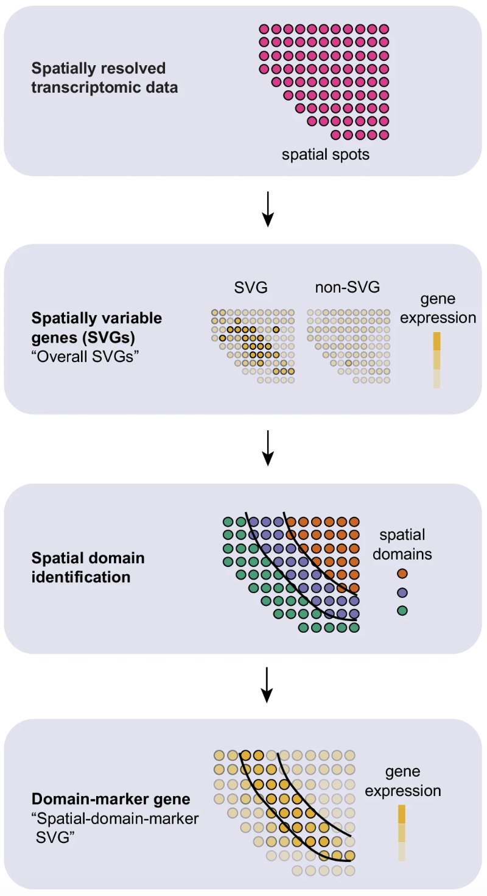
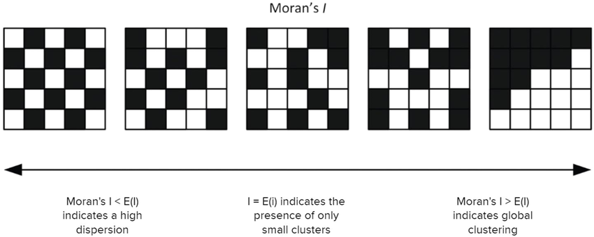

```{r}
#| label: load_libraries_data
#| echo: false
# Load libraries and data
library(Seurat)
library(tidyverse)
library(qs2)

# Increases the size of the default vector (8GB)
options(future.globals.maxSize = 8000 * 1024^2)

# Set parallelization (multithreading) to speed up calculations
plan("multicore", workers = parallel::detectCores() - 1)

# Load dataset
seurat_rctd <- qs_read("intermediate/09_seurat_banksy_2.qs")
```

Approximate time: XX minutes

## Learning objectives 

In this lesson, we will:

- Learning Objective 1
- Learning Objective 2
- Learning Objective 3

## Overview of lesson

When doing XYZ...

## Spatially variable genes (SVGs)


::: {#fig-svg_schematic .fig}
{width=300}

Schematic of how spatially variable genes present themselves in spatial data.<br>
_Image source: [Yan et al. (2025)](https://www.nature.com/articles/s41467-025-56080-w)_
:::


Spatially variable genes (SVGs) are similar in concept to highly variable genes (HVGs). These were identifies by evaluating the variability of gene expression across the entire dataset. However, now we have the additional layer of the spatial location of each bin. Therefore we are able to identify genes that have different levels of expression depending on which area of the tissue they are found on.

These methods can be used to identify genes that have strong strong spatial associations for downstream analyses - similar to how we used HVGs to calculate PCA. These SVGs can also be used to evaluate spatial niches within cell-types to assist in find subtypes with the tissue. 

Ultimately, these genes provide another peek in the spatial context of the tissue. 


##  Moran's I

Most of the SVG algorithms are built upon the concept of [Moran's I](https://en.wikipedia.org/wiki/Moran%27s_I) which is defined as "a measure of spatial autocorrelation".

The math behind the method is defined like so:

$$
I =
\frac{N}{S_0}
\frac{
\sum_{i=1}^N \sum_{j=1}^N w_{ij}\,(x_i - \bar{x})(x_j - \bar{x})
}{
\sum_{i=1}^N (x_i - \bar{x})^2
}
$$

where:

- $N$ is the number of spatial units, indexed by $i$ and $j$;
- $x$ is the variable of interest;
- $\bar{x}$ is the mean of $x$;
- $w_{ij}$ are the elements of the spatial-weights matrix, with $w_{ii} = 0$;
- $S_0$ is the sum of all spatial weights, $S_0 = \sum_{i=1}^N \sum_{j=1}^N w_{ij}$.

For a random spatial distribution, Moran's I will be near zero. A large positive value indicates the data is clustered. A large negative value indicates that the data is dispersed, meaning units that are close spatially have dissimilar variable values.

::: {#fig-morans_i .fig}


Range of Moran's I values, showing the range of scores that correspond to different spatial structures (clustered, random, dispersed).<br>
_Image source: [Tsui et al. (2022)](https://www.frontiersin.org/journals/built-environment/articles/10.3389/fbuil.2022.954642/full)_
:::

To see why this is the case, consider the expression $(x_i - \bar{x}) (x_j - \bar{x})$ in the above formula. If $x_i$ and $x_j$ are similar and far from the mean, then this product will be large and positive. If they are dissimilar (in particular, if one is well above the mean and one is far below) then this product will be large and negative.

::: callout-warning
Look into the weights that automatically assigned in the `FindSpatiallyVariableFeatures` function
:::

Note that Moran's I depends strongly on the choice of $w_{ij}$, which encodes the spatial relations of the units. A large value $w_{ij}$ reflects a modeling assumption that the units with variables $x_i$ and $x_j$ are close spatially. Different choices of weights will result in different values of Moran's I. In fact, even the upper and lower bounds of the measure depend on the spatial-weights matrix; caution is needed when choosing the weights and interpreting the corresponding Moran's I.


## Running Moran's I

Moran's I will work best if we focus on one sample at a time, as the spatial coordinates will be consistent within a single slide. Furthermore, because this step can take a long time to run, we are going to further subset the data to a singular celltype. In this way, we are attempting to evaluate genes that are specific to spatially defined subtype of a celltype. 

In this case, let us zoom in on the tumor cells in the CRC dataset:

```{r}
#| label: subset_crc_tumor
crc_sub <- subset(seurat_rctd,
              subset = (orig.ident == "P5CRC") &
                       (seurat_cluster.projected == 1))
crc_sub
```

For the best results we are going to make use of the `scale.data` assay (this was originally calculated right before the PCA step). However, we deleted this layer in the interest of storing memory, so we re-calculate it now:

```{r}
#| label: ScaleData
crc_sub <- ScaleData(crc_sub)
crc_sub
```

Now we can actually calculate Moran's I with `FindSpatiallyVariableFeatures()` and set the `selection.method = "moransi"`.

We are additionally going to specify that we want to evaluate Moran's I on the top 100 highly variable genes to reduce the number of calculations that take place (so we can reasonably run this on a laptop).

```{r}
#| label: run_morans_i
#| eval: false
crc_sub <- FindSpatiallyVariableFeatures(crc_sub,
                                      selection.method = "moransi",
                                      verbose = TRUE,
                                      features = VariableFeatures(crc_sub)[1:100],
                                      image = "P5CRC_sub.008um")
```

```{r}
#| label: instructor_svg
#| echo: false
# qs2::qs_save(crc_sub, "intermediate/14_crc_svg.qs")
crc_sub <- qs2::qs_read("intermediate/14_crc_svg.qs")
```

We can now access the features that have the top 

```{r}
#| label: top_svgs
# Get top 10 spatially variable features
top10_svg <- SpatiallyVariableFeatures(crc_sub, 
                                       method = "moransi")
top10_svg <- top10_svg[1:10]
top10_svg
```

And visualize the expression on the spatial slide:

```{r}
#| label: fig-top_svgs
#| fig-cap: Top spatially variable gene expression for tumor cells, plotted on top of the tissue.
#| fig-width: 6
#| fig-height: 6
# Spatial plot of top spatially variable features
SpatialFeaturePlot(crc_sub,
                   features = top10_svg[1:4],
                   pt.size.factor = 15,
                   image.alpha = 0.1, 
                   ncol = 2)
```

Recall in the [BANKSY lesson](11_banksy_clustering.qmd) we noted that the BANKSY algorithm identified different, spatially constrained subtypes in this cancerous region? Now we can clearly see which of those genes were defining the phenotype of these tumerous subtypes.

## Other SVG methods

Some popular methods include, but are not limited to:

- [SpatialDE](https://www.nature.com/articles/nmeth.4636)
- [MERINGUE](https://genome.cshlp.org/content/31/10/1843.long)
- [BinSpect](https://link.springer.com/article/10.1186/s13059-021-02286-2)

Some of these algorithms are written in Python.

***

[Next Lesson >>](15_cellchat.qmd)

[Back to Schedule](../schedule/schedule.qmd)