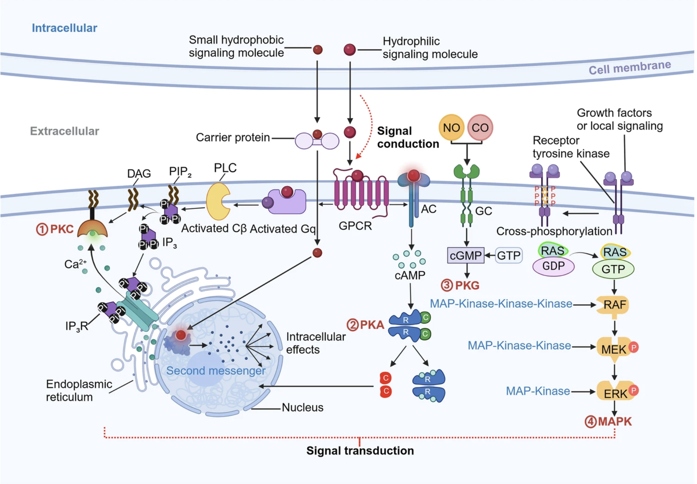
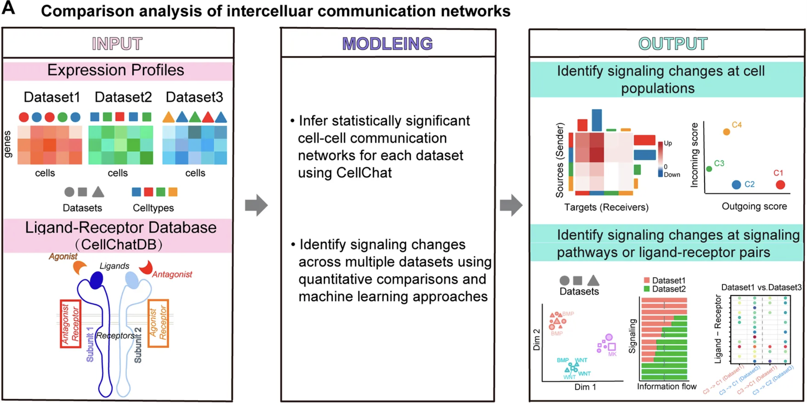
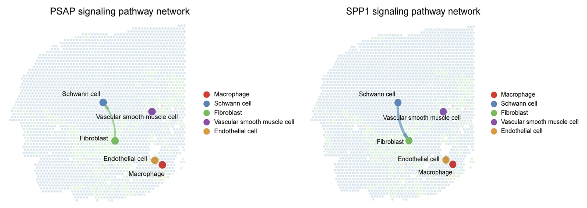

```{r}
#| label: load_libraries_data
#| echo: false
# Load libraries and data
library(Seurat)
library(tidyverse)
library(CellChat)

# devtools::install_github("KlugerLab/ALRA")
# remotes::install_github('JEFworks-Lab/MERINGUE', build_vignettes = TRUE)
# devtools::install_github("jinworks/SpatialCellChat")
# library(SpatialCellChat)


set.seed(12345)

# Set parallelization (multithreading) to speed up calculations
plan("multicore", workers = parallel::detectCores() - 1)

# Increases the size of the default vector (8GB)
options(future.globals.maxSize = 8000 * 1024^2)

seurat_rctd <- qs2::qs_read("intermediate/12_seurat_RCTD.qs")
```

Approximate time: XX minutes

## Learning objectives 

In this lesson, we will:

- Create a CellChat object
- Run the CellChat workflow to calculate ligand-receptor interactions
- Visualize ligand receptor interactions

## Overview of lesson

At this point in our analysis, we are comfortable with the celltype annotations of our dataset. So we might start asking questions about how each of those populations are interacting with one another. In this lesson, we will use CellChat to build directed signaling networks. These interaction maps help connect static expression patterns to dynamic biological processes such as immune infiltration, niche signaling or tumor–stroma crosstalk.

## Cell-cell communication

::: {#fig-ccc_schematic .fig}
{width=500}

Schematic of representative signal pathways for cell-cell communication.<br>
_Image source: [Su et al., 2024](https://www.nature.com/articles/s41392-024-01888-z)_
:::

We know that cells do not exist in an isolated environment, where they do not interact with anything. The opposite is true, where cells interact with one another and exchange information through various mechanisms, such as signal transduction for activating proteins. Understanding which cells interact with each other is crucial for understanding how cell differentiation, organ development and metabolism is modulated.

Spatial transcriptomics is a great input dataset for these methods because **many cell interactions are observed between cells in close proximity**. The coordinates become a powerful input parameter to improve the accuracy of interaction results.

### CellChat

CellChat is a method that was originally published by [Jin et al., 2021](https://www.nature.com/articles/s41467-021-21246-9), and then updated several years later [Jin et al., 2025](https://www.nature.com/articles/s41596-024-01045-4), to incorporate spatial coordinates into the model. The outputs of CellChat are lists of significant ligand-receptor interactions between cell types.

::: {#fig-cellchat_schematic .fig}
{width=500}

Overview of CellChat method.<br>
_Image source: [Hao et al., 2021](https://www.frontiersin.org/journals/genetics/articles/10.3389/fgene.2021.751158/full)_
:::

First, the authors created a database of known ligand-receptor interactions from the literature classified as: secreted signaling, extracellular matrix recepotrs and cell-cell contact. This database is used in conjunction with your own dataset and its celltype labels to identify communcations between populations. In essence, the method identifies overexpressed ligand receptors from the database in your own data to measure association using the principle of mass action.

## Running cellchat

CellChat was written such that you run the workflow on one sample at a time and then merge all datasets together to run a comparative analysis. So here, we are going to focus on the ligand-receptor results for our `P5CRC` dataset. As this is a new analysis, we will create a new script titled `09_cellchat.R` and place it within our `scripts` directory:

```{r}
#| label: header_libraries
#| eval: false
# CellChat
# Visium HD spatial transcriptomics workshop
# Author: Harvard Chan Bioinformatics Core
# Created: May 2025

# Load libararies
library(tidyverse)
library(Seurat)
library(CellChat)
set.seed(12345)

# Increases the size of the default vector (8GB)
options(future.globals.maxSize = 8000 * 1024^2)
# Set parallelization (multithreading) to speed up calculations
library(future)
plan(multisession, workers = parallel::detectCores() - 1)

# Load dataset
seurat_rctd <- readRDS("data/intermediate_seurat/seurat_RCTD.rds")
```

For now, let us say that our biological question is to identify which populations are interacting with the tumor cells in colorectal cancer. So first, we are going to subset the Seurat object to our relevant bins.

```{r}
#| label: subset_crc
# Subset to CRC sample
# Remove unassigned bins
crc <- subset(seurat_rctd,
              subset = (orig.ident == "P5CRC") &
                       (first_type != "unassigned"))

# CellChat expects a "samples" column that is a factor
crc$samples <- factor(crc$orig.ident)
crc
```

### Create CellChat object

Similar to RCTD, CellChat has its own data structure for storing information. In order to create this object with the `createCellChat()` function, we must provide the following pieces of information:

- `object`: Normalized counts matrix
- `coordinates`: Spatial coordinates for each bin
- `spatial.factors`: Spatial factors (stored in json file)

To generate these, we can use the `GetAssayData()` to grab the log-normalized counts from the `crc` Seurat object:

```{r}
#| label: get_assay
#| eval: false
# Get normalized counts matrices
counts_norm_crc <- GetAssayData(crc,
                                assay = "Spatial.008um",
                                layer = "data")
counts_norm_crc[1:5, 1:5]
```

```{r}
#| label: tbl-get_assay
#| tbl-cap: "First 5 bins and genes of log-normalized counts in the P5CRC dataset."
#| echo: false
# Get normalized counts matrices
counts_norm_crc <- GetAssayData(crc,
                                assay = "Spatial.008um",
                                layer = "data")
counts_norm_crc[1:5, 1:5] %>% knitr::kable()
```

Next, we will grab the spatial coordinates associated with each bin. Here, we will use the `FetchData()` function to grab the coordinates we stored in the `@meta.data`. You could also use the ouput from the `GetTissueCoordinates()` function as well.

```{r}
#| label: get_coords
#| eval: false
# Get spatial coordinates
coords_crc <- FetchData(crc, vars = c("x", "y"))
coords_crc %>% head()
```

```{r}
#| label: tbl-get_coords
#| tbl-cap: "Spatial coordinates of the first 5 bins in the P5CRC dataset."
#| echo: false
# Get spatial coordinates
coords_crc <- FetchData(crc, vars = c("x", "y"))
coords_crc %>% head() %>% knitr::kable()
```

We now need to grab the `spatial.factors` which is described as a dataframe with `ratio` and `tol`, where:

- `ratio`: conversion from image units (e.g., pixels) to micrometers. For example: `ratio = 0.18` means `1 pixel = 0.18 µm`.
- `tol`: distance tolerance to make center-to-center distance comparisons more robust, often set to about _half_ the cell/spot size (in µm).

Luckily, these values are stored in the `scalefactors_json.json` file that Space Ranger outputs. So we will need to load in the file using `jsonlite` and then create a dataframe with the relevant information.

```{r}
#| label: spatial_factors
# Scale factors stored in Space Ranger json output file
sf_json <- jsonlite::fromJSON("data/P5CRC_cropped/binned_outputs/square_008um/spatial/scalefactors_json.json")

# Create spatial.factors dataframe
spatial_factors_crc <- data.frame(
  # Pixels-to-µm conversion factor
  ratio = sf_json$bin_size_um / sf_json$spot_diameter_fullres,
  # Neighbour tolerance radius in µm
  tol = sf_json$bin_size_um / 2)
spatial_factors_crc
```

With all three input files needed for `createCellChat()` generated, we can start the CellChat workflow. We will additionally supply our metadata as well as the column which contains our cell type annotations (`first_type`).

```{r}
#| label: create_cellchat
# Create cellchat object
cellchat_crc <- createCellChat(
  object = counts_norm_crc,
  coordinates = coords_crc,
  spatial.factors = spatial_factors_crc,
  meta = crc@meta.data,
  group.by = "first_type",
  datatype = "spatial")

# Display the CellChat object
cellchat_crc
```

### CellChat databset

CellChatDB is the database that contains the manually curated set of ligand-receptor interactions created by the authors. It includes the following types of interactions:

- Secretory autocrine/paracrine signaling interactions
- Cell-cell contact interactions
- Extracellular matrix (ECM)-receptor interactions
- Non-protein signaling

We want to incorporate this information into our `cellchat_crc` so that when we run CellChat, the workflow will automatically know which interactions to include in the analysis. This database is available for both mouse and human. Since we are working with human samples, we will use `CellChatDB.human` and we assign this to our CellChat object.

```{r}
#| label: load_cellchat_db
# Load CellChat databases
cellchat_db <- CellChatDB.human

# Assign DB to cellchat object in the DB slot
cellchat_crc@DB <- cellchat_db
```


::: callout-note
# Subset CellChatDB
If you are not interested in the full set of interactions, you can subset the CellChatDB object like so:

```{r}
#| label: subset_DB
#| eval: false
# DO NOT RUN
# Subset CellChatDB for cell-cell communication analysis
cellchat_db <- subsetDB(CellChatDB, 
                            search = c("Secreted Signaling",
                                       "ECM-Receptor", 
                                       "Cell-Cell Contact"), 
                            non_protein = FALSE)
```

:::

Now that the database is linked to our dataset, we **need** to run the `subsetData()` function to filter the dataset to the signaling genes to save on computation.

```{r}
#| label: subsetdata_cellchat
# Subset step is required even if you have not filtered databset
cellchat_crc <- subsetData(cellchat_crc)
```

Next, we identify which genes are overexpressed in each cell type. These scores are calculated with a [Wilcoxon and auROC test](https://rdrr.io/github/immunogenomics/presto/man/wilcoxauc.html) from the `calculateOverExpressed()` function. 

This is very similar to how we ran `FindMarkers()` in a [previous lesson](13_dge_pathway.qmd). The results are stored in the `@var.features` slot of the CellChat object. To preview what is happening behind the scenes, we can take a look at the top genes per clusters, ranked by the adjusted p-value and log-fold change.

```{r}
#| label: identify_overexpressed_genes
#| eval: false
# Identify genes that are over-expressed relative to other cell types
cellchat_crc <- identifyOverExpressedGenes(cellchat_crc)

# Print top genes per cell type
cellchat_crc@var.features$features.info %>%
  group_by(clusters) %>%
  arrange(pvalues.adj, logFC) %>%
  slice_head(n = 2) %>% 
  View()
```

```{r}
#| label: tbl-identify_overexpressed_genes
#| tbl-cap: "Top over expressed genes in each cell type."
#| echo: false
# Identify genes that are over-expressed relative to other cell types
cellchat_crc <- identifyOverExpressedGenes(cellchat_crc)

# Print top genes per cell type
cellchat_crc@var.features$features.info %>%
  group_by(clusters) %>%
  arrange(pvalues.adj, desc(logFC)) %>%
  slice_head(n = 2) %>%
  knitr::kable()
```

Some of these genes may look familiar!

### Run CellChat and filter results

**We will not be running the following three steps during class due to the time it takes to compute.** We will provide an RDS object with the output in the appropriate step of the workflow.

Similar to how we identified over-expressed genes per cell type, we can also calculate over-expressed **interactions**, or ligand-receptor pairs. 

```{r}
#| label: identifyOverExpressedInteractions
#| eval: false
# DO NOT RUN
# Identify interactions that are over-expressed relative to other cell types
cellchat_crc <- identifyOverExpressedInteractions(cellchat_crc)
```

This next step of `smoothData()` (or `projectData()` in older version of CellChat) is **optional**. Here, we use the protein-protein network (`PPI.human`) to identify genes that can be smoothed based upon the neighborhood structure of the data. The [authors note](https://github.com/jinworks/CellChat/blob/main/R/utilities.R#L817) that "This function is useful when analyzing single-cell data with **shallow sequencing depth** because the projection reduces the dropout effects of signaling genes, in particular for possible zero expression of subunits of ligands/receptors"

```{r}
#| label: smoothdata
#| eval: false
# DO NOT RUN
# (Optional) 
# Smooth expression over the protein-protein interaction network to reduce dropout noise. 
# If you run this, set raw.use = FALSE in computeCommunProb()
cellchat_crc <- smoothData(cellchat_crc,
                           adj = PPI.human)
# For older versions of CellChat, the function is: 
# cellchat <- projectData(cellchat, PPI.human) 
```

The last computationally heavy step of this workflow is `computeCommunProb()` function, which calculates the interaction strengths and probabilities of cell types. The steps are:

1. Summarize gene expression per cell type by average and normalize (`triMean`)
2. Create ligand-receptor (LR) pairs and assign values based on expression patterns for each cell type
3. Assign weights to cell types based upon spatial proximity, where higher weights indicates closeness
4. Computer communication strength for LR and cell type pairs, incorporating spatial weights
5. Run permutation test for significance testing

These steps run under the principle of mass action, where high expression of ligand and receptors in cell types indicate a higher interaction strength.

```{r}
#| label: tbl-computeCommunProb_params
#| tbl-cap: "Parameters for `computeCommunProb()` function."
#| echo: false
library(knitr)
library(kableExtra)

args <- data.frame(
  Argument = c("`object`", "`type`", "`raw.use`", "distance.use", "`interaction.range`", "`scale.distance`", "`contact.dependent`", "`contact.range`"),
  Description = c(
    "CellChat object.",
    'Method for average expression; "triMean" (default) or "truncatedMean" (needs trim).',
    "Use raw (TRUE) or if smoothData() was run (FALSE)",
    "Apply spatial distance constraints (TRUE/FALSE.",
    "Maximum ligand interaction distance (µm)",
    "Scaling factor for spatial distances (e.g., 1, 0.2)",
    "Whether signaling is contact-dependent (TRUE/FALSE)",
    "Maximum distance (µm) for cells to be considered in contact"
  )
)

kable(args, col.names = c("Argument", "Description")) |>
  kable_styling(full_width = FALSE) |>
  column_spec(1, width = "20%") |>
  column_spec(2, width = "80%")
```

```{r}
#| label: computeCommunProb
#| eval: false
# DO NOT RUN
# Calculate community probability
cellchat_crc <- computeCommunProb(
  cellchat_crc,
  type = "trimean",
  distance.use = TRUE,
  interaction.range = 200,
  scale.distance = 0.2,
  contact.dependent = TRUE,
  contact.range = 10,
  raw.use = FALSE,
  seed.use = 12345)
```

```{r}
#| label: instructor_15_cellchat_crc_computeCommunProb
#| echo: false
# qs2::qs_save(cellchat_crc, "intermediate/15_cellchat_crc_computeCommunProb.qs")
# saveRDS(cellchat_crc, "data/intermediate_seurat/cellchat_crc_computeCommunProb.rds")
cellchat_crc <- qs2::qs_read("intermediate/15_cellchat_crc_computeCommunProb.qs")
```

This creates a new slot in the CellChat object called, `@net`, where the interaction strengths are stored.

::: callout-important
# Load RDS object
Those three steps take a long time to run, so we have created an RDS object for you to load in with the results from these steps:

```{r}
#| label: load_cellchat_rds
#| eval: false
# Load processed cellchat object
cellchat_crc <- readRDS("data/intermediate_seurat/cellchat_crc_computeCommunProb.rds")
```

:::

We can now filter results based first on the how many bins belong to each cell type:

```{r}
#| label: filtercommunication
# Removes celltype pairs with too few bins
cellchat_crc <- filterCommunication(cellchat_crc,
                                    min.cells = 5)
```

Each of the ligands and receptors are associated with different signaling pathways. So to summarize the results, we can aggregate the values to create a pathway-level score to identify more general trends in the data.

```{r}
#| label: summarize_pathways
# Summarize Ligand-Receptor pair probabilities into signalling pathway probabilities
cellchat_crc <- computeCommunProbPathway(cellchat_crc)
# Count interactions and sum weights into a flat network matrix
cellchat_crc <- aggregateNet(cellchat_crc)
# Compute how much each celltype sends vs receives across all pathways
cellchat_crc <- netAnalysis_computeCentrality(cellchat_crc, slot.name = "netP")
```

```{r}
#| label: instructor_cellchat_crc
#| echo: false
# qs2::qs_save(cellchat_crc, "intermediate/15_cellchat_crc.qs")
cellchat_crc <- qs2::qs_read("intermediate/15_cellchat_crc.qs")
```

## Visualize CellChat results

With this information, we can begin visualizing how the bins in `P5CRC` are interacting with one another. The CellChat package comes with a variety of different built-in ways to visualize the results which we will now explore.

### Strength and number of interactions

The most popular representation is the `netVisual_circle()` plot, which shows how the celltypes are interacting with one another. This is accomplished by setting nodes of each celltype on the boundary of a circle, with lines from source to target showcasing either the number or strength of interactions.

```{r}
#| label: fig-cell_type_interactions
#| fig-cap: "Circular plot, showcasing the strength and number of ligand-receptor interactions between cell types."
#| fig-width: 10
# 2 plots, side-by-side
par(mfrow = c(1, 2), xpd = TRUE) 

# Number of LR interactions between celltypes
netVisual_circle(
  cellchat_crc@net$count,
  weight.scale = TRUE,
  label.edge = FALSE,
  edge.width.max = 12,
  title.name = "Number of interactions")

# Strength of LR interactions
netVisual_circle(
  cellchat_crc@net$weight,
  weight.scale = TRUE,
  label.edge = FALSE,
  edge.width.max = 12,
  title.name = "Interaction strength")

# Reset par to not affect later plots
par(mfrow = c(1, 1)) 
```

Notice that the strongest interactions are circular between tumor cells. This tells us that tumor cells are frequently and strongly sending signals to one another. We can also see that fibroblasts appear to be sending signals to tumor cells. [Rodriguez et al., 2025](https://www.nature.com/articles/s42003-025-08799-x), found that cancer-associate fibroblasts "induce pro-invasive gene expression changes involved in epithelial-mesenchymal transition, extracellular matrix remodeling and migration."

An alternative way to represent this same information can be done with a heatmap. On the y-axis are the "sources" and the x-axis are the "receivers". The intensity of the heatmap is proportional to the number/strength of interactions between the source and receiver cell types. The top colored bar plot represents the sum of column of values displayed in the heatmap. The right colored bar plot represents the sum of row of values.

```{r}
#| label: fig-netVisual_heatmap
#| fig-cap: "Heatmap of interaction numbers and strengths between cell types."
# Number of LR interactions between celltypes heatmap
gg_h_count  <- netVisual_heatmap(
  cellchat_crc, 
  measure = "count",
  color.heatmap = "Blues",
  title.name = "Number of interactions")

# Stregnth of LR interactions between celltypes heatmap
gg_h_weight <- netVisual_heatmap(
  cellchat_crc, 
  measure = "weight",
  color.heatmap = "Reds",
  title.name = "Interaction strength")

# Plot heatmaps side by side
gg_h_count + gg_h_weight
```

To summarize the amount of incoming and outgoing signal, we can also generate a scatterplot. Each point represents a unique cell types, where the size is the total number of incoming and outgoing ligand-receptor interactions for that celltype. The x-axis represents the total _outgoing_ communication probability and the y-axis, similarly, represents the total _incoming_ communication probability. 

```{r}
#| label: fig-signalingrole
#| fig-cap: "Scatterplot of incoming and outgoing signaling for each cell type."
# Scatterplot of in/out signaling for each cell type
netAnalysis_signalingRole_scatter(cellchat_crc)
```

### Pathway-level visuals

The last steps we ran in the CellChat workflow was to calculate statistics for the overarching pathways involved with each ligand-receptor. So now we can take a look at the ranked, top significant pathways associated within our dataset:

```{r}
#| label: fig-ranknet
#| fig-cap: "Top ranked ligand-receptor pathways."
#| fig-height: 8
# Top significant pathways
rankNet(cellchat_crc, 
        measure = "weight",
        mode = "single", 
        stacked = TRUE, 
        do.stat = TRUE)
```

For each of these pathways, we have associated signaling strength for each celltype. We can evaluate the outgoing and incoming pathways signal strength for each celltype.

```{r}
#| label: fig-heatmap_pathways
#| fig-cap: "Outgoing and incoming pathways signal strength for each celltype"
#| fig-width: 10
#| fig-height: 10
# Heatmap of outgoing pathway signaling strength
ht_out <- netAnalysis_signalingRole_heatmap(
  cellchat_crc, 
  pattern = "outgoing",
  width = 10,
  height = 20,
  color.heatmap = "YlOrRd",
  title = "Outgoing signaling strength")

# Heatmap of incoming pathway signaling strength
ht_in  <- netAnalysis_signalingRole_heatmap(
  cellchat_crc, 
  pattern = "incoming",
  width = 10,
  height = 15,
  color.heatmap = "GnBu",
  title = "Incoming signaling strength")

# Plot heatmaps side by side
ht_out + ht_in
```

If we wanted to zoom in on one particular pathway, in this case `CEACAM`, we can use the `netVisual_aggregate()` and specify the signaling pathway. For a circular plot with lines directed between, we supply the `layout` argument as `"chord"`.

```{r}
#| label: fig-netVisual_aggregate_chord
#| fig-cap: "CEACAM pathways interactions between celltypes."
#| fig-width: 6.5
#| fig-height: 6.5
# netVisual_aggregate on the whole pathway to show chrods
netVisual_aggregate(cellchat_crc,
                    signaling  = "CEACAM",
                    layout = "chord",
                    title.name = "CEACAM signaling")
```

::: {.callout-note collapse="true"}
# Spatial `netVisual_aggregate()`
There is `spatial` layout that we can also supply to `netVisual_aggregate()`. However, since our dataset does not have cell types localize to particular regions of the tissue, this visual is not as informative.

```{r}
#| label: fig-netVisual_aggregate_spatial
#| fig-cap: "Spatial plot of CEACAM pathway interaction between celltypes on the tissue."
# netVisual_aggregate on the whole pathway to show arrows of interactions
# Plotted on the spatial tissue slide
netVisual_aggregate(
  cellchat_crc,
  signaling = "CEACAM",
  layout = "spatial",
  point.size = 0.05,
  alpha.image = 0.1,
  alpha = 0.6,
  vertex.size.max = 3,
  edge.width.max = 5,
  vertex.label.cex = 3)
```

Other, more structured spatially datasets, can make use of this type of figure to show where exactly interactions are occuring, seen here:

::: {#fig-cellchat_netVisual_aggregate_spatial .fig}
{width=800}

Spatial images of PSAP and SPP1 signaling pathway network, the thickness of lines represents the strength of signals.<br>
_Image source: [Dong et al., 2025](https://www.nature.com/articles/s41698-025-01028-y/figures/7)_
:::

:::

### Bubble plot

Within CellChat, we can also zoom in on specific ligand-receptor pairs that belong to pathways we have identified. For example, let us take the top 5 pathways and use them as input for `netVisual_bubble()`:

```{r}
#| label: top_pathways
# Number of unique cell types
n_ct <- seurat_rctd@meta.data %>%
  pull(first_type) %>%
  unique() %>% length()

# Top 5 significant pathways
top_pathways <- cellchat_crc@netP$pathways[1:5]
top_pathways
```

In particular, we are interested in the celltypes that are interacting with tumor cells. So we will look at all ligand-receptor complexes in those top pathways that have tumor cells as the source. This is represented as a bubbleplot, where the size of the dot is proportion to the p-value. The color represents the probability of interaction for the celltype-directed interaction, as labeled on the x-axis.

```{r}
#| label: fig-netVisiual_bubble
#| fig-cap: "Bubbleplot of significant pathways with tumor cells as source."
#| fig-width: 8
#| fig-height: 8
netVisual_bubble(cellchat_crc,
                 signaling = top_pathways,
                 sort.by.source.priority = TRUE,
                 sources.use = 1:n_ct,
                 targets.use = "Tumor",
                 remove.isolate = TRUE,
                 color.heatmap = "viridis",
                 angle.x = 90)
```

### Zoom in on specific ligand-receptor complexes

::: {.callout-note collapse="true"}
# Accessing the table of ligand-receptor results

If you wanted to access the full dataframe of results, we can use the `subsetCommuncation()` function:

```{r}
#| label: lr_results
#| eval: false
df_lr <- subsetCommunication(cellchat_crc) %>%
  arrange(desc(prob))
df_lr %>% head(5)
```

```{r}
#| label: tbl-lr_results
#| tbl-cap: "Dataframe of ligand-receptor results, sorted by probability."
#| echo: false
df_lr <- subsetCommunication(cellchat_crc) %>%
  arrange(desc(prob))
df_lr %>% head(5) %>% knitr::kable()
```

:::


From the previous visual, perhaps we were interested in the specific ligand, `COL3A1`, and receptor, `SDC4`, interaction between fibroblasts and tumors. We can start by taking a look at the `SpatialFeaturePlot()` to get a better sense of where these genes localize on our slide:

```{r}
#| label: fig-spatialfeatureplot
#| fig-cap: "SpatialFeaturePlot showing the expression of a ligand (COL3A1) and a receptor (SDC4) on our CRC slide."
ligand <- "COL3A1"
receptor <- "SDC4"

SpatialFeaturePlot(crc, 
                   features = c(ligand, receptor),
                   pt.size.factor = 15,
                   image.alpha = 0.2)
```

There is a [population of fibroblasts](12_deconvolution.html#fig-spatial_first_type_split) in the tumor cells that appears to correspond with the bins with high `COL3A1` expression. Most likely, it is these nearby fibroblasts that are interacting with tumor cells. To confirm that there is higher expression of `COL3A1` in fibroblasts, we can use a `VlnPlot()`:

```{r}
#| label: fig-vlnplot_ligand_receptor
#| fig-cap: "Distribution of ligand-receptor pair, COL3A1-SDC4, which has significant communication between fibroblasts and tumor cells."
#| fig-height: 6
VlnPlot(crc, 
        features = c(ligand, receptor), 
        group.by = "first_type",
        pt.size = 0,
        ncol = 1)
```

Notably, there is also high expression of `SDC4` in the tumor cells. This is the underlying principle of mass action utilized by CellChat. Essentially, if there is high expression of the ligand (`COL3A1`) in the source celltype (fibroblasts) and high expression of the receptor (`SDC4`) in the target celltype (tumor cells), then there will be a high probability communication between the two, especially, if they are localized to the same area of the tissue.

## Session information

Now that we have completed our analysis, it would be a good time record the packages and versions of the tools we used in the analysis. The `sink()` function allows us to save the output from a function, in this case the `sessionInfo()` function. This improves the reproducibility of our code for ourselves and others. We can do this like:

```{r}
#| label: sessioninfo
#| eval: false
# Create and save a text file with sessionInfo
sink("sessionInfo_spatial_transcriptomics.txt")
sessionInfo()
sink()
```

***

[Back to Schedule](../schedule/schedule.qmd)
